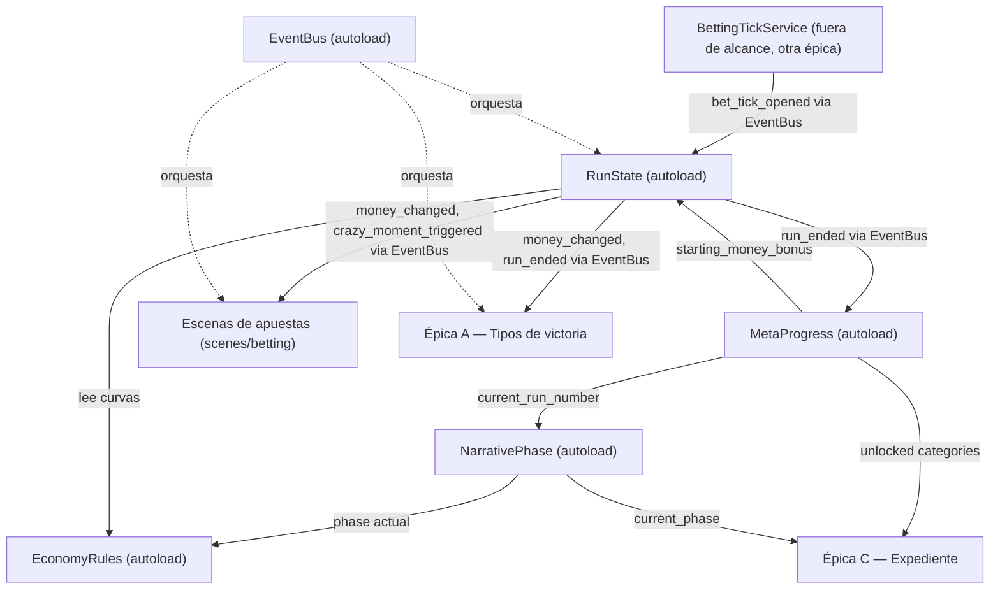

# Arquitectura base — Crazy Weekend (Godot/GDScript)

Estado: propuesta inicial de Architect. No existe todavía `project.godot` ni código — este documento es la
primera decisión de estructura del proyecto. Se escribe a partir de la Épica B (Economía de run) pero está
pensado para ser reutilizado sin cambios por la Épica A (tipos de victoria) y la Épica C (Expediente), que
son las siguientes en el roadmap y dependen de los mismos autoloads de estado/persistencia.

Cuando Épica A/C se diseñen, Architect debe extender este documento (nuevas señales, nuevos campos de
recurso) en vez de crear autoloads paralelos. No se debe crear un segundo autoload de persistencia ni un
segundo bus de señales.

---

## 1. Convención de carpetas `res://`

```
res://
  autoloads/              # scripts de los singletons (ver sección 2), un .gd por autoload
    run_state.gd
    meta_progress.gd
    narrative_phase.gd
    event_bus.gd
    economy_rules.gd
  resources/
    definitions/          # Resource .tres que definen datos de diseño versionables en editor
      meta_bonus/          # una .tres por bonus de meta-progresión (ver Épica B.1)
      narrative_phase/     # una .tres por fase narrativa (ver Épica B.4)
      market/              # una .tres por mercado de apuesta (usado también por Épica A)
    runtime/               # clases Resource usadas como structs en memoria (no assets .tres versionados a mano)
  scenes/
    betting/               # jornada de apuestas, panel de partido, tick UI (fuera de alcance de Épica B, pero
                           # es el consumidor de las señales que Épica B define)
    meta/                  # fase inter-run (lunes-jueves)
    collection/            # pantalla "Tu Expediente" (Épica C)
    shared/                # componentes de UI reutilizables (paneles, popups, HUD de saldo)
    main/                  # escena raíz / gestor de flujo de juego
  scripts/
    betting/
    economy/               # lógica de Épica B que no vive en autoload (ej. resolvers, calculadoras)
    victory/               # lógica de Épica A
    collection/            # lógica de Épica C
  data/
    saves/                 # user:// en build final; carpeta solo de referencia en editor
  audio/
  art/
```

Regla general: los **autoloads** contienen únicamente estado + orquestación mínima (fuente de verdad y
señales). La lógica de cálculo pura (curvas, pesos, validaciones) vive en scripts/clases `RefCounted` sin
estado bajo `res://scripts/economy/`, `res://scripts/victory/`, etc., para que Programmer pueda testear esa
lógica de forma aislada sin necesitar el árbol de escena completo.

---

## 2. Autoloads globales (singletons)

Orden de carga en `project.godot` (autoloads posteriores pueden asumir que los anteriores ya existen):

1. `EventBus`
2. `MetaProgress`
3. `NarrativePhase`
4. `RunState`
5. `EconomyRules`

### 2.1 `EventBus` (autoload, `res://autoloads/event_bus.gd`)

Bus de señales globales, sin estado propio. Patrón elegido para desacoplar autoloads de estado de las
escenas de UI/gameplay que reaccionan a esos cambios (evita que `RunState` necesite conocer nodos de escena
concretos). Todas las señales que cruzan el límite "autoload → escena" o "autoload → autoload" pasan por
aquí; los autoloads de estado no se referencian entre sí más que por llamadas directas a métodos cuando hace
falta leer un valor (ej. `RunState` puede leer `MetaProgress.get_total_starting_bonus()` directamente, pero
emite el resultado de sus propios cambios vía `EventBus`).

Señales relevantes para Épica B (otras épicas añadirán las suyas a este mismo autoload):

```gdscript
signal run_started(starting_money: int, run_number: int)
signal money_changed(new_amount: int, delta: int, reason: String)
signal bet_tick_opened(context: BetTickContext)          # ver 4.2 — el tick service anuncia que hay que apostar
signal bet_tick_resolved(tick_index: int)
signal crazy_moment_triggered(crazy_bet: CrazyBetContext) # ver 4.3
signal crazy_moment_ended()
signal run_ended(result: RunResult)                       # ver 3.3 — victoria o derrota, incluye motivo
```

### 2.2 `MetaProgress` (autoload, `res://autoloads/meta_progress.gd`)

Fuente de verdad de todo lo que persiste **entre runs y entre temporadas** (ya descrito en
`game-design.md` → "Meta-progresión y persistencia"). Épica B solo consume la parte de bonus de dinero
inicial y número de run; Épica A/C añadirán aquí el resto de campos (pool de amuletos, categorías
Expediente, standings de liga) sin tocar el contrato ya definido para Épica B.

Responsabilidad para Épica B:
- Llevar el contador `current_run_number: int` (empieza en 1, se incrementa en cada `run_ended`).
- Llevar la lista de bonus de dinero inicial desbloqueados (ver B.1, sección "Recurso `MetaMoneyBonus`").
- Exponer `get_total_starting_money_bonus() -> int`: suma de todos los bonus desbloqueados.
- Persistir a `user://save_meta.tres` (o `.json`, a decidir por Programmer; se recomienda `Resource` con
  `ResourceSaver`/`ResourceLoader` para consistencia con el resto de recursos del proyecto).

Contrato mínimo (firmas, sin implementación):

```gdscript
# MetaProgress (autoload)
func get_current_run_number() -> int
func get_total_starting_money_bonus() -> int
func unlock_money_bonus(bonus_id: StringName) -> void   # idempotente: desbloquear dos veces no duplica el bonus
func is_money_bonus_unlocked(bonus_id: StringName) -> bool
func advance_run_number() -> void                        # llamado al cerrar una run (victoria o derrota)
func save() -> void
func load_or_create() -> void                            # llamado una vez al boot del juego
```

### 2.3 `NarrativePhase` (autoload, `res://autoloads/narrative_phase.gd`)

Deriva la fase narrativa (1-4) a partir de `MetaProgress.get_current_run_number()`. Es un autoload propio
(no un método suelto dentro de `MetaProgress`) porque tanto Épica B (B.4, cadencia de Momento Crazy) como
Épica C (deterioro visual del Expediente) y el sistema de amuletos Absurdos lo consultan por igual — se
centraliza la tabla runs→fase en un solo lugar para que no se duplique el mapeo en tres sistemas distintos.

```gdscript
# NarrativePhase (autoload)
enum Phase { PHASE_1 = 1, PHASE_2 = 2, PHASE_3 = 3, PHASE_4 = 4 }

func get_current_phase() -> Phase
func get_phase_for_run(run_number: int) -> Phase   # función pura, usable en tests sin depender del run activo
```

Tabla fija (constante interna, ver `game-design.md` → "Arco narrativo"):

| Fase | Runs |
|---|---|
| PHASE_1 | 1-5 |
| PHASE_2 | 6-12 |
| PHASE_3 | 13-20 |
| PHASE_4 | 21+ |

Nota: esta tabla (1-5 / 6-12) es la de "Arco narrativo" general. B.4 usa una tabla ligeramente distinta para
cadencia de Momento Crazy (1-12 / 13-20 / 21+, ver spec de Épica B sección B.4) — **son dos tablas
distintas a propósito** porque el propio `game-design.md` las define distintas (el arco narrativo agrupa
1-2 en runs 1-12 solo a efectos de comentarios/voces, pero de forma no uniforme dentro de ese rango: fase 1
son runs 1-5 y fase 2 son runs 6-12). `NarrativePhase` expone las 4 fases granulares (1/2/3/4); B.4 combina
`PHASE_1` y `PHASE_2` bajo la misma regla de cadencia consultando `get_current_phase() <= Phase.PHASE_2`.
Ver detalle en la spec de B.4.

### 2.4 `RunState` (autoload, `res://autoloads/run_state.gd`)

Fuente de verdad del estado de la **run activa** (se resetea en cada `run_started`, no persiste — ver
`game-design.md` → "Qué no persiste"). Épica A leerá de aquí el pico de dinero de la run (hito económico,
historia A.8) y contadores de aciertos por mercado dentro de la run (historia A.3); Épica B es quien
gestiona el campo principal (`current_money`) y las reglas de tick/jornada.

```gdscript
# RunState (autoload)
var current_money: int
var run_number: int                  # copia de MetaProgress.get_current_run_number() al iniciar la run
var current_day: BettingDay.Day      # FRIDAY / SATURDAY / SUNDAY — ver 4.1
var current_tick_index: int          # índice global de tick dentro de la jornada actual, reinicia por día
var peak_money_this_run: int         # máximo histórico alcanzado en la run, se actualiza en cada set_money

func start_new_run() -> void          # calcula dinero inicial (ver B.1) y emite run_started
func set_money(new_amount: int, reason: String) -> void  # única vía de mutar dinero; emite money_changed, actualiza peak_money_this_run, evalúa muerte de run (B.2)
func get_money() -> int
func end_run(result: RunResult) -> void
```

Regla de diseño importante: **ningún otro script muta `current_money` directamente.** Toda escena de
apuestas llama a `RunState.set_money(...)`. Esto es lo que permite que B.2 (muerte por saldo cero) y A.8
(pico de dinero) se evalúen en un único punto sin duplicar la validación en cada lugar que resuelve una
apuesta.

### 2.5 `EconomyRules` (autoload, `res://autoloads/economy_rules.gd`)

Contiene las **constantes y curvas de balance** de la economía de run (Épica B), para que Programmer tenga
un único lugar donde ajustar números sin tocar lógica. No tiene estado mutable de instancia — es
efectivamente un objeto de configuración con métodos de cálculo puros. Detalle completo en la spec de
Épica B (sección "Recursos y constantes").

---

## 3. Recursos (`Resource` de Godot) compartidos

### 3.1 `RunResult` (`res://resources/runtime/run_result.gd`, `class_name RunResult extends Resource`)

Usado por `RunState.end_run()` y la señal `EventBus.run_ended`. Épica A lo consulta para saber si evaluar
hitos de fin de run; Épica C lo usa para saber qué mostrar en el resumen de lunes.

```gdscript
class_name RunResult extends Resource

enum Outcome { WON, LOST_BANKRUPT }  # "WON" = llegó a domingo con dinero > 0; ver nota más abajo

@export var outcome: Outcome
@export var final_money: int
@export var peak_money: int
@export var run_number: int
```

Nota: "ganar" una run en el sentido de `game-design.md` → "Loop principal" es simplemente llegar al domingo
con dinero > 0 — no implica ninguna categoría de Épica A. `RunResult` no decide nada sobre el final canónico;
solo describe el desenlace económico de la run puntual. Épica A evalúa sus categorías de forma independiente
al escuchar `money_changed` y `run_ended`.

### 3.2 `BettingDay` (`res://resources/runtime/betting_day.gd`)

Enum compartido para identificar la jornada de una run (viernes/sábado/domingo). Se define como recurso
propio (no como enum anidado en `RunState`) porque tanto B.4 (ventanas de Momento Crazy) como el futuro
sistema de partidos/mercados de domingo (`game-design.md` → "Restricciones del domingo") lo necesitan sin
depender de `RunState`.

```gdscript
class_name BettingDay extends RefCounted   # namespace estático simple, no Resource: no necesita serializarse

enum Day { FRIDAY = 0, SATURDAY = 1, SUNDAY = 2 }
```

---

## 4. Contrato con el sistema de partidos/apuestas (fuera de alcance de esta spec)

El sistema completo de simulación de partidos, ticks de 15 minutos y mercados de apuesta (`game-design.md`
→ "Sistema de tiempo semi-pausado" y "Sistema de apuestas") **no forma parte de la Épica B** y no se
diseña en este documento. Sin embargo, B.2/B.3/B.4 dependen de un contrato mínimo con ese sistema (aquí
llamado, provisionalmente, `BettingTickService` — nombre de autoload a confirmar cuando se diseñe esa
épica). Se deja fijado aquí el contrato mínimo para que Programmer pueda implementar Épica B ya mismo sin
bloquearse esperando esa épica, mediante un stub/mock que cumpla esta interfaz.

### 4.1 Qué necesita Épica B **de** ese sistema
- Una señal (vía `EventBus`) quede claro cuándo se abre un tick obligatorio de apuesta:
  `bet_tick_opened(context: BetTickContext)`.
- El listado de mercados disponibles en ese tick, con su probabilidad/cuota, para poder identificar "el
  mercado más seguro" (necesario para B.3).
- Saber la jornada (`BettingDay.Day`) y el índice de tick dentro de esa jornada (para B.4 — piso que
  impide el primer tick).

### 4.2 `BetTickContext` (`res://resources/runtime/bet_tick_context.gd`)

Recurso de transporte, emitido por el sistema de partidos y consumido por Épica B (para decidir si el tick
dispara Momento Crazy) y por la UI de apuestas.

```gdscript
class_name BetTickContext extends Resource

@export var day: BettingDay.Day
@export var tick_index_in_day: int              # 0-based, reinicia cada jornada
@export var available_markets: Array[MarketOffer]  # ver 4.4
```

### 4.3 `CrazyBetContext` (`res://resources/runtime/crazy_bet_context.gd`)

Emitido por Épica B (`EventBus.crazy_moment_triggered`) para que la UI de apuestas sepa que debe forzar el
stake y restringir mercados. Definido en detalle en la spec de Épica B (sección B.3).

### 4.4 `MarketOffer` (`res://resources/runtime/market_offer.gd`)

Recurso mínimo para identificar un mercado ofertado en un tick. Épica A reutilizará este mismo recurso para
identificar qué mercado se acertó (no se duplica una segunda representación de "mercado" en Épica A).

```gdscript
class_name MarketOffer extends Resource

@export var market_id: StringName          # ej. "1x2", "goals_ou_2_5", "cards_ou", "fouls_ou"
@export var match_id: StringName
@export var displayed_probability_min: float
@export var displayed_probability_max: float
@export var confidence: float               # 0.0-1.0, qué tan "informado" está el jugador de este mercado (ver B.3)
```

`confidence` es el campo que Épica B.3 usa para decidir cuál es "el mercado más seguro/informado" a
excluir durante un Momento Crazy (ver spec B.3, sección "Selección del mercado excluido"). Se deja
declarado aquí porque es un campo transversal — el sistema de mercados (fuera de alcance) es quien lo
calcula y lo rellena en cada `MarketOffer`.

---

## 5. Diagrama de dependencias (Mermaid)



---

## 6. Convenciones generales para Programmer

- Todos los autoloads exponen solo métodos + señales; no exponen nodos de escena.
- Ningún autoload hace `get_tree().current_scene` ni referencia escenas concretas — la comunicación autoload
  → escena es siempre vía `EventBus`.
- Toda constante de balance (dinero inicial, stake mínimo, pesos de Crazy Bet, tabla de fases) vive en
  `EconomyRules` o en recursos `.tres` bajo `resources/definitions/`, nunca hardcodeada en escenas de UI.
  Esto es lo que permite que Game Designer/Coordinator ajusten balance sin tocar escenas.
- Nomenclatura de señales: `snake_case`, tiempo pasado para hechos consumados (`run_started`,
  `money_changed`), y sufijo `_triggered`/`_opened`/`_ended` para eventos con ciclo de vida.
