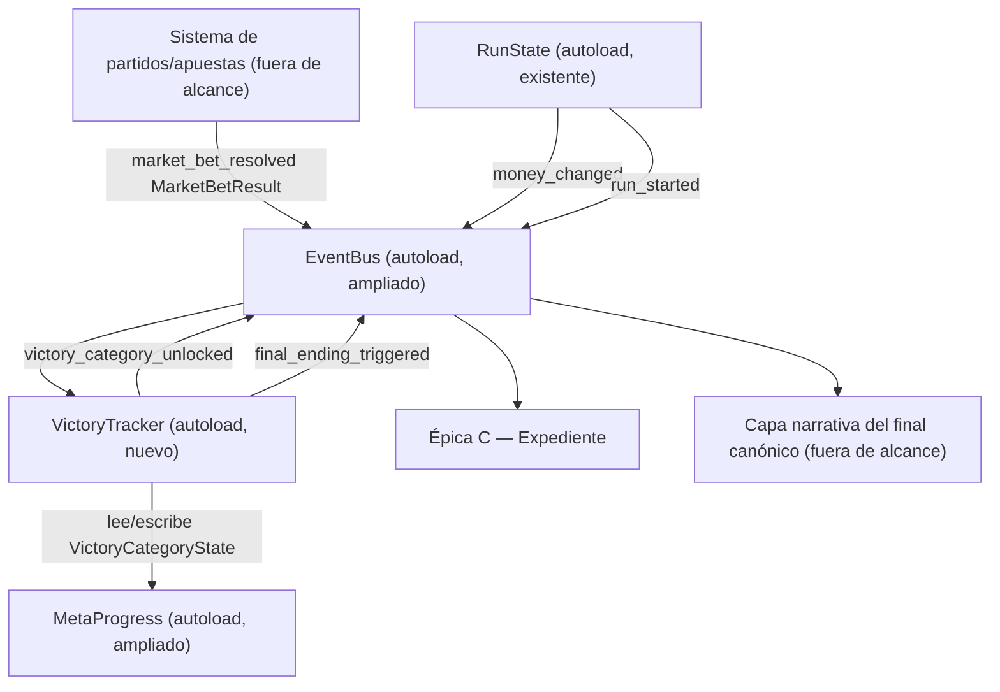
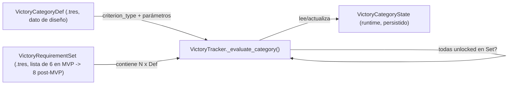

# Épica A — Sistema de tipos de victoria y final canónico (spec técnica, versión MVP)

Cubre historias A.1, A.2, A.3, A.4, A.5, A.8, A.9 del backlog (versión MVP: 6 de 8 categorías). A.6 y A.7
(Corners, Resultado Exacto) están fuera de alcance — diferidas a post-MVP — pero todo el diseño de datos de
este documento está hecho explícitamente para que su incorporación futura sea **sumar dos recursos de
categoría al set evaluado**, no reescribir lógica.

Reutiliza en su totalidad `.ai-studio/specs/_arquitectura-base.md` (autoloads `EventBus`, `MetaProgress`,
`NarrativePhase`, `RunState`, `EconomyRules`, y los recursos `RunResult`, `BettingDay`, `BetTickContext`,
`MarketOffer`). No se crean autoloads paralelos de estado ni un segundo bus de señales. Este documento solo
añade lo específico de la colección de victorias.

---

## 0. Resumen de decisiones de diseño clave

1. **"Categoría de victoria" se modela como dato (`Resource`), no como código por categoría.** Un único
   recurso `VictoryCategoryDef` describe *qué hay que cumplir* de forma declarativa (tipo de criterio +
   parámetros), y un único autoload `VictoryTracker` contiene la lógica de evaluación genérica que interpreta
   esos parámetros. Añadir Victoria de Corners/Resultado Exacto en post-MVP es crear dos `.tres` nuevos y
   registrar su tipo de criterio (si es un criterio nuevo) o reutilizar uno existente ("primer acierto de
   mercado X con condición Y"), sin tocar el evaluador de las 6 categorías del MVP.
2. **El slot combinado de hito económico (A.8) es una sola entrada del set de 6/8**, respaldada por 3
   sub-hitos independientes (10K/100K/1M) que se seguyen contando por separado para completismo del
   Expediente, pero de los cuales solo se necesita 1 para resolver el slot.
3. **La condición de victoria final (A.9) nunca cuenta "categorías hardcodeadas por nombre".** Cuenta
   cuántas entradas de una **lista configurable de "categorías requeridas para el final"**
   (`VictoryRequirementSet`, un `Resource` con un `Array[VictoryCategoryDef]`) están resueltas. En MVP esa
   lista tiene 6 elementos; el día que se añadan Corners/Resultado Exacto, el cambio es editar ese `.tres`
   para que pase a tener 8 elementos. La lógica de disparo (`VictoryTracker._check_final_ending()`) no
   cambia una sola línea.
4. **Contadores de acierto con dos ámbitos de vida distintos** (persistente vs. por-run) se modelan con el
   mismo tipo de recurso, diferenciados por un campo `counter_scope` — no por dos sistemas de conteo
   separados. Esto responde directamente a la nota de A.2 sobre ámbito de conteo.

---

## 1. Recursos (`Resource`) nuevos de Épica A

### 1.1 `VictoryCategoryDef` — definición estática de una categoría (dato de diseño)

`res://resources/definitions/victory_category/*.tres` — un `.tres` por categoría. Editable en el editor de
Godot por Game Designer/Coordinator sin tocar código.

```gdscript
class_name VictoryCategoryDef extends Resource

enum Family { MARKET, ECONOMIC_MILESTONE }  # Familia A / Familia B, ver glossary.md

enum CriterionType {
    MARKET_HIT_WITH_TAG,     # acierto de un mercado + el partido/contexto cumple un tag específico (A.1, A.5)
    MARKET_HIT_COUNT,        # N aciertos acumulados del mismo mercado, ámbito configurable (A.2, A.3)
    MARKET_HIT_DISTINCT_MATCHDAY, # N aciertos del mismo mercado en partidos distintos de la misma jornada (A.4)
    MONEY_THRESHOLD_ANY,     # superar cualquiera de N umbrales de dinero dentro de una run (A.8, vía sub-hitos)
}

@export var category_id: StringName          # ej. "victory_base", "victory_medias", "victory_goles",
                                               # "victory_tarjetas", "victory_faltas", "economic_milestone_slot"
@export var display_name: String              # "Victoria de Base", etc. — usado por Épica C
@export var family: Family
@export var criterion_type: CriterionType

# Parámetros del criterio — solo los relevantes al criterion_type elegido se usan; el resto quedan en default.
@export var market_id: StringName             # ej. "1x2", "goals_ou_2_5", "goals_ou" (genérico goles), "cards_ou", "fouls_ou"
@export var required_tag: StringName          # ej. "underdog_win" (A.1), "dirty_match_fouls_gt_20" (A.5)
@export var required_count: int               # ej. 3 (A.2), 5 (A.3), 3 (A.4)
@export var counter_scope: CounterScope        # ver 1.2 — PERSISTENT (A.2) vs PER_RUN (A.3, A.4)
@export var money_thresholds: Array[int]       # ej. [10000, 100000, 1000000] — solo A.8

enum CounterScope { PERSISTENT, PER_RUN }
```

Nota sobre `required_tag`: no se modela como enum cerrado en `VictoryCategoryDef` sino como `StringName`
libre. El significado de cada tag lo resuelve el productor del evento (ver sección 2), no el recurso de
definición — esto evita que `VictoryCategoryDef` necesite conocer de antemano cada tipo de contexto especial
que pueda aparecer en post-MVP (ej. tags futuros para Corners/Resultado Exacto no rompen este enum).

Instancias necesarias para el MVP (7 recursos: 5 mercado + 1 slot combinado + 1 set de requisitos, ver 1.3):

| `category_id` | `family` | `criterion_type` | parámetros clave |
|---|---|---|---|
| `victory_base` | MARKET | MARKET_HIT_WITH_TAG | `market_id="1x2"`, `required_tag="underdog_win"` |
| `victory_medias` | MARKET | MARKET_HIT_COUNT | `market_id="goals_ou_2_5"`, `required_count=3`, `counter_scope=PERSISTENT` |
| `victory_goles` | MARKET | MARKET_HIT_COUNT | `market_id="goals_ou"`, `required_count=5`, `counter_scope=PER_RUN` |
| `victory_tarjetas` | MARKET | MARKET_HIT_DISTINCT_MATCHDAY | `market_id="cards_ou"`, `required_count=3` |
| `victory_faltas` | MARKET | MARKET_HIT_WITH_TAG | `market_id="fouls_ou"`, `required_tag="dirty_match_fouls_gt_20"` |
| `economic_milestone_slot` | ECONOMIC_MILESTONE | MONEY_THRESHOLD_ANY | `money_thresholds=[10000,100000,1000000]` |

Nota `victory_goles` vs `victory_medias`: son `market_id` distintos aunque ambos operan sobre "goles
totales". `goals_ou_2_5` identifica específicamente el mercado con umbral fijo 2.5 (Victoria de Medias);
`goals_ou` identifica el mercado de goles totales en cualquier umbral ofertado (1.5/2.5/3.5, Victoria de
Goles — ver `game-design.md` → "Mercados disponibles (MVP)"). El sistema de mercados (fuera de alcance de
esta épica) es responsable de emitir el `market_id` correcto según el umbral apostado; ver sección 2 sobre
el contrato de evento esperado. Esto es una dependencia explícita a validar con quien diseñe el sistema de
mercados/apuestas.

### 1.2 `VictoryCategoryState` — estado runtime de una categoría (persistente)

`res://resources/runtime/victory_category_state.gd`. Una instancia por categoría, gestionada por
`VictoryTracker`, persistida como parte del save de `MetaProgress` (ver sección 3).

```gdscript
class_name VictoryCategoryState extends Resource

@export var category_id: StringName
@export var unlocked: bool = false
@export var unlocked_at_run_number: int = -1     # -1 si no desbloqueada
@export var unlocked_at_date: String = ""        # ISO8601, para flavor text del Expediente (Épica C)

# Contadores — MARKET_HIT_COUNT / MARKET_HIT_DISTINCT_MATCHDAY
@export var persistent_hit_count: int = 0        # usado si counter_scope == PERSISTENT (A.2)
@export var per_run_hit_count: int = 0           # usado si counter_scope == PER_RUN (A.3); se resetea en cada run_started
@export var matchday_hits: Dictionary = {}       # { matchday_id: Array[match_id] } — para MARKET_HIT_DISTINCT_MATCHDAY (A.4)

# Sub-hitos — solo economic_milestone_slot (A.8)
@export var milestone_reached: Dictionary = {}   # { 10000: bool, 100000: bool, 1000000: bool } — persistente, para completismo del Expediente
```

`matchday_hits` se resetea por jornada (no por run): al detectar que `matchday_id` cambió respecto al último
acierto registrado para esa categoría, se limpia antes de insertar el nuevo. Esto cubre A.4 ("3 partidos
distintos de la misma jornada") sin necesitar un campo separado de "jornada actual" — el propio dato ya
lleva la jornada consigo.

### 1.3 `VictoryRequirementSet` — lista configurable de categorías que cierran el final canónico

`res://resources/definitions/victory_requirement_set_mvp.tres`. Este es el recurso que responde
directamente al requisito de A.9 de no rehacer lógica al pasar de 6 a 8.

```gdscript
class_name VictoryRequirementSet extends Resource

@export var set_id: StringName                       # "mvp_6of8" — versionado explícito, no implícito
@export var required_categories: Array[VictoryCategoryDef]
```

Para el MVP, `required_categories` = las 6 entradas de la tabla en 1.1 (5 mercado + 1 slot combinado).
Cuando A.6/A.7 se implementen, se crea `victory_requirement_set_full_8of8.tres` con las 8 entradas, y se
cambia **una sola referencia** (qué `VictoryRequirementSet` usa `VictoryTracker` activo — ver 4.1, campo
`active_requirement_set`). No hay rama de código `if version == mvp`.

---

## 2. Contrato de entrada — eventos que `VictoryTracker` consume

`VictoryTracker` (autoload nuevo, ver sección 4) no conoce el sistema de partidos/apuestas (fuera de
alcance de esta épica, igual que aclara `_arquitectura-base.md` sección 4). Se suscribe únicamente a señales
de `EventBus`. Dos señales nuevas se añaden al contrato de `EventBus` definido en la arquitectura base
(sección 2.1 de ese documento) — no se crean autoloads de señales nuevos, se amplía el existente:

```gdscript
# Añadidas a EventBus (autoload ya existente, ver _arquitectura-base.md 2.1)
signal market_bet_resolved(result: MarketBetResult)   # emitido por el sistema de apuestas en cada resolución, ganada o perdida
# money_changed y run_ended ya existen en EventBus (arquitectura base) y también son consumidas por VictoryTracker
```

### 2.1 `MarketBetResult` (`res://resources/runtime/market_bet_result.gd`) — recurso de transporte nuevo

Análogo a `MarketOffer` (arquitectura base 4.4), pero representa una apuesta ya resuelta. Es responsabilidad
del sistema de apuestas (fuera de alcance) rellenar `context_tags` correctamente; queda documentado aquí
como contrato explícito para que Programmer del sistema de apuestas sepa qué debe emitir.

```gdscript
class_name MarketBetResult extends Resource

@export var market_id: StringName          # ver tabla 1.1 para los market_id relevantes al MVP
@export var match_id: StringName
@export var matchday_id: StringName        # jornada — necesario para A.4
@export var won: bool
@export var run_number: int
@export var context_tags: Array[StringName]  # tags que describen condiciones del partido/apuesta relevantes
                                              # para retos de desbloqueo, ej.:
                                              #   "underdog_win"              -> A.1 (el ganador del 1x2 tenía menor probabilidad)
                                              #   "dirty_match_fouls_gt_20"   -> A.5 (faltas totales del partido > 20)
```

`VictoryTracker` solo actúa sobre `market_bet_result` cuando `won == true`; los tags se evalúan únicamente en
apuestas ganadas (fallar una apuesta nunca puede cumplir un reto).

Dependencia explícita a validar con quien diseñe el sistema de mercados/partidos: quién calcula
`"underdog_win"` (comparar probabilidad implícita de la opción ganadora contra las demás opciones del mismo
mercado en el momento de cierre de la apuesta) y `"dirty_match_fouls_gt_20"` (estadística de faltas totales
del partido ≥ dato ya contemplado en el panel de partido, según `game-design.md` → "Sistema de tiempo
semi-pausado"). Esta spec fija el **contrato de tag**, no quién lo calcula — eso es diseño del sistema de
partidos, épica separada.

---

## 3. Persistencia

Reutiliza `MetaProgress` (arquitectura base 2.2) como contenedor — Épica A no crea un segundo archivo de
save. Se añade a `MetaProgress` (ampliación del contrato ya existente, no un autoload nuevo):

```gdscript
# Añadido al contrato de MetaProgress (autoload, ver _arquitectura-base.md 2.2)
func get_victory_category_state(category_id: StringName) -> VictoryCategoryState
func get_all_victory_category_states() -> Array[VictoryCategoryState]
func save_victory_category_state(state: VictoryCategoryState) -> void   # persiste vía el mismo save() de MetaProgress
func is_final_ending_triggered() -> bool
func mark_final_ending_triggered(at_run_number: int) -> void            # idempotente
```

`VictoryCategoryState` (por categoría) y el flag de final canónico ya disparado viven en el mismo
`user://save_meta.tres` que el resto de meta-progresión (bonus de dinero, número de run) — un único archivo
de save, un único punto de verdad, coherente con la regla ya fijada en la arquitectura base de "no crear un
segundo autoload de persistencia".

`per_run_hit_count` y `matchday_hits` (los dos campos de ámbito no-persistente en espíritu) **sí se guardan
en el mismo recurso persistente**, porque una run puede cerrarse y reabrirse (guardado/carga a medio fin de
semana); lo que los distingue de `persistent_hit_count` no es "no se guarda en disco" sino "se resetea al
recibir `run_started`", ver 4.2.

---

## 4. `VictoryTracker` (autoload nuevo)

`res://autoloads/victory_tracker.gd`. Añadido al orden de carga de autoloads de la arquitectura base, **después**
de `MetaProgress` y `RunState` (necesita leer ambos):

```
1. EventBus
2. MetaProgress
3. NarrativePhase
4. RunState
5. EconomyRules
6. VictoryTracker        <- nuevo, Épica A
```

### 4.1 Responsabilidad y contrato

```gdscript
# VictoryTracker (autoload)
@export var active_requirement_set: VictoryRequirementSet  # asignado en editor: victory_requirement_set_mvp.tres en MVP

func _on_market_bet_resolved(result: MarketBetResult) -> void   # conectado a EventBus.market_bet_resolved
func _on_money_changed(new_amount: int, delta: int, reason: String) -> void  # conectado a EventBus.money_changed (A.8)
func _on_run_started(starting_money: int, run_number: int) -> void  # conectado a EventBus.run_started (resetea contadores PER_RUN)

func _evaluate_category(def: VictoryCategoryDef, state: VictoryCategoryState, ctx: Variant) -> bool  # true si pasa a unlocked
func _unlock_category(category_id: StringName) -> void   # marca unlocked, persiste, emite victory_category_unlocked
func _check_final_ending() -> void                        # ver 4.3
```

`_evaluate_category` es la **única función que conoce los 4 `CriterionType`** (switch sobre
`def.criterion_type`); es el único lugar que crece si se añade un `CriterionType` nuevo en post-MVP (ej. si
Resultado Exacto necesitara un tipo de criterio que no encaje en los 4 ya existentes — aunque "primer acierto
de mercado X" ya encaja en `MARKET_HIT_WITH_TAG` sin tag, o en `MARKET_HIT_COUNT` con `required_count=1`, por
lo que es probable que ni siquiera se necesite un 5º tipo).

### 4.2 Reset de contadores `PER_RUN`

En `_on_run_started`, `VictoryTracker` itera `active_requirement_set.required_categories`, filtra las que
tienen `counter_scope == PER_RUN` (en MVP: solo `victory_goles`), y resetea `per_run_hit_count = 0` en su
`VictoryCategoryState` correspondiente. `matchday_hits` (usado por `victory_tarjetas`, que no es
`counter_scope`-dependiente sino que vive dentro de `MARKET_HIT_DISTINCT_MATCHDAY`) no se resetea por run,
solo se limpia por cambio de jornada (ver 1.2) — una jornada puede, en teoría, cruzar el límite de una run
en el diseño de liga (`game-design.md`: "una jornada de liga no equivale a un fin de semana real" solo en el
sentido de que 38 jornadas ≠ 38 runs necesariamente 1:1 a largo del roadmap, aunque en la práctica de una
run cada jornada avanza una vez por fin de semana jugado); se deja explícito que el ámbito de A.4 es
"jornada", no "run", tal como especifica la historia.

### 4.3 `_check_final_ending()` — disparo del final canónico (A.9)

```gdscript
func _check_final_ending() -> void:
    if MetaProgress.is_final_ending_triggered():
        return
    for def in active_requirement_set.required_categories:
        if not MetaProgress.get_victory_category_state(def.category_id).unlocked:
            return
    MetaProgress.mark_final_ending_triggered(RunState.run_number)
    EventBus.emit_signal("final_ending_triggered", RunState.run_number)
```

Se llama al final de `_unlock_category(...)` (cualquier desbloqueo puede ser el que complete el set) y
también tras `_on_money_changed` cuando resuelve el slot combinado. Es intencionalmente ciego a **qué**
categorías son o cuántas son — solo itera `active_requirement_set.required_categories` y comprueba
`unlocked`. Esto es lo que garantiza el requisito explícito de A.9: pasar de 6 a 8 es cambiar qué `.tres`
apunta `active_requirement_set`, no tocar `_check_final_ending()`.

Nota de diseño (`game-design.md` → "Condición de victoria final"): el final se dispara "en la run donde se
completa la última categoría, sin importar si esa run se gana o se pierde en dinero" — por eso
`_check_final_ending()` no consulta `RunState` para nada relativo al resultado económico, solo
`RunState.run_number` para el registro histórico.

### 4.4 Señal nueva emitida por `VictoryTracker` (añadida a `EventBus`)

```gdscript
# Añadidas a EventBus
signal victory_category_unlocked(category_id: StringName, run_number: int)  # consumida por Épica C (Expediente)
signal final_ending_triggered(run_number: int)                              # consumida por Épica C / capa narrativa del final
```

---

## 5. Evaluación por historia (mapeo directo criterio → implementación)

| Historia | Evento disparador | `criterion_type` | Detalle de evaluación |
|---|---|---|---|
| A.1 Victoria de Base | `market_bet_resolved` (`market_id="1x2"`, `won=true`) | `MARKET_HIT_WITH_TAG` | `"underdog_win" in result.context_tags` → unlock inmediato |
| A.2 Victoria de Medias | `market_bet_resolved` (`market_id="goals_ou_2_5"`, `won=true`) | `MARKET_HIT_COUNT` (`PERSISTENT`) | `persistent_hit_count += 1`; si `>= 3` → unlock. No se resetea entre runs (nota A.2 resuelta: ámbito **persistente/histórico**, ver 5.1) |
| A.3 Victoria de Goles | `market_bet_resolved` (`market_id="goals_ou"`, `won=true`) | `MARKET_HIT_COUNT` (`PER_RUN`) | `per_run_hit_count += 1`; si `>= 5` → unlock. Se resetea en `run_started` |
| A.4 Victoria de Tarjetas | `market_bet_resolved` (`market_id="cards_ou"`, `won=true`) | `MARKET_HIT_DISTINCT_MATCHDAY` | añade `match_id` a `matchday_hits[matchday_id]` (limpiando si cambió la jornada); si `len(matchday_hits[current_matchday]) >= 3` (partidos únicos) → unlock |
| A.5 Victoria de Faltas | `market_bet_resolved` (`market_id="fouls_ou"`, `won=true`) | `MARKET_HIT_WITH_TAG` | `"dirty_match_fouls_gt_20" in result.context_tags` → unlock inmediato |
| A.8 Slot hito económico | `money_changed` (cualquier delta, dentro de una run activa) | `MONEY_THRESHOLD_ANY` | para cada umbral en `money_thresholds`: si `new_amount >= umbral` y `milestone_reached[umbral] == false`, marcar `true`; si **algún** umbral pasó a `true` (el primero que se cumple ya cierra el slot) → unlock del slot. Los otros dos umbrales se siguen marcando aunque el slot ya esté resuelto, para completismo (ver 1.2) |
| A.9 Final canónico | tras cualquier `_unlock_category` | — (orquestador, no criterio) | ver `_check_final_ending()`, sección 4.3 |

### 5.1 Resolución de la nota abierta de A.2

El backlog pedía a Architect confirmar explícitamente el ámbito de conteo de Victoria de Medias. Decisión:
**ámbito persistente** (`counter_scope = PERSISTENT`, acumulado histórico a través de runs y temporadas,
nunca se resetea) — se apoya en que `game-design.md` describe el reto como "3 partidos consecutivos (misma
jornada o jornadas distintas)" sin mencionar límite de run, a diferencia de A.3 que sí fija explícitamente
"el contador se resetea al inicio de cada run" en su propio criterio de éxito. Queda fijado en el campo
`counter_scope` del recurso `victory_medias.tres`, no como comentario de código — es dato de diseño,
editable si Game Designer cambia de opinión sin tocar `VictoryTracker`.

Nota adicional: pese a que `game-design.md` dice "3 partidos consecutivos", el criterio de éxito de A.2 en
el backlog dice "3 aciertos... consecutivos o no". Se sigue el backlog (fuente más reciente/resuelta): no se
exige adyacencia entre aciertos, solo alcanzar el conteo de 3. Si el Director Creativo quisiera exigir
consecutividad real, requeriría un `CriterionType` distinto (`MARKET_HIT_STREAK`) — no está en el MVP.

---

## 6. Diagrama de flujo (Mermaid)





---

## 7. Dependencias y fuera de alcance

- **Depende de** (arquitectura base, ya definida): `EventBus`, `MetaProgress`, `NarrativePhase`, `RunState`,
  recursos `RunResult`, `BettingDay`, `MarketOffer`.
- **Depende de** (fuera de esta épica, contrato fijado en sección 2): el sistema de partidos/apuestas debe
  emitir `EventBus.market_bet_resolved(MarketBetResult)` en cada resolución de apuesta ganada o perdida, con
  `context_tags` correctamente calculados para `"underdog_win"` y `"dirty_match_fouls_gt_20"`, y debe existir
  el mercado `fouls_ou` (Faltas totales) en el catálogo de mercados MVP (`game-design.md` ya lo marca como
  incluido en MVP por bajo costo, derivable del panel de estadísticas existente).
- **Consumido por** Épica C (Expediente): lee `MetaProgress.get_all_victory_category_states()` para pintar
  la grilla, y escucha `victory_category_unlocked` / `final_ending_triggered` para animar el destape en
  tiempo real si el jugador está en esa pantalla.
- **Fuera de alcance de este documento**: contenido narrativo del final canónico (evento en sí, textos —
  pertenece a Game Designer/narrative, según aclara A.9); mercado `fouls_ou` como UI de apuesta jugable
  (pertenece al sistema de apuestas, esta spec solo consume su resultado); A.6/A.7 (Corners, Resultado
  Exacto) y las 4 categorías del Anexo (post-MVP, ver `backlog.md`).

---

## 8. Extender a post-MVP (A.6, A.7) — checklist para el próximo Architect/Programmer

Para pasar de 6/8 a 8/8 categorías sin refactor, según lo diseñado aquí:

1. Crear `victory_corners.tres` y `victory_resultado_exacto.tres` (`VictoryCategoryDef`), reutilizando
   `MARKET_HIT_WITH_TAG` (ej. tag `"corners_over_9_5"`) o `MARKET_HIT_COUNT` con `required_count=1` según
   convenga — probablemente no requieren `CriterionType` nuevo (ver nota en 4.1).
2. Crear `victory_requirement_set_full_8of8.tres` con las 8 entradas.
3. Reasignar `VictoryTracker.active_requirement_set` a ese nuevo recurso (cambio de referencia en editor o
   en configuración de build, a decidir por Programmer — no requiere tocar `victory_tracker.gd`).
4. Añadir los `market_id` nuevos (`corners_ou`, `exact_score`) al sistema de mercados/apuestas (fuera de
   alcance de Épica A, épica de mercados).
5. No se toca `_evaluate_category()` ni `_check_final_ending()` salvo que un criterio nuevo realmente no
   encaje en los 4 `CriterionType` existentes.
