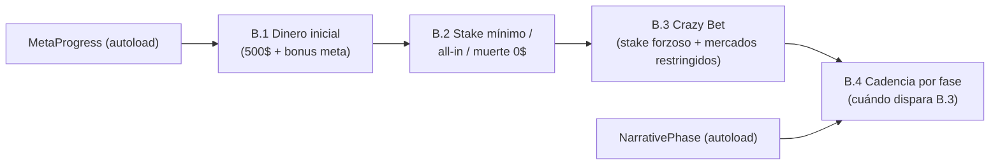
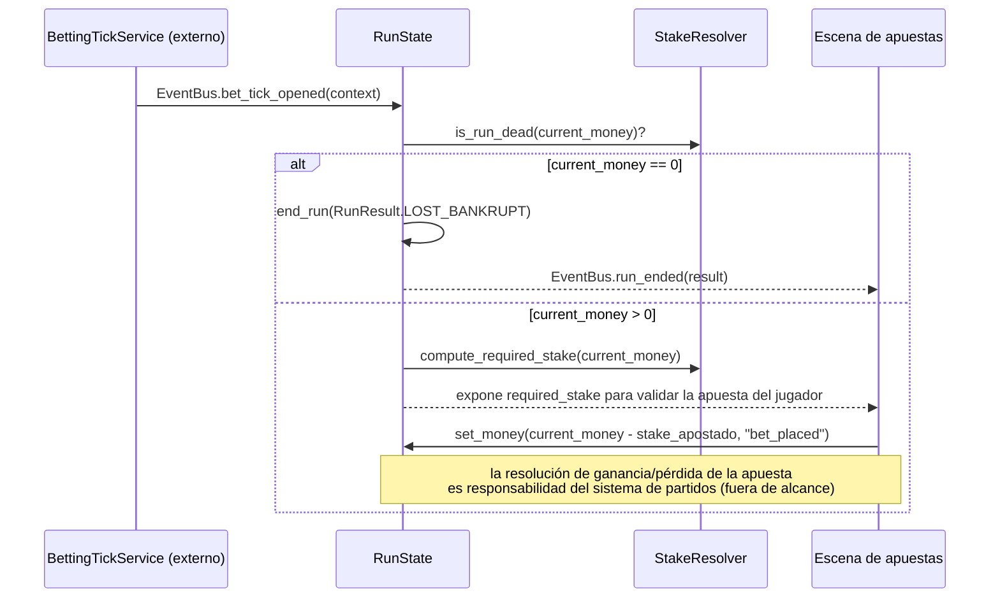

# Spec técnica — Épica B: Economía de run

Fuente de diseño: `.ai-studio/memory/game-design.md` → "Economía de run". Historias origen:
`.ai-studio/memory/backlog.md` → Épica B (B.1-B.4).

Este documento asume la arquitectura base definida en `.ai-studio/specs/_arquitectura-base.md` (autoloads
`EventBus`, `MetaProgress`, `NarrativePhase`, `RunState`, `EconomyRules`, y los recursos `RunResult`,
`BettingDay`, `BetTickContext`, `MarketOffer`). Léase ese documento primero.

Ningún fragmento de código aquí es GDScript final: son firmas/contratos para que Programmer implemente sin
ambigüedad.

---

## Resumen de relación entre historias



- B.1 fija cuánto dinero tiene el jugador al arrancar (`RunState.start_new_run()`).
- B.2 es la regla que se aplica en **todos** los ticks obligatorios, incluidos los de Momento Crazy: define
  el piso (50$/all-in/muerte). B.3 es un **caso especial de tick obligatorio** que sobrescribe el monto
  exigido (50/70/100% en vez de 50$ fijo) y la lista de mercados — pero sigue pasando por la misma
  validación de muerte por saldo cero de B.2 si el resultado deja al jugador en 0$.
- B.4 no añade lógica de apuesta nueva: decide **cuándo** se dispara el mecanismo ya definido en B.3.

---

## B.1 — Dinero inicial de run con escalado por meta-progresión

### Qué implementa
`RunState.start_new_run()` calcula el dinero inicial como `BASE_STARTING_MONEY + MetaProgress.get_total_starting_money_bonus()`
y lo asigna a `current_money`, luego emite `EventBus.run_started`.

### Constantes (`EconomyRules`)
```gdscript
const BASE_STARTING_MONEY: int = 500
```

### Recurso `MetaMoneyBonus` (`res://resources/definitions/meta_bonus/meta_money_bonus.gd`)
Cada desbloqueo de "+X$ al empezar" es una instancia `.tres` de este recurso, para que Game
Designer/Coordinator puedan añadir/ajustar desbloqueos sin tocar código:

```gdscript
class_name MetaMoneyBonus extends Resource

@export var bonus_id: StringName        # ej. "bonus_investigacion_1", "bonus_hito_10k"
@export var amount: int                 # cuánto dinero inicial adicional otorga, permanente
@export var unlock_source: String       # texto libre para trazabilidad ("logro", "hito colección", "decisión inter-run X")
```

`MetaProgress` guarda solo la lista de `bonus_id` desbloqueados (`Array[StringName]`), no una copia del
`amount` — el valor se resuelve en tiempo de ejecución contra la definición `.tres`, para que ajustar el
balance de un bonus ya desbloqueado (durante desarrollo/balanceo) no requiera migrar saves.

`get_total_starting_money_bonus()` recorre `res://resources/definitions/meta_bonus/*.tres`, filtra por los
`bonus_id` marcados como desbloqueados en `MetaProgress`, y suma `amount`.

### Curva propuesta (delegada explícitamente por el backlog a Architect)

Principio de balance: cada bonus individual debe ser notorio pero nunca trivializar el stake mínimo de 50$
(ver B.2) ni hacer irrelevante la presión inicial que `game-design.md` pide explícitamente ("el jugador
siente presión desde el primer tick"). Curva de rendimientos decrecientes: los primeros bonus son más
generosos (recompensan progreso temprano, coherente con "el juego se vuelve progresivamente más manejable"),
los últimos son más caros de conseguir y de menor impacto relativo porque en fases avanzadas la presión debe
sostenerse (fase 4 = "ruptura", no debería sentirse económicamente cómoda).

| `bonus_id` | Monto | Fuente de desbloqueo propuesta | Total acumulado tras este bonus |
|---|---|---|---|
| `bonus_inter_run_1` | +50$ | 1ª decisión de investigación inter-run (temprano, tutorial de la mecánica de bonus) | 550$ |
| `bonus_inter_run_2` | +50$ | 2ª decisión de investigación inter-run | 600$ |
| `bonus_logro_primera_run_ganada` | +100$ | Ganar la primera run (llegar a domingo con dinero > 0) | 700$ |
| `bonus_hito_10k` | +100$ | Desbloquear Victoria del Cuatro Cifras (Épica A, Familia B) | 800$ |
| `bonus_hito_100k` | +150$ | Desbloquear Victoria del Cien Mil (Épica A, Familia B) | 950$ |
| `bonus_coleccion_mercado_3` | +150$ | Desbloquear 3 de las 5 categorías de mercado del MVP (cualquiera) | 1100$ |
| `bonus_hito_1m` | +200$ | Desbloquear Victoria del Millón (Épica A, Familia B) | 1300$ |
| `bonus_coleccion_mercado_completa` | +200$ | Desbloquear las 5 categorías de mercado del MVP | 1500$ |

Techo del MVP: **+1000$ acumulables** (dinero inicial máximo posible = 1500$, 3x el valor base). Este techo
es intencionado: mantiene coherencia con el pilar "la dificultad, la rareza de los amuletos y la intensidad
narrativa suben juntas" — el dinero inicial nunca debe crecer tan rápido como para neutralizar la presión de
fases 3-4. Si Épica A añade Corners/Resultado Exacto (post-MVP), Coordinator/Architect deben añadir 2 filas
más siguiendo la misma curva (~+150-200$ cada una), no reabrir esta tabla.

Nota: los `bonus_id` ligados a hitos de Épica A/categorías de colección son una dependencia de diseño, no
técnica — B.1 no requiere que Épica A esté implementada; el mecanismo de `unlock_money_bonus(bonus_id)` es
genérico y cualquier sistema (inter-run, Épica A, logros futuros) lo invoca igual. Mientras Épica A no
exista, esos `bonus_id` simplemente no se desbloquean y el jugador sigue empezando en 500$ + lo que la fase
inter-run ya otorgue.

### Señales / eventos
- `EventBus.run_started(starting_money: int, run_number: int)` — emitido al final de `start_new_run()`.
  Consumido por: UI de HUD (mostrar saldo inicial), Épica C (no aplica en B), logging.

### Criterio de éxito (trazado del backlog)
Toda run nueva arranca con `500 + suma(bonus desbloqueados)`. Verificable con test unitario sobre
`EconomyRules`/`MetaProgress` sin necesitar escena: dado un set de `bonus_id` desbloqueados, el total
calculado coincide con la tabla.

---

## B.2 — Stake mínimo obligatorio, all-in forzoso y muerte de run por saldo cero

### Qué implementa
La validación de que **toda** apuesta resuelta en un tick obligatorio (Momento Crazy incluido) cumple el
piso mínimo, y la detección de muerte de run. Vive como lógica pura en
`res://scripts/economy/stake_resolver.gd` (clase `RefCounted`, sin estado), invocada por `RunState` y por la
escena de apuestas antes de aceptar una apuesta del jugador.

### Constantes (`EconomyRules`)
```gdscript
const MINIMUM_STAKE: int = 50
```

### Contrato de `StakeResolver` (`res://scripts/economy/stake_resolver.gd`)

Función pura, sin dependencia de nodos, testeable de forma aislada:

```gdscript
class_name StakeResolver extends RefCounted

## Devuelve el stake mínimo exigido al jugador en el tick actual, dado su dinero disponible.
## No decide el mercado ni ejecuta la apuesta — solo calcula el monto obligatorio.
static func compute_required_stake(current_money: int) -> int:
    # current_money >= MINIMUM_STAKE  -> devuelve MINIMUM_STAKE (50$)
    # 0 < current_money < MINIMUM_STAKE -> devuelve current_money (all-in forzoso)
    # current_money == 0 -> caso de muerte de run, ver is_run_dead(); no debería llegar a pedir stake
    pass

static func is_run_dead(current_money: int) -> bool:
    return current_money == 0
```

Nota: esta función **no** aplica cuando hay un Momento Crazy activo — en ese caso el monto exigido lo calcula
`CrazyBetResolver` (B.3), no `StakeResolver`. `RunState`/la escena de apuestas deciden cuál de los dos
invocar según si `EventBus.crazy_moment_triggered` está activo para el tick actual (ver B.3, "Interacción con
B.2").

### Flujo de `RunState` en cada tick obligatorio



Puntos de contrato explícitos para Programmer:
- La comprobación de muerte de run ocurre **al abrir el tick**, antes de pedir ninguna apuesta — coherente
  con "no hay tick de gracia": si `current_money == 0` al llegar el tick, la run termina ahí, no se muestra
  ni siquiera la pantalla de apuesta.
- La UI de apuestas no puede confirmar una apuesta por debajo de `required_stake`; es responsabilidad de la
  escena de apuestas (fuera de esta épica) deshabilitar la confirmación si el monto introducido es menor.
  B.2 solo expone el número correcto; no diseña el widget de input (eso es una historia de UI de la épica de
  sistema de apuestas).
- `RunState.set_money()` es la única vía de descuento; cualquier resta de saldo por apuesta pasa por ahí
  para que el chequeo de muerte de run del siguiente tick sea siempre coherente con el último valor real.

### Señales / eventos
- `EventBus.run_ended(result: RunResult)` con `result.outcome == RunResult.Outcome.LOST_BANKRUPT` cuando la
  muerte de run se dispara por saldo cero en tick obligatorio.
- No se añade una señal nueva para "all-in forzoso": es simplemente el valor devuelto por
  `compute_required_stake()` siendo menor a 50; la UI lo distingue mostrando el mensaje de all-in cuando
  `required_stake == current_money and current_money < MINIMUM_STAKE`.

### Criterio de éxito (trazado del backlog)
- `compute_required_stake(500) == 50`; `compute_required_stake(30) == 30`; `is_run_dead(0) == true`.
- `RunState` nunca permite abrir un tick con apuesta pendiente si `current_money == 0`: dispara
  `run_ended(LOST_BANKRUPT)` inmediatamente.

---

## B.3 — Mecanismo base de Momento Crazy (Crazy Bet + restricción de mercados)

### Qué implementa
El cálculo del stake forzoso (50/70/100% del dinero **actual**, con pesos) y la selección de qué mercados
quedan disponibles durante el tick marcado como Crazy, excluyendo siempre el más seguro. Vive en
`res://scripts/economy/crazy_bet_resolver.gd` (clase `RefCounted`, lógica pura) + orquestación mínima en
`RunState` para emitir la señal correspondiente.

### Recurso `CrazyBetContext` (`res://resources/runtime/crazy_bet_context.gd`)
Ya declarado como recurso compartido en la arquitectura base; se detalla aquí su contenido completo:

```gdscript
class_name CrazyBetContext extends Resource

enum StakePercentage { FIFTY = 50, SEVENTY = 70, ONE_HUNDRED = 100 }

@export var stake_percentage: StakePercentage
@export var forced_stake_amount: int              # ya resuelto en dinero absoluto, = current_money * percentage/100
@export var allowed_market_ids: Array[StringName] # 1-2 mercados, nunca incluye el excluido
@export var excluded_market_id: StringName        # el mercado identificado como "más seguro", para debug/UI
```

### Constantes y pesos (`EconomyRules`)

Pesos de `stake_percentage`, dependientes de fase narrativa (ya especificado en `game-design.md`: "50% es el
más común, 100% el más raro, escalando en probabilidad con la fase narrativa — en fase 4, el 100% es tan
probable como el 50%"). Se modela como tabla de pesos por fase para que Game Designer pueda ajustar sin
tocar código:

```gdscript
# EconomyRules — pesos relativos (no necesitan sumar 100, se normalizan al usarlos)
const CRAZY_BET_WEIGHTS_BY_PHASE: Dictionary = {
    NarrativePhase.Phase.PHASE_1: {50: 60, 70: 30, 100: 10},
    NarrativePhase.Phase.PHASE_2: {50: 60, 70: 30, 100: 10},
    NarrativePhase.Phase.PHASE_3: {50: 45, 70: 35, 100: 20},
    NarrativePhase.Phase.PHASE_4: {50: 35, 70: 30, 100: 35},
}

const CRAZY_BET_MAX_ALLOWED_MARKETS: int = 2
const CRAZY_BET_MIN_ALLOWED_MARKETS: int = 1
```

Nota de balance: en fase 4 el enunciado de diseño pide "100% tan probable como el 50%" — la tabla anterior
usa 35/35 (no exactamente iguales al resto para dejar hueco al 70%) como propuesta concreta; es un valor de
contenido ajustable por Game Designer vía esta misma constante, no una decisión estructural.

### Contrato de `CrazyBetResolver`

```gdscript
class_name CrazyBetResolver extends RefCounted

## Elige el porcentaje forzoso según los pesos de la fase narrativa actual.
static func roll_stake_percentage(phase: NarrativePhase.Phase, rng: RandomNumberGenerator) -> CrazyBetContext.StakePercentage:
    pass

## Calcula el monto absoluto forzoso. Redondeo: hacia arriba (ceil) al entero de dinero más cercano,
## para que nunca se pida "menos" del porcentaje anunciado por redondeo hacia abajo.
static func compute_forced_amount(current_money: int, percentage: CrazyBetContext.StakePercentage) -> int:
    pass

## Selecciona 1-2 mercados disponibles excluyendo siempre el de mayor `confidence` (ver MarketOffer,
## arquitectura base). Si hay empate de mayor confidence, se excluyen todos los empatados si al hacerlo
## sigue quedando al menos 1 mercado disponible; si excluir todos los empatados deja 0 mercados, se excluye
## solo uno de ellos (elegido por rng) para garantizar CRAZY_BET_MIN_ALLOWED_MARKETS.
static func select_restricted_markets(available: Array[MarketOffer], rng: RandomNumberGenerator) -> Dictionary:
    # devuelve { "allowed": Array[StringName], "excluded": StringName }
    pass

## Punto de entrada único: arma el CrazyBetContext completo para el tick actual.
static func build_context(current_money: int, phase: NarrativePhase.Phase, available_markets: Array[MarketOffer], rng: RandomNumberGenerator) -> CrazyBetContext:
    pass
```

### Selección del mercado excluido — regla explícita
"El mercado más seguro/informado que el jugador tenga disponible" (`game-design.md`) se traduce como: el
`MarketOffer` con mayor valor de `confidence` entre los `available_markets` del tick (campo ya definido en la
arquitectura base, calculado por el sistema de mercados fuera de esta épica). B.3 no calcula `confidence`,
solo la consume. Esto desacopla la épica de economía de la lógica de cálculo de probabilidades/investigación
(`game-design.md` → "Cómo informan las probabilidades"), que pertenece a otra épica.

### Interacción con B.2
Cuando hay un `CrazyBetContext` activo para el tick, `RunState`/la UI de apuestas usan
`crazy_bet_context.forced_stake_amount` como monto obligatorio **en vez de** `StakeResolver.compute_required_stake()`.
La comprobación de muerte de run de B.2 sigue aplicando igual: si `forced_stake_amount` deja
`current_money` en 0 tras la apuesta, el siguiente tick abierto detectará `is_run_dead() == true` con el
flujo ya descrito en B.2 (no se duplica lógica de muerte dentro de Crazy Bet).

### Señales / eventos
- `EventBus.crazy_moment_triggered(crazy_bet: CrazyBetContext)` — emitida cuando `RunState` recibe de B.4 la
  decisión de que el tick actual dispara Momento Crazy. Consumida por la UI (sello "CRAZY", parpadeo de
  saldo, cambio de registro del comentario — presentación, fuera de esta historia según nota del backlog).
- `EventBus.crazy_moment_ended()` — emitida al resolverse la apuesta forzosa del tick, para que la UI
  retire la presentación especial.

### Criterio de éxito (trazado del backlog)
- Al disparar, `forced_stake_amount` se calcula siempre sobre `RunState.current_money` en el momento del
  tick (no sobre `BASE_STARTING_MONEY` ni sobre el dinero al inicio de la run).
- `allowed_market_ids` nunca contiene `excluded_market_id`, y `excluded_market_id` es siempre el de mayor
  `confidence` entre los ofertados ese tick.
- La UI recibe suficiente información en `CrazyBetContext` para mostrar el sello "CRAZY" (historia de
  presentación separada, no bloqueante para esta historia).

---

## B.4 — Cadencia de Momento Crazy por fase narrativa

### Qué implementa
La decisión de **en qué jornada(s)** de una run habrá Momento Crazy y **cuántos**, según la fase narrativa,
más el sorteo del tick exacto dentro de la jornada elegida (con piso que excluye el primer tick). Vive en
`res://scripts/economy/crazy_moment_scheduler.gd` (clase `RefCounted`), invocado por `RunState` una vez al
inicio de cada run (`start_new_run()`), **no** en cada tick — se decide el "plan" completo de la run por
adelantado y luego se compara contra el tick actual a medida que llegan los `bet_tick_opened`.

### Tabla de cadencia (constante en `EconomyRules`, distinta de la tabla de `NarrativePhase` general — ver
nota en arquitectura base sección 2.3)

```gdscript
# EconomyRules
const CRAZY_MOMENT_SCHEDULE_BY_PHASE: Dictionary = {
    # runs 1-12 (Fase 1 y 2 combinadas a efectos de cadencia de Momento Crazy)
    "phase_1_2": { "count": 1, "allowed_days": [BettingDay.Day.SATURDAY] },
    # runs 13-20 (Fase 3)
    "phase_3":   { "count": 2, "allowed_days": [BettingDay.Day.SATURDAY, BettingDay.Day.SUNDAY] },
    # runs 21+ (Fase 4)
    "phase_4":   { "count_min": 2, "count_max": 3, "allowed_days": [BettingDay.Day.FRIDAY, BettingDay.Day.SATURDAY, BettingDay.Day.SUNDAY] },
}
```

Regla de mapeo `NarrativePhase.Phase` → clave de esta tabla (documentada explícitamente porque **no** es 1:1
con las 4 fases de `NarrativePhase`):

| `NarrativePhase.Phase` | Runs | Clave de cadencia |
|---|---|---|
| PHASE_1 | 1-5 | `phase_1_2` |
| PHASE_2 | 6-12 | `phase_1_2` |
| PHASE_3 | 13-20 | `phase_3` |
| PHASE_4 | 21+ | `phase_4` |

Regla de asignación día↔momento cuando `count > allowed_days.size()` (fase 3: count=2, 2 días disponibles →
1 por día, sin ambigüedad; fase 4: count puede ser 3 con 3 días disponibles → 1 por día, o count=2 con 3 días
→ se eligen 2 de los 3 días sin repetición, elegidos por rng). En ningún caso de la Épica B el mismo día
recibe 2 Momentos Crazy — no está especificado por diseño y generaría ambigüedad de UX (dos sellos "CRAZY"
el mismo día); si Game Designer quiere permitirlo en el futuro, requiere una nueva decisión de diseño, no es
una interpretación libre de Architect.

### Piso de tick dentro de la jornada
"Nunca el primer tick de la jornada" (`game-design.md`). Dado que una jornada tiene 6 ticks (90 min / 15
min, ver `game-design.md` → "Sistema de tiempo semi-pausado"), el sorteo del tick exacto se hace sobre el
rango `[1, 5]` (índices 0-based, excluyendo el índice 0). Constante:

```gdscript
# EconomyRules
const CRAZY_MOMENT_MIN_TICK_INDEX: int = 1   # 0-based; índice 0 (primer tick del día) queda excluido siempre
```

### Contrato de `CrazyMomentScheduler`

```gdscript
class_name CrazyMomentScheduler extends RefCounted

## Un slot planificado: qué día y qué tick de ese día disparará Momento Crazy.
class ScheduledCrazyMoment extends RefCounted:
    var day: BettingDay.Day
    var tick_index: int

## Genera el plan completo de Momentos Crazy para una run nueva, a partir de la fase narrativa activa.
## Se llama una vez en RunState.start_new_run(), el resultado se guarda en RunState para toda la run.
static func build_schedule_for_run(phase: NarrativePhase.Phase, rng: RandomNumberGenerator) -> Array[ScheduledCrazyMoment]:
    pass

## Consultado en cada bet_tick_opened: ¿el tick actual coincide con algún slot planificado?
static func is_crazy_moment_tick(schedule: Array[ScheduledCrazyMoment], day: BettingDay.Day, tick_index: int) -> bool:
    pass
```

`RunState` guarda el resultado de `build_schedule_for_run()` en un campo propio
(`crazy_moment_schedule: Array[CrazyMomentScheduler.ScheduledCrazyMoment]`, no persistente, se regenera en
cada `start_new_run()`). En cada `bet_tick_opened`, `RunState` llama a `is_crazy_moment_tick(...)`; si es
`true`, invoca `CrazyBetResolver.build_context(...)` (B.3) y emite `crazy_moment_triggered`; si es `false`,
sigue el flujo normal de B.2.

### Interacción con restricciones de domingo (nota, no bloqueante)
`game-design.md` menciona que en fase 3, el Momento Crazy de domingo "se apila sobre las restricciones de
mercado ya existentes de esa jornada" (mercados de domingo ya reducidos por diseño, fuera de esta épica). No
requiere lógica adicional en B.3/B.4: `CrazyBetResolver.select_restricted_markets()` ya opera solo sobre
`available_markets` recibidos en el `BetTickContext` de ese tick — si el sistema de partidos ya entrega una
lista reducida por ser domingo, B.3 simplemente restringe aún más esa lista ya reducida. Se deja anotado
para que Programmer no intente re-implementar la restricción de domingo dentro de Épica B.

### Señales / eventos
No añade señales nuevas: reutiliza `bet_tick_opened` (consumida, no emitida por B.4) y
`crazy_moment_triggered`/`crazy_moment_ended` (ya definidas en B.3).

### Criterio de éxito (trazado del backlog)
- Fase 1-2: exactamente 1 slot planificado, `day == SATURDAY`.
- Fase 3: exactamente 2 slots, uno en `SATURDAY` y otro en `SUNDAY`.
- Fase 4: entre 2 y 3 slots, `day` puede incluir `FRIDAY`.
- Ningún `tick_index` planificado es `0`.
- El plan se genera una vez por run (al llamar `start_new_run()`) y no cambia durante la run.

---

## Resumen de archivos a crear (para Programmer)

```
res://autoloads/event_bus.gd
res://autoloads/meta_progress.gd
res://autoloads/narrative_phase.gd
res://autoloads/run_state.gd
res://autoloads/economy_rules.gd

res://resources/runtime/run_result.gd
res://resources/runtime/betting_day.gd
res://resources/runtime/bet_tick_context.gd
res://resources/runtime/crazy_bet_context.gd
res://resources/runtime/market_offer.gd

res://resources/definitions/meta_bonus/meta_money_bonus.gd
res://resources/definitions/meta_bonus/bonus_inter_run_1.tres
res://resources/definitions/meta_bonus/bonus_inter_run_2.tres
res://resources/definitions/meta_bonus/bonus_logro_primera_run_ganada.tres
res://resources/definitions/meta_bonus/bonus_hito_10k.tres
res://resources/definitions/meta_bonus/bonus_hito_100k.tres
res://resources/definitions/meta_bonus/bonus_coleccion_mercado_3.tres
res://resources/definitions/meta_bonus/bonus_hito_1m.tres
res://resources/definitions/meta_bonus/bonus_coleccion_mercado_completa.tres

res://scripts/economy/stake_resolver.gd
res://scripts/economy/crazy_bet_resolver.gd
res://scripts/economy/crazy_moment_scheduler.gd
```

Dependencia externa declarada (no crear en esta épica, solo dejar el punto de integración): un mock/stub de
`BettingTickService` que emita `EventBus.bet_tick_opened` con un `BetTickContext` de prueba, para poder
validar B.2-B.4 sin esperar al sistema real de partidos.
