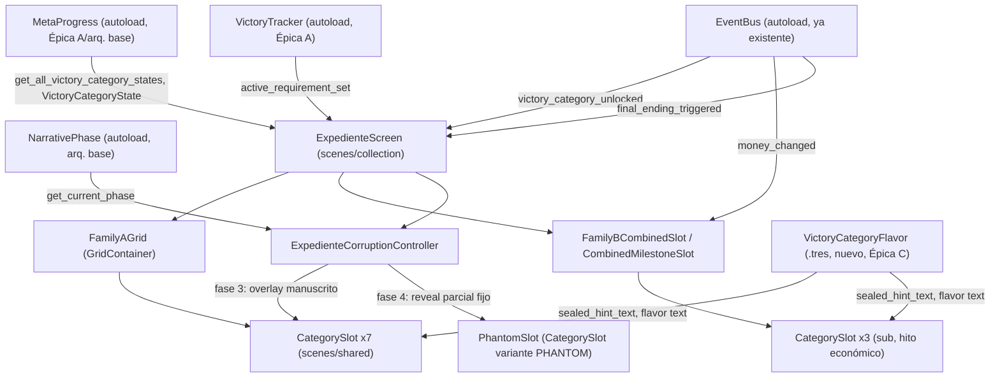
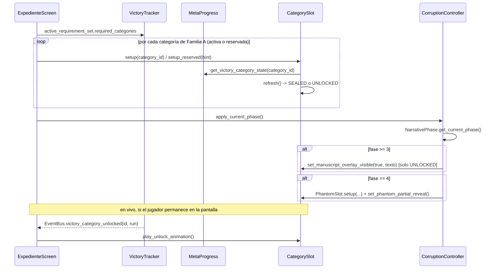

# Épica C — Pantalla de colección "Tu Expediente" (spec técnica, versión MVP)

Cubre historias C.1 y C.2 del backlog. Fuente de diseño: `.ai-studio/memory/game-design.md` → "Pantalla de
colección — Expediente de casa" y "Arco narrativo — Fases de deterioro". Vocabulario: `.ai-studio/memory/glossary.md`.

Reutiliza en su totalidad `.ai-studio/specs/_arquitectura-base.md` (autoloads `EventBus`, `MetaProgress`,
`NarrativePhase`, `RunState`, `EconomyRules`) y `.ai-studio/specs/epic-a-tipos-de-victoria.md` (autoload
`VictoryTracker`, recursos `VictoryCategoryDef`, `VictoryCategoryState`, `VictoryRequirementSet`, señales
`victory_category_unlocked` / `final_ending_triggered`). **No se rediseña la arquitectura de Épica A.** Esta
spec solo añade lo específico de la pantalla: escena, nodos, contenido narrativo de casillas selladas, y
reglas de deterioro visual por fase.

No se crean autoloads nuevos. No se crean recursos de estado runtime nuevos — el estado de cada categoría ya
vive en `VictoryCategoryState` (Épica A). Épica C sí añade **un recurso de contenido/definición** nuevo
(`VictoryCategoryFlavor`, sección 1) porque el texto de pista ambigua y flavor text de desbloqueo no tiene
todavía un lugar donde vivir como dato editable — `VictoryCategoryDef` (Épica A) deliberadamente no lo incluye
(es un recurso de *criterio de evaluación*, no de *contenido narrativo*; mezclarlos acoplaría a
Game Designer/narrative con el recurso que consume `VictoryTracker`).

---

## 0. Resumen de decisiones técnicas clave

1. **Separación estricta contenido/lógica**: `VictoryTracker` y sus recursos (`VictoryCategoryDef`,
   `VictoryCategoryState`) no se tocan. Épica C solo **lee** de `MetaProgress`/`VictoryTracker` y **añade**
   un recurso de contenido puro (`VictoryCategoryFlavor`) para pista ambigua + flavor text, indexado por el
   mismo `category_id` que ya usa Épica A. Esto permite que Game Designer/narrative rellene/edite textos sin
   tocar ningún script, y que Architect/Programmer no dupliquen el concepto de "categoría" en dos sistemas.
2. **La grilla se construye por iteración de datos, no por nodos fijos por categoría.** Un único
   `CategorySlot` (escena reutilizable) se instancia dinámicamente por cada entrada de
   `active_requirement_set.required_categories` (Épica A) más el slot combinado — igual que
   `VictoryTracker._evaluate_category()` es agnóstico al número de categorías, la escena de grilla es
   agnóstica a cuántas casillas de mercado existen (6 en MVP, 8 post-MVP). Añadir Corners/Resultado Exacto
   post-MVP es sumar 2 `.tres` de `VictoryCategoryFlavor`, no tocar la escena.
3. **Reserva de espacio visual para categorías post-MVP: SÍ, con casillas explícitamente "en proceso",
   distintas de una casilla sellada normal.** Ver sección 2.3 — decisión justificada ahí.
4. **El deterioro por fase (C.2) es una capa de presentación desacoplada del contenido**: un único nodo
   `ExpedienteCorruptionController` consulta `NarrativePhase.get_current_phase()` una vez al abrir la
   pantalla (más se re-suscribe por si el jugador completa una run mientras la pantalla está en memoria, caso
   límite poco probable pero cubierto) y aplica overlays visuales sobre la grilla ya construida, sin conocer
   el contenido de ninguna categoría. La casilla fantasma de fase 4 (C.2) es un slot más gestionado por este
   controller, no por el data-source de categorías de Épica A.
5. **Reutilización de patrón "documento redactado / destape"**: se modela como dos estados visuales de
   `CategorySlot` (`SEALED` / `UNLOCKED`) más un estado transitorio de animación (`UNLOCKING`), sin crear
   escenas separadas por estado — un único nodo con un `AnimationPlayer` y visibilidad condicional de sus
   sub-nodos, igual que se recomendaría para cualquier "card flip" reutilizable de UI de este proyecto (no
   existe todavía ningún componente compartido en `res://scenes/shared/` que hacer match, por lo que
   `CategorySlot` se construye aquí y queda disponible en `res://scenes/shared/` para que futuras pantallas
   de colección/logros lo reutilicen).

---

## 1. Recursos nuevos de Épica C

### 1.1 `VictoryCategoryFlavor` — contenido narrativo de una categoría (dato de diseño, nuevo)

`res://resources/definitions/victory_flavor/*.tres` — un `.tres` por categoría, **indexado por el mismo
`category_id` que `VictoryCategoryDef`** (Épica A, sección 1.1). No es una extensión de `VictoryCategoryDef`
ni vive en el mismo recurso: se mantiene como recurso independiente para que el paquete de contenido narrativo
(pistas, flavor text) pueda ser editado por Game Designer/narrative sin tocar el recurso que gobierna la
lógica de evaluación de `VictoryTracker`, y para que Épica C pueda cargar contenido de categorías que ni
siquiera estén en el `VictoryRequirementSet` activo (ej. Corners/Resultado Exacto reservadas, ver 2.3; o el
futuro Anexo de comportamiento observado).

```gdscript
class_name VictoryCategoryFlavor extends Resource

@export var category_id: StringName            # debe matchear un VictoryCategoryDef.category_id existente,
                                                 # o un id reservado para categoría post-MVP (ver 2.3)
@export var display_name: String                # duplicado deliberado de VictoryCategoryDef.display_name:
                                                 # ver nota más abajo
@export var sealed_hint_text: String            # pista ambigua, SIEMPRE visible aunque la categoría esté bloqueada
                                                 # ej. "Un acierto. Uno solo. ¿Cuándo te atreverás?"
@export var unlocked_flavor_text_template: String
    # plantilla con placeholders resueltos por CategorySlot al montar el estado UNLOCKED, ej.:
    # "Expediente actualizado. El sujeto acertó {criterio} el {fecha}. Se ha tomado nota."
    # placeholders soportados: {fecha} (de VictoryCategoryState.unlocked_at_date),
    #                          {run} (de VictoryCategoryState.unlocked_at_run_number)
    # NO incluye un placeholder de "criterio exacto" resuelto por código: el criterio ya cumplido se redacta
    # a mano por categoría (ver nota debajo) porque traducir VictoryCategoryDef.criterion_type +
    # parámetros a lenguaje natural es responsabilidad de contenido, no de una función genérica de UI.
@export var unlocked_criteria_text: String      # descripción en lenguaje natural del criterio YA CUMPLIDO,
                                                 # mostrada solo en estado UNLOCKED (nunca antes)
                                                 # ej. "Acertaste un resultado exacto."
```

Nota sobre `display_name` duplicado: `VictoryCategoryDef.display_name` (Épica A) ya existe y es la fuente de
verdad para lógica/debug. Se duplica aquí en vez de que `CategorySlot` lea directamente de
`VictoryCategoryDef` porque **una casilla sellada no debe mostrar el nombre real de la categoría si Game
Designer decide en el futuro que ni el nombre debe filtrarse** (ver 2.2 sobre qué se revela sellado). En MVP
ambos campos tendrán el mismo valor y Programmer puede optar por leer directamente de
`VictoryCategoryDef.display_name` si Game Designer confirma que el nombre siempre es público — se deja el
campo aquí para no bloquear esa decisión de contenido detrás de un cambio de arquitectura. Queda como nota
abierta para Game Designer en la sección 6.

### 1.2 Set de recursos necesarios para el MVP

Un `.tres` de `VictoryCategoryFlavor` por cada `category_id` de `victory_requirement_set_mvp.tres` (Épica A,
sección 1.1/1.3), más 2 adicionales para las casillas reservadas post-MVP (sección 2.3):

```
res://resources/definitions/victory_flavor/
  victory_base.tres
  victory_medias.tres
  victory_goles.tres
  victory_tarjetas.tres
  victory_faltas.tres
  economic_milestone_slot.tres        # cubre el copy general de la celda combinada
  economic_milestone_10k.tres         # sub-casilla, ver 2.4
  economic_milestone_100k.tres        # sub-casilla
  economic_milestone_1m.tres          # sub-casilla
  victory_corners.tres                # reservada, post-MVP — ver 2.3
  victory_resultado_exacto.tres       # reservada, post-MVP — ver 2.3
```

Redacción de estos `.tres` es tarea de contenido (Game Designer/narrative), no de Programmer — queda anotado
como pendiente explícito en sección 6, igual que ya anotó el backlog en la nota de C.1.

---

## 2. Escena — `res://scenes/collection/expediente_screen.tscn`

### 2.1 Árbol de nodos

```
ExpedienteScreen (Control)                         [script: expediente_screen.gd]
├── Background (TextureRect / ColorRect)            # fondo "documento burocrático"
├── HeaderPanel (Control)
│   ├── TitleLabel (Label)                          # "Tu Expediente"
│   └── CloseButton (Button)                         -> back al menú inter-run
├── FamilyAGrid (GridContainer)                      [script: category_grid.gd]
│   # 7 hijos CategorySlot en la versión completa; en MVP 5 activos + 2 reservados (ver 2.3)
│   ├── CategorySlot_victory_base            (instancia de category_slot.tscn)
│   ├── CategorySlot_victory_medias          (instancia de category_slot.tscn)
│   ├── CategorySlot_victory_goles           (instancia de category_slot.tscn)
│   ├── CategorySlot_victory_tarjetas        (instancia de category_slot.tscn)
│   ├── CategorySlot_victory_faltas          (instancia de category_slot.tscn)
│   ├── CategorySlot_victory_corners         (instancia de category_slot.tscn, modo RESERVED — ver 2.3)
│   └── CategorySlot_victory_resultado_exacto (instancia de category_slot.tscn, modo RESERVED)
├── FamilyBCombinedSlot (Control)                    [script: combined_milestone_slot.gd]
│   ├── CombinedHeaderLabel (Label)                  # nombre de la celda combinada
│   ├── SubSlot_10k  (instancia de category_slot.tscn, variante "sub", compact=true)
│   ├── SubSlot_100k (instancia de category_slot.tscn, variante "sub", compact=true)
│   └── SubSlot_1m   (instancia de category_slot.tscn, variante "sub", compact=true)
├── AnnexSection (Control)                           # placeholder vacío en MVP — ver nota
│   └── AnnexPlaceholderLabel (Label)                # "Anexo — Comportamiento observado (próximamente)"
├── PhantomSlot (instancia de category_slot.tscn, variante "phantom")  # solo visible fase 4 — ver 3.3
└── CorruptionController (Node)                       [script: expediente_corruption_controller.gd]
```

Notas de estructura:
- `AnnexSection` se deja como placeholder vacío/oculto en MVP porque el Anexo de comportamiento observado
  (Victoria de Hierro/Ludópata/Domingo/Fantasma) está explícitamente diferido a post-MVP en el backlog
  (`backlog.md` → "Épica (post-MVP) — Colección extendida"). Se reserva el nodo contenedor ahora para que
  esa épica futura no tenga que reestructurar `ExpedienteScreen.tscn`, pero no se construye contenido dentro.
  `AnnexPlaceholderLabel` es opcionalmente visible u oculto según decida Coordinator/Game Designer al cerrar
  el MVP (no es parte del criterio de éxito de C.1/C.2); si se oculta, el nodo puede quedar con `visible = false`
  sin eliminarse.
- `PhantomSlot` vive fuera de `FamilyAGrid`/`FamilyBCombinedSlot` como nodo hermano porque no es una
  categoría real de ningún `VictoryRequirementSet` — es puramente un efecto de fase 4 gestionado por
  `CorruptionController` (ver 3.3). No se registra en `MetaProgress` ni en `VictoryTracker`.

### 2.2 `CategorySlot` (`res://scenes/shared/category_slot.tscn`)

Componente reutilizable, un nodo por categoría (incluye las 3 sub-casillas de hito económico y la casilla
fantasma de fase 4 mediante variantes de configuración, no escenas separadas).

```
CategorySlot (Control)                              [script: category_slot.gd]
├── SealedState (Control)                           # visible cuando estado == SEALED
│   ├── RedactedNameLabel (Label)                    # nombre visible (ver nota "display_name")
│   ├── RedactionBarsTextureRect (TextureRect/NinePatchRect)  # barras negras estilo desclasificado
│   └── HintLabel (Label)                            # sealed_hint_text
├── UnlockedState (Control)                          # visible cuando estado == UNLOCKED
│   ├── DisplayNameLabel (Label)
│   ├── CriteriaLabel (Label)                        # unlocked_criteria_text
│   ├── AchievementDateLabel (Label)                 # "Run {n} — {fecha}"
│   └── FlavorTextLabel (Label)                       # unlocked_flavor_text_template ya resuelto
├── ReservedState (Control)                          # visible cuando estado == RESERVED (post-MVP, ver 2.3)
│   └── ReservedLabel (Label)                        # texto fijo, no lee VictoryCategoryFlavor
├── PhantomOverlay (Control)                         # solo usado por la variante "phantom" (fase 4, C.2)
│   └── PartiallyLiftedBarsTextureRect (TextureRect)  # barras negras parcialmente levantadas, nunca 100%
├── ManuscriptOverlay (Control)                       # solo usado en fase 3+, ver 3.2 — oculto por defecto
│   └── HandwrittenAnnotationLabel (Label/RichTextLabel)
└── UnlockAnimationPlayer (AnimationPlayer)           # anima transición SEALED -> UNLOCKED ("destape")
```

`category_slot.gd` — contrato (firmas, sin implementación):

```gdscript
class_name CategorySlot extends Control

enum SlotState { SEALED, UNLOCKED, RESERVED }
enum SlotVariant { STANDARD, SUB_MILESTONE, PHANTOM }

signal unlock_animation_finished(category_id: StringName)

## Configura el slot para una categoría real (Familia A o sub-casilla de Familia B).
## No dispara animación: usar para el estado inicial al abrir la pantalla.
func setup(category_id: StringName, variant: SlotVariant = SlotVariant.STANDARD) -> void

## Configura el slot como reservado (post-MVP, sin VictoryCategoryFlavor real detrás) — ver 2.3.
func setup_reserved(display_hint: String) -> void

## Refresca el contenido visible leyendo el estado actual de VictoryCategoryState (Épica A) y
## VictoryCategoryFlavor (1.1) para el category_id ya configurado. Idempotente.
func refresh() -> void

## Reproduce la animación de destape y transiciona a UNLOCKED al terminar. Emite unlock_animation_finished.
func play_unlock_animation() -> void

## Activa/desactiva el overlay de anotación manuscrita (fase 3+, C.2). No cambia SlotState.
func set_manuscript_overlay_visible(is_visible: bool, annotation_text: String = "") -> void
```

Qué se revela en estado `SEALED` (fija el alcance exacto pedido por C.1 — "nunca el criterio exacto"):
- `RedactedNameLabel`: nombre de la categoría (`VictoryCategoryFlavor.display_name`).
- `HintLabel`: `VictoryCategoryFlavor.sealed_hint_text` (pista ambigua predefinida).
- Nunca se muestra: `market_id`, `required_tag`, `required_count`, `money_thresholds`, ni ningún campo de
  `VictoryCategoryDef` — `CategorySlot` en estado `SEALED` **no lee `VictoryCategoryDef` en absoluto**, solo
  `VictoryCategoryFlavor` (contenido) y `VictoryCategoryState.unlocked` (para decidir si sigue sellado). Esto
  hace estructuralmente imposible una fuga de criterio exacto por bug de UI: el dato sensible ni siquiera
  llega al nodo mientras está sellado.

### 2.3 Decisión — reserva de espacio visual para Corners y Resultado Exacto

**Decisión: sí, la grilla de Familia A reserva las 7 casillas siempre, incluso en MVP con solo 5 categorías
de mercado activas.** Las 2 casillas de Corners/Resultado Exacto se muestran en estado `RESERVED` — visible,
pero explícitamente distinto de `SEALED`:

- `SEALED` (categoría real, no desbloqueada): nombre + pista ambigua, comunica "esto existe y es
  descubrible ahora".
- `RESERVED` (categoría post-MVP, no existe todavía en el juego): un texto fijo y genérico
  (`ReservedLabel`, ej. *"Expediente incompleto. Este archivo no ha sido abierto."*), sin pista, sin nombre
  de mercado real, para no prometer un reto que el jugador no puede perseguir todavía.

Razones:
1. **Consistencia con el layout ya fijado en `game-design.md`**: el diseño describe explícitamente "grilla
   de 7 casillas + 1 combinada" como estructura visual permanente de la pantalla, no como algo que crece de
   5 a 7 casillas en un patch. Ocultar 2 casillas en MVP y añadirlas después cambiaría el layout de
   `GridContainer` (5→7 columnas/filas) en un patch de contenido, mientras que reservarlas desde el inicio
   deja el layout estable para siempre — un solo `GridContainer` de 7 columnas, sin necesidad de re-diseñar
   la escena cuando A.6/A.7 se implementen.
2. **Coherencia narrativa con el tono de "dossier incompleto"**: un expediente burocrático con archivos
   pendientes de apertura encaja con el tono de vigilancia corporativa mejor que una grilla que
   silenciosamente tiene menos casillas — refuerza la sensación de que hay más por descubrir sin filtrar
   contenido real.
3. **Costo de implementación no aumenta**: `setup_reserved()` no necesita `VictoryCategoryDef` ni
   `VictoryCategoryFlavor` reales — es contenido trivial (un string fijo), no lógica.
4. **Migración a post-MVP sin tocar la escena**: cuando A.6/A.7 se implementen, el cambio es (a) crear los
   `.tres` de `VictoryCategoryFlavor` para `victory_corners`/`victory_resultado_exacto` con contenido real,
   (b) cambiar en `expediente_screen.gd` la llamada de `setup_reserved(...)` a `setup(category_id, ...)` para
   esos 2 slots. Cero cambios de layout, cero nodos nuevos.

`ExpedienteScreen` decide qué categorías están activas (llaman `setup`) vs. reservadas (llaman
`setup_reserved`) consultando una única fuente: si `category_id` está presente en
`VictoryTracker.active_requirement_set.required_categories` (Épica A, expuesto ya como propiedad del
autoload) → `setup()`; si no está pero corresponde a una casilla de layout fijo de Familia A (Corners,
Resultado Exacto) → `setup_reserved()`. Esto evita hardcodear en `ExpedienteScreen` la lista de "cuáles son
post-MVP": la única fuente de verdad de qué está activo sigue siendo el `VictoryRequirementSet` de Épica A.

### 2.4 Slot combinado de Familia B (`combined_milestone_slot.gd`)

```gdscript
class_name CombinedMilestoneSlot extends Control

## Refresca las 3 sub-casillas (10k/100k/1m) leyendo VictoryCategoryState.milestone_reached
## (Épica A, sección 1.2) del category_id "economic_milestone_slot", y el header/estado combinado
## general leyendo VictoryCategoryState.unlocked del mismo category_id.
func refresh() -> void
```

Contrato de lectura (ya definido por Épica A, sección 1.2 — no se añade nada nuevo, solo se documenta el
consumo):
- Celda combinada completa (para el final canónico): `VictoryCategoryState("economic_milestone_slot").unlocked`.
- Cada sub-casilla persigue su propio hito histórico, independiente de si el slot ya está resuelto:
  `VictoryCategoryState("economic_milestone_slot").milestone_reached[10000|100000|1000000]`.
- Las 3 sub-casillas usan `CategorySlot` en variante `SUB_MILESTONE` (`compact=true` reduce el tamaño del
  nodo pero reutiliza el mismo estado `SEALED`/`UNLOCKED`/animación de destape — cada sub-hito individual
  también se "destapa" con su propia fecha/run, coherente con `game-design.md`: *"las otras dos siguen
  visibles y perseguibles por separado como registro histórico"*). El texto de pista/flavor de cada
  sub-casilla sale de `victory_flavor/economic_milestone_10k.tres` etc. (sección 1.2) — no del
  `economic_milestone_slot.tres` general, que cubre solo el copy de la celda combinada como conjunto.

---

## 3. Conexión con autoloads — quién escucha qué

### 3.1 `expediente_screen.gd` — orquestador de la pantalla

```gdscript
class_name ExpedienteScreen extends Control

func _ready() -> void
    # 1. Itera VictoryTracker.active_requirement_set.required_categories (Familia A) + categorías
    #    reservadas de layout fijo -> configura cada CategorySlot (setup/setup_reserved) y llama refresh().
    # 2. Configura FamilyBCombinedSlot -> refresh().
    # 3. Delega a CorruptionController.apply_current_phase() (ver 3.2/3.3).
    # 4. Se suscribe a EventBus.victory_category_unlocked y EventBus.final_ending_triggered.

func _on_victory_category_unlocked(category_id: StringName, run_number: int) -> void
    # Busca el CategorySlot cuyo category_id matchea (incluidas las 3 sub-casillas de hito económico,
    # que no comparten category_id con el slot combinado -- ver nota de sub-hitos abajo) y llama
    # play_unlock_animation() SOLO SI la pantalla está actualmente visible/en árbol; si el desbloqueo
    # ocurre estando el jugador fuera de esta pantalla, refresh() en el próximo _ready() ya lo muestra
    # como UNLOCKED sin necesidad de reproducir la animación retroactivamente.

func _on_final_ending_triggered(run_number: int) -> void
    # Fuera de alcance de C.1/C.2: la presentación del final canónico en sí (evento narrativo) no
    # pertenece a esta pantalla según _arquitectura-base.md / epic-a spec (sección 7, "fuera de alcance").
    # ExpedienteScreen puede, como mucho, marcar visualmente que el set está 100% completo (todas las
    # casillas de Familia A + el slot combinado en UNLOCKED implica esto automáticamente vía refresh(),
    # sin lógica adicional) -- no se requiere un manejador especial más allá de refresh() ya cubierto
    # por _on_victory_category_unlocked.
```

Nota sobre sub-hitos económicos y la señal `victory_category_unlocked`: Épica A (sección 4.1, `_unlock_category`)
emite esa señal por `category_id` de `VictoryCategoryDef` — los 3 sub-hitos (10k/100k/1m) **no son
`VictoryCategoryDef` propios**, son campos internos (`milestone_reached`) del único category_id
`economic_milestone_slot` (ver Épica A sección 1.2/5, fila A.8). Esto significa que `VictoryTracker` tal
como está especificado en Épica A **no emite una señal granular por sub-hito individual** — solo emite
`victory_category_unlocked("economic_milestone_slot", run_number)` la primera vez que se resuelve el slot
completo (el primer umbral alcanzado). Para que las sub-casillas 10k/100k/1m puedan animarse individualmente
en tiempo real cuando el jugador está viendo la pantalla durante una run activa (caso: el jugador pasa de
10K a 100K a mitad de una run y decide mirar el Expediente), `CombinedMilestoneSlot` debe además
**suscribirse directamente a `EventBus.money_changed`** y comparar contra los umbrales ya no marcados en
`VictoryCategoryState.milestone_reached`, disparando su propio `play_unlock_animation()` de sub-casilla sin
depender de una señal nueva de Épica A. Se documenta aquí como responsabilidad explícita de
`CombinedMilestoneSlot`, no como ampliación de contrato de `VictoryTracker` — evita tocar Épica A ya cerrada.
Si Coordinator prefiriera en cambio ampliar `VictoryTracker` con una señal `milestone_threshold_reached(threshold:
int, run_number: int)`, es una alternativa válida pero **requiere reabrir la spec de Épica A**; esta spec de
Épica C elige explícitamente la opción que no toca Épica A.

### 3.2 `expediente_corruption_controller.gd` — deterioro por fase (C.2)

```gdscript
class_name ExpedienteCorruptionController extends Node

func apply_current_phase() -> void
    # Lee NarrativePhase.get_current_phase() una vez y aplica el nivel de corrupción correspondiente
    # (ver 3.3). Llamado desde ExpedienteScreen._ready().

func _apply_phase_1_2() -> void   # documento limpio -- estado base, sin overlays
func _apply_phase_3() -> void     # activa ManuscriptOverlay en N casillas ya UNLOCKED (ver detalle abajo)
func _apply_phase_4() -> void     # phase_3 + muestra y configura PhantomSlot (ver detalle abajo)
```

No se suscribe a un hipotético `NarrativePhase.phase_changed` (esa señal no existe en la arquitectura base —
`NarrativePhase` no emite señales, es de solo consulta, ver `_arquitectura-base.md` sección 2.3). La fase
narrativa solo puede cambiar entre runs (el número de run solo avanza al cerrar una run,
`MetaProgress.advance_run_number()`), y la pantalla del Expediente solo es accesible desde el menú inter-run
(fuera de una run activa) — por lo tanto **consultar la fase una sola vez en `_ready()` es correcto y
suficiente**, no hace falta reactividad en caliente dentro de la propia sesión de la pantalla.

### 3.3 Reglas de deterioro por fase (contrato explícito, versión final de C.2)

| Fase | Regla | Implementación |
|---|---|---|
| PHASE_1, PHASE_2 | Documento limpio, sin overlays. | `CorruptionController` no activa ningún `ManuscriptOverlay` ni muestra `PhantomSlot` (`visible = false`). |
| PHASE_3 | Casillas ya `UNLOCKED` muestran anotación manuscrita superpuesta. `PhantomSlot` sigue oculto. | Para cada `CategorySlot` en estado `UNLOCKED` (consultado vía `VictoryCategoryState.unlocked`, no vía un nuevo campo), llama `set_manuscript_overlay_visible(true, text)`. El `text` de la anotación es contenido nuevo (ver 3.4) — no reutiliza `unlocked_flavor_text_template`, es una capa superpuesta *encima* del flavor text ya existente, coherente con `game-design.md`: *"como si alguien (algo) hubiera intervenido el documento oficial"*. |
| PHASE_4 | Igual que fase 3, más: `PhantomSlot` visible, en variante `PHANTOM`, con `PartiallyLiftedBarsTextureRect` mostrando las barras negras en una posición fija de "parcialmente levantadas" — **nunca** en estado `UNLOCKED` completo. | `PhantomSlot.setup(&"phantom_unnamed", SlotVariant.PHANTOM)` seguido de una llamada de configuración específica (`set_phantom_partial_reveal()`, ver abajo) que fija la animación en un frame intermedio fijo del `UnlockAnimationPlayer`, sin permitir que llegue al final. |

Contrato adicional en `category_slot.gd` para la variante `PHANTOM` (fase 4):

```gdscript
## Solo válido en SlotVariant.PHANTOM. Detiene la animación de destape en un punto intermedio fijo
## (nunca 100%) y la deja congelada ahí — es una decisión de diseño explícita, no un bug de animación:
## "la casilla nunca se completa del todo" (game-design.md).
func set_phantom_partial_reveal() -> void
```

`PhantomSlot` no tiene `category_id` real, no lee `VictoryCategoryState` ni `VictoryCategoryFlavor` de
ningún registro de `MetaProgress`/Épica A — es puramente decorativo/narrativo, gestionado enteramente por
`CorruptionController` con contenido fijo embebido en la propia escena o en un recurso mínimo dedicado
(`res://resources/definitions/victory_flavor/phantom_slot_flavor.tres`, mismo tipo `VictoryCategoryFlavor`
reutilizado por conveniencia de tipo, pero **no registrado en ningún `VictoryRequirementSet`** — nunca
cuenta para el final canónico, coherente con `game-design.md`: *"pista visual de que el final canónico... está
cerca, y de que ganar la colección no es lo mismo que salir"*).

### 3.4 Contenido nuevo requerido para C.2 (anotar para Game Designer/narrative)

- 1 texto de anotación manuscrita por categoría desbloqueable (o un pool genérico reutilizable si Game
  Designer prefiere no redactar 6-8 variantes) — mostrado en fase 3+ sobre casillas ya `UNLOCKED`.
- 1 texto fijo para `PhantomSlot` (fase 4) — nombre ambiguo/redactado (nunca un `display_name` real) y una
  pista igual de ambigua que las demás, pero que deliberadamente nunca se resuelve.

---

## 4. Diagrama de dependencias (Mermaid)





---

## 5. Archivos a crear (resumen para Programmer)

```
res://scenes/collection/expediente_screen.tscn
res://scenes/collection/expediente_screen.gd
res://scenes/collection/combined_milestone_slot.gd     # script del nodo FamilyBCombinedSlot

res://scenes/shared/category_slot.tscn
res://scenes/shared/category_slot.gd

res://scripts/collection/expediente_corruption_controller.gd

res://resources/definitions/victory_flavor/victory_category_flavor.gd   # class_name VictoryCategoryFlavor
res://resources/definitions/victory_flavor/victory_base.tres
res://resources/definitions/victory_flavor/victory_medias.tres
res://resources/definitions/victory_flavor/victory_goles.tres
res://resources/definitions/victory_flavor/victory_tarjetas.tres
res://resources/definitions/victory_flavor/victory_faltas.tres
res://resources/definitions/victory_flavor/economic_milestone_slot.tres
res://resources/definitions/victory_flavor/economic_milestone_10k.tres
res://resources/definitions/victory_flavor/economic_milestone_100k.tres
res://resources/definitions/victory_flavor/economic_milestone_1m.tres
res://resources/definitions/victory_flavor/victory_corners.tres          # reservada, contenido genérico
res://resources/definitions/victory_flavor/victory_resultado_exacto.tres # reservada, contenido genérico
res://resources/definitions/victory_flavor/phantom_slot_flavor.tres      # fase 4, nunca cuenta para el final
```

No se crean autoloads nuevos. No se modifica `_arquitectura-base.md` ni la spec de Épica A: ambas quedan
como dependencias de solo lectura para esta épica.

---

## 6. Dependencias y fuera de alcance

- **Depende de** (ya definido, no se toca): `EventBus` (`victory_category_unlocked`, `final_ending_triggered`,
  `money_changed`), `MetaProgress` (`get_victory_category_state`, `get_all_victory_category_states`),
  `VictoryTracker` (`active_requirement_set`), `NarrativePhase` (`get_current_phase`).
- **Bloqueada en paralelo, no en serie**: C.1 puede construirse con datos mock de `VictoryCategoryState`
  mientras Épica A avanza (igual nota que ya deja el backlog); el contrato de lectura ya está fijado en esta
  spec y en la de Épica A, por lo que no hay ambigüedad que resolver cuando se integren.
- **Pendiente de contenido (no de arquitectura)**, a coordinar con Game Designer/narrative antes de dar C.1/C.2
  por cerradas en implementación real (los `.tres` pueden llevar texto placeholder mientras tanto sin
  bloquear a Programmer):
  - Los 11 `.tres` de `VictoryCategoryFlavor` listados en sección 1.2/5 (pista ambigua + criterio cumplido +
    plantilla de flavor text por categoría, incluidas las 2 reservadas y la fantasma).
  - Confirmar si `RedactedNameLabel` en estado `SEALED` debe mostrar siempre el nombre real de la categoría
    (asumido en esta spec, coherente con la tabla de `game-design.md` que ya nombra las categorías
    explícitamente) o si Game Designer quiere ocultarlo también — ver nota en sección 1.1.
  - Texto de anotación manuscrita (fase 3+) y texto fijo de `PhantomSlot` (fase 4) — sección 3.4.
- **Fuera de alcance de este documento**: contenido/presentación del Anexo de comportamiento observado
  (post-MVP, sección de nodo reservada en 2.1 pero sin implementar); presentación del evento de final
  canónico en sí (`final_ending_triggered`) más allá de que la propia grilla refleje el 100% de categorías
  completas — pertenece a la capa narrativa del final, fuera de alcance también en la spec de Épica A
  (sección 7).
