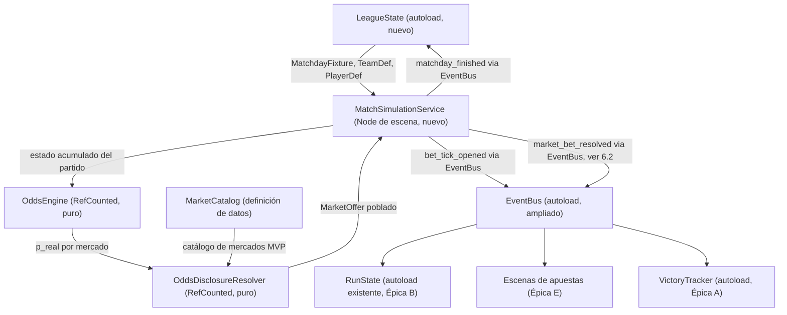
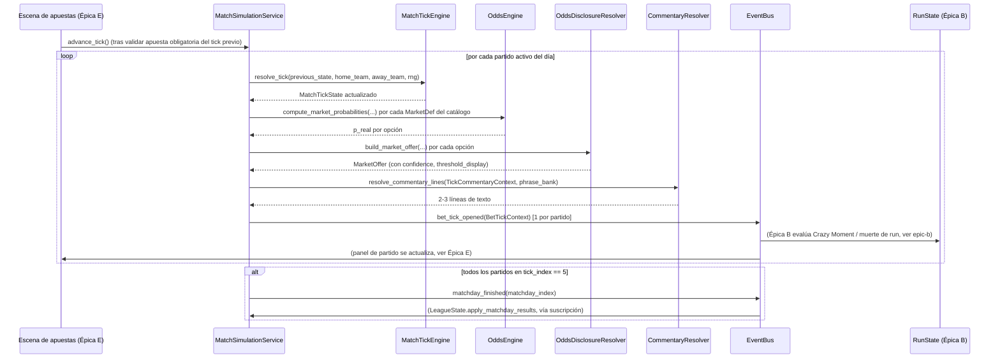

# Épica D — Simulación de liga y partidos (motor de tick) — spec técnica

Cubre historias D.1 a D.5 del backlog. Fuente de diseño: `.ai-studio/memory/game-design.md` → "Liga
ficticia", "Sistema de tiempo semi-pausado", "Sistema de apuestas", "Odds y cuotas". Vocabulario:
`.ai-studio/memory/glossary.md`.

Reutiliza en su totalidad `.ai-studio/specs/_arquitectura-base.md` (autoloads `EventBus`, `MetaProgress`,
`NarrativePhase`, `RunState`, `EconomyRules`, y los recursos `RunResult`, `BettingDay`, `BetTickContext`,
`MarketOffer`) y consume convenciones ya usadas en `epic-b-economia-de-run.md` / `epic-a-tipos-de-victoria.md`
(lógica pura en clases `RefCounted` bajo `res://scripts/`, datos de diseño en `Resource` `.tres` bajo
`res://resources/definitions/`, estado runtime en `res://resources/runtime/`). **No se rediseña el contrato
ya fijado en `_arquitectura-base.md` sección 4** (`BetTickContext`, `MarketOffer`, señal
`EventBus.bet_tick_opened`) — esta épica lo implementa. Se extiende `MarketOffer` con un campo nuevo
(`market_id` ya existe; se documenta abajo qué falta) solo donde es estrictamente necesario, justificado caso
por caso.

Ningún fragmento de código aquí es GDScript final: son firmas/contratos para que Programmer implemente sin
ambigüedad.

---

## 0. Resumen de decisiones técnicas clave

1. **`BettingTickService` se llama, en su forma definitiva, `MatchSimulationService` y es un nodo de escena
   (`Node`), no un autoload.** Ver sección 1 para la justificación completa. El nombre `BettingTickService`
   queda descartado (era un placeholder de la arquitectura base) porque describe mal su responsabilidad real
   (simula partidos; emitir el tick de apuesta es una consecuencia, no el propósito). El contrato de señales
   que la arquitectura base fijó (`EventBus.bet_tick_opened(context: BetTickContext)`) no cambia — solo
   cambia qué objeto lo emite y dónde vive.
2. **La liga (equipos, jugadores, calendario, standings) vive en un autoload nuevo, `LeagueState`,
   separado de `MetaProgress`.** No se mete en `MetaProgress` a pesar de que persiste igual que el resto de
   meta-progresión, porque su volumen de datos (20 equipos, ~500 jugadores, calendario de 38 jornadas,
   standings) es cualitativamente distinto de los campos escalares/listas cortas que ya tiene `MetaProgress`
   (bonus desbloqueados, categorías de victoria). Separar el archivo de guardado de la liga
   (`user://save_league.tres`) del de meta-progresión (`user://save_meta.tres`) permite además regenerar la
   liga en jornada 38 (nueva temporada) sin tocar ni releer el resto del save. Ver sección 2 para el detalle
   de por qué esto no viola la regla de "no crear un segundo autoload de persistencia" de la arquitectura
   base: `LeagueState` persiste con el mismo mecanismo (`ResourceSaver`/`ResourceLoader` sobre `Resource`),
   solo en archivo separado — la regla que importa (un único *mecanismo* de guardado, no un único *archivo*)
   se mantiene.
3. **La simulación de partido es determinista dado un seed, y se resuelve por atributos + ruido acotado, no
   puramente aleatoria.** Motor de "tick delta": en cada uno de los 6 ticks se generan eventos discretos
   (gol, tarjeta, tiro, corner, falta) por muestreo ponderado a partir de los atributos de ambos equipos
   (ofensiva/defensiva/forma/factor local) y de los jugadores relevantes, acumulando estado sobre el tick
   anterior. Ver sección 4.
4. **Las probabilidades de mercado ("odds") se derivan en dos pasos separados y explícitos**: (a) un
   **motor de probabilidad real interno** (`OddsEngine`, puro, nunca expuesto al jugador) que calcula
   `p_real` por mercado a partir de atributos + estado acumulado del partido; (b) una **capa de
   presentación/opacidad** (`OddsDisclosureResolver`) que aplica margen de casa + ensancha `p_real` en un
   rango visible (`displayed_probability_min/max`) sin investigación. Esto es lo que rellena `MarketOffer` y
   lo que calcula `confidence` (ver sección 5.3). Separar estos dos pasos es lo que permite que la futura
   historia de "investigación inter-run" (fuera de esta épica, gap ya señalado en el backlog) solo tenga que
   tocar el paso (b) — estrechar el rango — sin tocar el motor de probabilidad real.
5. **Los comentarios textuales (D.4) se generan por un resolver de datos puro que produce una lista de
   `StringName` de "eventos de tick" + metadata, y un segundo componente (fuera del alcance de esta spec, de
   Game Designer/narrativa) resuelve esos eventos a texto final según banco de frases por
   `NarrativePhase`.** Se fija aquí el contrato de datos (`TickCommentaryContext`), no el copy.
6. **Corners es solo estadística de panel en el MVP, no mercado.** Confirmado contra `game-design.md`: el
   panel de información por partido lista explícitamente "posesión, tiros a puerta, tarjetas, corners" como
   estadísticas del panel (sección "Sistema de tiempo semi-pausado"), mientras que "Sistema de apuestas →
   Mercados disponibles (MVP)" no incluye corners como mercado (queda en "Mercados requeridos por la Win
   condition", explícitamente post-MVP junto a Resultado Exacto). D.3 simula y expone corners como campo de
   `MatchTickState` (estadística), pero `MarketCatalog` (sección 3) no genera ningún `MarketOffer` de
   corners en el MVP.

---

## 1. `BettingTickService` → decisión definitiva: `MatchSimulationService`, nodo de escena (no autoload)

### Justificación (nodo de escena, no autoload)

La arquitectura base dejó la puerta abierta explícitamente ("nombre a confirmar... o si conviene que sea un
objeto de escena"). Criterio de decisión aplicado:

- **Identidad de partida en curso, no identidad global de programa.** Un autoload vive durante toda la
  ejecución del juego, desde el menú principal. `MatchSimulationService` solo tiene sentido *mientras hay una
  jornada de partidos en curso* (viernes→domingo de una run activa) — no existe "simulación de partido" en
  la pantalla de inicio, en el Expediente, ni en la fase inter-run. Forzarlo a autoload significaría que
  existe todo el tiempo pero solo "hace algo" durante una fracción del loop, exactamente el antipatrón que
  `RunState` ya evita para `current_money` (RunState sí es autoload porque el dinero de la run **sí** tiene
  sentido consultarlo desde cualquier pantalla del loop, incluida meta; la simulación de partido no).
- **Ciclo de vida explícito y reiniciable.** Cada run nueva necesita una instancia de simulación "limpia"
  (nuevos partidos de la jornada correspondiente, temporizadores de tick reseteados). Con un `Node` de escena
  esto es gratis: se instancia al entrar a la escena de apuestas (`res://scenes/betting/`) y se libera
  (`queue_free()`) al salir. Con un autoload habría que añadir métodos de "reset" manuales que ya sabemos
  (por la nota de "convenciones para Programmer" de la arquitectura base) que el proyecto prefiere evitar
  cuando el ciclo de vida natural de Godot ya resuelve el problema.
- **No rompe el contrato con Épica B.** B.2/B.3/B.4 (`RunState`) solo dependen de la señal
  `EventBus.bet_tick_opened` y de los recursos `BetTickContext`/`MarketOffer`/`CrazyBetContext` — nunca
  llaman directamente a `BettingTickService` por nombre de autoload (arquitectura base sección 4.1: "Qué
  necesita Épica B **de** ese sistema" está descrito enteramente en términos de señal + recursos, no de
  llamadas a método). Cambiar de autoload a nodo de escena es, por tanto, un cambio que Épica B no necesita
  ni notar.

### Ubicación y ciclo de vida

```
res://scenes/betting/match_simulation_service.gd   # Node, hijo de la escena raíz de apuestas (res://scenes/betting/betting_root.tscn)
```

`MatchSimulationService` es un `Node` (no necesita árbol de renderizado, solo `_process`/temporizador lógico)
instanciado como hijo directo de la escena raíz de la jornada de apuestas. Se crea al entrar a esa escena
(inicio de run, o al recuperar una run en curso desde guardado — fuera de alcance de esta épica definir
save/load de mitad de run, ver nota en sección 7) y se destruye al salir de ella (fin de run → pantalla de
resumen de lunes, Épica E.5/E.6).

```gdscript
class_name MatchSimulationService extends Node

## Llamado una vez al entrar a la escena de apuestas de una run, con la jornada ya resuelta por LeagueState.
func start_matchday(matchday: MatchdayFixture, day: BettingDay.Day) -> void

## Avanza manualmente al siguiente tick de todos los partidos en curso de este día.
## Quien lo llama: la UI de apuestas (Épica E), tras validar que el jugador ya cumplió
## la apuesta obligatoria del tick actual (regla de B.2/B.3, no de esta épica).
func advance_tick() -> void

## true si todos los partidos del día ya llegaron al minuto 90.
func is_matchday_finished() -> bool
```

Nota de contrato explícito para Épica E: `MatchSimulationService` **no** avanza de tick automáticamente por
temporizador real — avanza cuando `advance_tick()` es invocado, y quien decide cuándo invocarlo es la UI de
apuestas, después de que el jugador cumplió su apuesta obligatoria del tick vigente (coherente con "no existe
opción de pasar sin apostar", `game-design.md`). Esto evita que la épica de simulación tenga que conocer el
estado de validación de apuesta de Épica B/E.

### Diagrama de dependencias



---

## 2. `LeagueState` (autoload nuevo) — D.1, D.2

### Orden de carga (actualiza la tabla de la arquitectura base)

```
1. EventBus
2. MetaProgress
3. NarrativePhase
4. RunState
5. EconomyRules
6. VictoryTracker      (Épica A)
7. LeagueState         <- nuevo, Épica D
```

`LeagueState` se carga después de `MetaProgress` (necesita saber si hay una liga guardada para esta campaña
o si debe generarla) pero no depende de `RunState`/`VictoryTracker` — se documenta el orden solo para
completar la tabla, no hay dependencia estricta de carga con ellos.

### Responsabilidad

Fuente de verdad de la liga: equipos, jugadores, calendario de 38 jornadas, standings, estadísticas de
jugador acumuladas. Persiste en su propio archivo (`user://save_league.tres`), independiente de
`user://save_meta.tres`.

```gdscript
# LeagueState (autoload)
var teams: Array[TeamDef]                      # 20 equipos, ver 2.1
var calendar: Array[MatchdayFixture]            # 38 entradas, ver 2.3
var standings: Dictionary                       # team_id (StringName) -> TeamStandingEntry, ver 2.2
var current_matchday_index: int                 # 0-based, 0-37
var current_season_number: int                  # se incrementa al regenerar liga tras jornada 38

func generate_new_league(season_number: int, rng_seed: int) -> void
    # D.1: genera 20 TeamDef + plantillas de PlayerDef + calendario de 38 jornadas.
    # Llamado al inicio de una campaña nueva y al completar la jornada 38 (nueva temporada).

func get_current_matchday_fixture() -> MatchdayFixture
func get_team(team_id: StringName) -> TeamDef
func get_standing(team_id: StringName) -> TeamStandingEntry
func apply_matchday_results(results: Array[MatchResult]) -> void
    # D.2: llamado por MatchSimulationService cuando is_matchday_finished() == true.
    # Actualiza standings (puntos/GF/GC/forma) y estadísticas de jugador, avanza current_matchday_index,
    # y dispara regeneración de liga si current_matchday_index supera 37 (nueva temporada).

func save() -> void
func load_or_create() -> void   # llamado una vez al boot; si no existe save_league.tres, llama generate_new_league()
```

### 2.1 `TeamDef` (`res://resources/runtime/team_def.gd`)

```gdscript
class_name TeamDef extends Resource

@export var team_id: StringName          # ej. "real_madrileno", "fc_barceloneta"
@export var display_name: String         # "Real Madrileño"
@export var offense: float                # 0.0-1.0
@export var defense: float                # 0.0-1.0
@export var current_form: float           # 0.0-1.0, se recalcula en cada apply_matchday_results (D.2)
@export var home_advantage: float         # 0.0-1.0, factor local — constante por equipo, no cambia jornada a jornada
@export var is_star_team: bool            # true para equipos con peso hacia jerarquía reconocible (ver 2.4)
@export var squad: Array[PlayerDef]
```

### `PlayerDef` (`res://resources/runtime/player_def.gd`)

```gdscript
class_name PlayerDef extends Resource

enum Position { GOALKEEPER, DEFENDER, MIDFIELDER, FORWARD }

@export var player_id: StringName
@export var display_name: String
@export var team_id: StringName
@export var position: Position
@export var avg_goals_per_match: float    # media de goles por partido, ya diferenciada por posición al generar
@export var card_probability: float       # 0.0-1.0, probabilidad de recibir tarjeta en un partido

# Estadísticas acumuladas de temporada — actualizadas por D.2, no en la generación inicial (D.1)
@export var season_goals: int = 0
@export var season_cards: int = 0
@export var season_matches_played: int = 0
```

### 2.2 `TeamStandingEntry` (`res://resources/runtime/team_standing_entry.gd`)

```gdscript
class_name TeamStandingEntry extends Resource

@export var team_id: StringName
@export var points: int = 0
@export var goals_for: int = 0
@export var goals_against: int = 0
@export var matches_played: int = 0
@export var last_5_results: Array[int] = []   # 0=derrota,1=empate,3=victoria; array de máx 5, FIFO (ver nota)
```

Nota `last_5_results`: se implementa como cola FIFO de tamaño máximo 5 (`append` + `pop_front` si
`size() > 5`), no como ventana calculada sobre historial completo — evita guardar el historial completo de
resultados de la temporada solo para derivar "forma últimos 5". `TeamDef.current_form` (2.1) se recalcula
como promedio normalizado (0.0-1.0) de `last_5_results` tras cada jornada, y es lo que alimenta `OddsEngine`
en jornadas siguientes (la forma de jornadas ya jugadas influye en las probabilidades de las siguientes,
coherente con `game-design.md`: "el motor calcula probabilidades base a partir de los atributos + historial
de jornadas anteriores").

### 2.3 `MatchdayFixture` (`res://resources/runtime/matchday_fixture.gd`)

```gdscript
class_name MatchdayFixture extends Resource

@export var matchday_index: int                 # 0-based, 0-37
@export var matches: Array[MatchFixture]        # ~10 partidos, todos los equipos juegan exactamente una vez
```

```gdscript
class_name MatchFixture extends Resource

@export var match_id: StringName                # único por temporada, ej. "s1_md3_m7"
@export var home_team_id: StringName
@export var away_team_id: StringName
```

Algoritmo de generación de calendario (D.1): round-robin estándar (círculo de rotación, 1 equipo fijo + 19
rotando) para garantizar "cada equipo juega exactamente una vez por jornada" en las 38 jornadas (19 jornadas
ida + 19 vuelta con 20 equipos), sin colisiones. Es un algoritmo conocido y determinista dado el orden inicial
de equipos — no requiere lógica de emparejamiento aleatorio jornada a jornada (evita el riesgo de generar un
calendario inválido). El único componente aleatorio de D.1 es el orden inicial de equipos antes de aplicar
round-robin (irrelevante para la validez del calendario) y la generación de atributos (2.4).

### 2.4 Generación de atributos con peso hacia jerarquía (D.1)

Para que "la jerarquía de equipos estrella sea perceptible" (criterio de éxito D.1):

- De los 20 equipos, un subconjunto fijo por configuración (`EconomyRules`-equivalente para liga, ver
  `LeagueRules` en sección 2.5) se marca `is_star_team = true` (propuesta: 4 de 20, ~20%).
- `offense`/`defense` se generan por muestreo de dos distribuciones distintas: equipos estrella muestrean de
  un rango alto (ej. `[0.65, 0.95]`), el resto de un rango medio-bajo con cola (ej. `[0.25, 0.75]`). Esto es
  intencionalmente una tabla de configuración (no una curva compleja) para que Game Designer pueda ajustar
  balance sin tocar código, análoga a como `EconomyRules.CRAZY_BET_WEIGHTS_BY_PHASE` ya se modela como
  diccionario de constantes en Épica B.
- `current_form` inicial (antes de jugarse ninguna jornada) se genera con ruido pequeño alrededor de 0.5,
  independiente de si el equipo es estrella (la forma es "lo que está pasando ahora", no un atributo de
  calidad estructural).
- `home_advantage` se genera con rango más estrecho y no correlacionado con `is_star_team` (un equipo
  pequeño puede tener un fortín local notable — es una fuente de variedad narrativa/de upsets, relevante para
  Épica A.1 "underdog_win").

### 2.5 `LeagueRules` (`res://autoloads/league_rules.gd`, autoload nuevo, análogo a `EconomyRules`)

Se crea un autoload de constantes propio (no se añade a `EconomyRules`) porque `EconomyRules` es
explícitamente el objeto de configuración de la *economía de run* (Épica B); las constantes de generación de
liga/partido son un dominio de balance distinto, con otro dueño natural de contenido (Game Designer de
liga/deportes, no de economía). Mismo patrón: solo constantes + funciones de cálculo puras, sin estado.

```gdscript
# LeagueRules (autoload)
const TEAM_COUNT: int = 20
const STAR_TEAM_COUNT: int = 4
const OFFENSE_DEFENSE_RANGE_STAR: Vector2 = Vector2(0.65, 0.95)
const OFFENSE_DEFENSE_RANGE_NORMAL: Vector2 = Vector2(0.25, 0.75)
const SQUAD_SIZE_PER_TEAM: int = 18
const TOTAL_MATCHDAYS: int = 38
const TICKS_PER_MATCH: int = 6
const MATCH_MINUTES_PER_TICK: int = 15
```

Orden de carga final (actualización completa de la tabla):

```
1. EventBus
2. MetaProgress
3. NarrativePhase
4. RunState
5. EconomyRules
6. VictoryTracker
7. LeagueRules       <- nuevo, Épica D
8. LeagueState       <- nuevo, Épica D (lee LeagueRules)
```

---

## 3. Catálogo de mercados — `MarketCatalog`

`res://resources/definitions/market/*.tres` — ya anticipado como carpeta en la arquitectura base
(`resources/definitions/market/`, "una .tres por mercado de apuesta, usado también por Épica A"). Épica D es
quien finalmente puebla esta carpeta con contenido real.

```gdscript
class_name MarketDef extends Resource

enum MarketKind { MATCH_RESULT_1X2, GOALS_OVER_UNDER, FIRST_SCORER, BOTH_TEAMS_SCORE, CARDS_OVER_UNDER, FOULS_OVER_UNDER }

@export var market_id: StringName        # "1x2", "goals_ou_2_5", "goals_ou_1_5", "goals_ou_3_5",
                                          # "first_scorer", "btts", "cards_ou", "fouls_ou"
@export var kind: MarketKind
@export var threshold: float              # solo relevante para *_OVER_UNDER (1.5/2.5/3.5 goles, umbral de tarjetas/faltas)
@export var base_house_margin: float      # margen de casa base 0.0-1.0, ver 5.2
```

Instancias necesarias para el MVP (8 `.tres`, cubriendo los 6 "mercados disponibles (MVP)" de
`game-design.md` — nótese que "Goles totales" son 3 `.tres` por los 3 umbrales variables, y se añade
`fouls_ou` que el propio documento ya pide como mercado adicional de bajo costo, ya asumido por Épica A.5):

| `market_id` | `kind` | `threshold` | Nota |
|---|---|---|---|
| `1x2` | MATCH_RESULT_1X2 | — | usado por Épica A.1 (Victoria de Base) |
| `goals_ou_1_5` | GOALS_OVER_UNDER | 1.5 | |
| `goals_ou_2_5` | GOALS_OVER_UNDER | 2.5 | usado por Épica A.2 (Victoria de Medias); también identificado genéricamente como `goals_ou` por A.3 (ver nota abajo) |
| `goals_ou_3_5` | GOALS_OVER_UNDER | 3.5 | |
| `first_scorer` | FIRST_SCORER | — | |
| `btts` | BOTH_TEAMS_SCORE | — | |
| `cards_ou` | CARDS_OVER_UNDER | (config, ver `LeagueRules`) | usado por Épica A.4 (Victoria de Tarjetas) |
| `fouls_ou` | FOULS_OVER_UNDER | (config, ver `LeagueRules`) | usado por Épica A.5 (Victoria de Faltas) |

**Nota de reconciliación con Épica A**: la spec de Épica A (`epic-a-tipos-de-victoria.md`, sección 1.1) usa
`market_id="goals_ou"` genérico para Victoria de Goles (A.3, "5 aciertos del mercado de goles totales en
cualquier umbral ofertado"). Épica D emite `market_id` específico por umbral (`goals_ou_1_5`,
`goals_ou_2_5`, `goals_ou_3_5`) en `MarketBetResult.market_id`, porque cada umbral es una oferta de apuesta
distinta con su propia probabilidad — **no existe un mercado real llamado `goals_ou`**. Esta spec fija el
contrato de reconciliación explícito para que Programmer no lo interprete libremente: `VictoryTracker`
(Épica A) debe tratar cualquier `market_bet_result.market_id` que empiece por el prefijo `"goals_ou_"` como
perteneciente a la categoría genérica de goles a efectos de A.3, mientras que A.2 (Victoria de Medias) solo
cuenta el caso exacto `market_id == "goals_ou_2_5"`. Esto es una nota de integración entre Épica A y D, no un
cambio a la spec ya cerrada de Épica A — Programmer debe aplicar este matching por prefijo en
`VictoryTracker._on_market_bet_resolved`, documentado aquí porque D es quien define los `market_id` reales
por primera vez.

`CARDS_OVER_UNDER`/`FOULS_OVER_UNDER` no tienen un único `threshold` fijo global: el umbral ofertado varía por
partido (ver `OddsEngine`, sección 5), tomado de una tabla de umbrales candidatos en `LeagueRules`
(`CARDS_THRESHOLDS: Array[float] = [3.5, 4.5]`, `FOULS_THRESHOLDS: Array[float] = [19.5, 22.5]` — valores de
contenido, ajustables por Game Designer). El `.tres` de catálogo define el mercado como concepto; el
`MarketOffer` de cada tick concreto es quien lleva el `threshold` elegido para ese partido (campo nuevo, ver
sección 6).

---

## 4. Motor de simulación de partido (D.3) — `MatchTickEngine`

`res://scripts/league/match_tick_engine.gd`, clase `RefCounted`, lógica pura (sin nodo, testeable aislado,
mismo patrón que `StakeResolver`/`CrazyBetResolver` de Épica B). Invocado por `MatchSimulationService` una vez
por partido por tick.

### 4.1 `MatchTickState` (`res://resources/runtime/match_tick_state.gd`) — estado acumulado de un partido

```gdscript
class_name MatchTickState extends Resource

@export var match_id: StringName
@export var home_team_id: StringName
@export var away_team_id: StringName
@export var current_tick_index: int = 0        # 0-5
@export var current_minute: int = 0            # 0, 15, 30, 45, 60, 75, 90 tras cada tick
@export var home_goals: int = 0
@export var away_goals: int = 0
@export var possession_home_pct: float = 50.0   # acumulado, se re-normaliza cada tick
@export var shots_on_target_home: int = 0
@export var shots_on_target_away: int = 0
@export var cards_home: int = 0
@export var cards_away: int = 0
@export var corners_home: int = 0               # solo estadística de panel, ver decisión 6
@export var corners_away: int = 0
@export var fouls_home: int = 0
@export var fouls_away: int = 0
@export var goal_scorers: Array[StringName] = []  # player_id, en orden — para mercado first_scorer
@export var tick_events: Array[MatchTickEvent]     # eventos discretos SOLO del tick recién resuelto (se reemplaza cada tick, no acumula)
```

### 4.2 `MatchTickEvent` (`res://resources/runtime/match_tick_event.gd`) — evento discreto de un tick

```gdscript
class_name MatchTickEvent extends Resource

enum EventKind { GOAL, CARD, SHOT_ON_TARGET, SHOT_OFF_TARGET, CORNER, FOUL, NO_EVENT }

@export var kind: EventKind
@export var team_id: StringName            # equipo que protagoniza el evento
@export var player_id: StringName          # "" si no aplica (ej. corner sin jugador destacado)
@export var minute: int                    # minuto exacto dentro del tick (current_minute anterior + 1..15)
```

`tick_events` es el input directo de D.4 (comentarios) — no requiere volver a derivarlo del delta de
contadores porque ya viene como lista de eventos discretos con su jugador/minuto.

### 4.3 Contrato de `MatchTickEngine`

```gdscript
class_name MatchTickEngine extends RefCounted

## Resuelve un único tick de 15 minutos para un partido, mutando/devolviendo el nuevo MatchTickState.
## No conoce mercados ni apuestas — solo produce el estado del partido en sí.
static func resolve_tick(previous_state: MatchTickState, home_team: TeamDef, away_team: TeamDef, rng: RandomNumberGenerator) -> MatchTickState:
    pass
```

Algoritmo (determinístico dado el mismo `rng` state, ponderado por atributos — no puramente aleatorio, tal
como exige el criterio de éxito de D.3):

1. Calcular `attack_pressure_home = home_team.offense * (1 + home_team.home_advantage) * home_team.current_form`
   y análogo para away sin `home_advantage`. Estos dos valores son los pesos relativos que gobiernan cuántos
   eventos ofensivos genera cada equipo este tick (no una probabilidad de gol directa).
2. Muestrear un número pequeño de "intentos" por equipo este tick (ej. Poisson con λ proporcional a
   `attack_pressure`), cada intento se resuelve como `SHOT_OFF_TARGET`, `SHOT_ON_TARGET`, o `GOAL`
   (`GOAL` solo posible desde un intento ya clasificado `SHOT_ON_TARGET`, ponderado por
   `1 - defense_del_rival`).
3. Goles atribuidos a un `player_id` de la plantilla, muestreado por peso `avg_goals_per_match` entre
   `FORWARD`/`MIDFIELDER` del equipo (posiciones con `avg_goals_per_match` más alto tienen más probabilidad
   de ser el asignado).
4. Tarjetas/faltas/corners muestreados de forma independiente por tick con tasas base en `LeagueRules`
   (constantes nuevas: `BASE_FOULS_PER_TICK_RANGE`, `BASE_CARDS_PER_TICK_CHANCE`,
   `BASE_CORNERS_PER_TICK_RANGE`), ajustadas levemente por `defense`/`offense` del rival (más faltas cuando
   defiendes contra más ofensiva rival). Tarjetas de jugador concreto muestreadas por `card_probability`.
5. Todo lo anterior se acumula sobre `previous_state` (contadores suman, no se reemplazan) excepto
   `tick_events`, que se reemplaza (solo eventos de este tick) y `current_minute`/`current_tick_index`, que
   avanzan.

Este algoritmo es contrato de comportamiento (qué debe cumplir: ponderado por atributos, coherente
tick a tick), no pseudocódigo obligatorio línea por línea — Programmer puede ajustar la distribución exacta
(Poisson vs. binomial, etc.) siempre que se preserve: (a) más `offense`/`current_form`/`home_advantage` →
más eventos ofensivos esperados: (b) el resultado del partido completo (6 ticks) debe correlacionar con la
diferencia de atributos entre equipos de forma verificable en test (equipo con atributos muy superiores gana
la mayoría de partidos simulados en una muestra grande), sin ser 100% determinista (debe permitir upsets,
necesarios para Épica A.1).

### 4.4 `MatchSimulationService` — orquestación de múltiples partidos en paralelo

```gdscript
# MatchSimulationService (Node), continuación de sección 1
var active_matches: Dictionary   # match_id (StringName) -> MatchTickState
var _rng: RandomNumberGenerator

func start_matchday(matchday: MatchdayFixture, day: BettingDay.Day) -> void:
    # instancia un MatchTickState inicial (todo en cero, current_tick_index=0) por cada MatchFixture del día
    pass

func advance_tick() -> void:
    # para cada match en active_matches:
    #   1. MatchTickEngine.resolve_tick(...)
    #   2. OddsEngine.compute_market_probabilities(...) (sección 5)
    #   3. OddsDisclosureResolver.build_market_offers(...) (sección 5.2) -> Array[MarketOffer]
    #   4. arma BetTickContext(day, tick_index_in_day=current_tick_index, available_markets)
    #   5. EventBus.emit_signal("bet_tick_opened", context)   -- UNA señal por partido enfocable,
    #      ver nota de "varios partidos en paralelo" abajo
    # tras procesar todos los partidos del tick, si current_tick_index == 5 para todos: emite matchday_finished
    pass
```

**Nota sobre "varios partidos en paralelo" y el contrato `bet_tick_opened`**: `game-design.md` especifica que
varios partidos corren en paralelo y el jugador decide en cuál enfocar atención cada tick, con apuestas
abiertas simultáneamente en varios. El contrato ya fijado en la arquitectura base declara
`BetTickContext` con un único `match_id` implícito por `MarketOffer.match_id` (no un array de partidos por
contexto) — se preserva sin ambigüedad: `MatchSimulationService` emite **una señal `bet_tick_opened` por
partido**, no una por jornada. Los `MarketOffer.match_id` de un mismo `BetTickContext` son siempre del mismo
partido. La UI de apuestas (Épica E) es quien agrupa las N señales recibidas en el mismo tick global (mismo
`tick_index_in_day`) en su selector de partidos — Épica D no necesita un recurso "jornada de contextos", ya
que reutilizar el contrato 1 señal = 1 `BetTickContext` = 1 partido es más simple y no requiere tocar el
recurso ya fijado por Épica B. Se dejará una nota equivalente en la spec de Épica E cuando se diseñe (fuera
de esta spec, pero relevante para quien la escriba).

---

## 5. Motor de probabilidades (D.5) — `OddsEngine` + `OddsDisclosureResolver`

### 5.1 `OddsEngine` (`res://scripts/league/odds_engine.gd`, `RefCounted`, puro)

Calcula la probabilidad **real interna** (`p_real`, nunca mostrada al jugador tal cual) de cada resultado de
cada mercado disponible, dado el estado acumulado de un partido y los atributos de ambos equipos.

```gdscript
class_name OddsEngine extends RefCounted

## Devuelve p_real (0.0-1.0) por cada opción del mercado, ya normalizado a que sume 1.0 dentro del mismo mercado
## cuando el mercado tiene opciones mutuamente excluyentes (1x2, over/under).
static func compute_market_probabilities(market: MarketDef, state: MatchTickState, home_team: TeamDef, away_team: TeamDef) -> Dictionary:
    # devuelve { option_key: String -> p_real: float }
    # ej. para "1x2": { "home": 0.55, "draw": 0.25, "away": 0.20 }
    # ej. para "goals_ou_2_5": { "over": 0.62, "under": 0.38 }
    pass
```

Principio de cálculo (mismo espíritu que 4.3): combina atributos base (`offense`/`defense`/`current_form`/
`home_advantage`) con el estado ya transcurrido del partido (marcador actual, minutos restantes) — un
partido que va 2-0 a favor del local en el minuto 60 debe mostrar `p_real("home")` de 1x2 más alta que al
inicio del partido, y la probabilidad de "under 2.5" debe bajar si ya van 3 goles (imposible ya, `p_real = 0`
o cercano, salvo que el umbral aplicable sea otro — ver nota de recalibración de umbral en 5.4). Esto es
justamente el criterio de éxito de D.3 ("un equipo que va ganando 2-0 no puede mostrar probabilidad de 2.5
goles totales sin subir").

### 5.2 Margen de casa — `OddsDisclosureResolver`

`res://scripts/league/odds_disclosure_resolver.gd`, `RefCounted`, puro. Aplica margen de casa y ensancha el
rango visible, produciendo el `MarketOffer` final.

```gdscript
class_name OddsDisclosureResolver extends RefCounted

## Aplica margen de casa (nunca expuesto) sobre p_real, y calcula el rango visible ancho.
## displayed_probability_min/max SIEMPRE contienen el valor real ajustado por margen en algún punto interior
## del rango (nunca fuera de rango) para que el rango sea honesto aunque impreciso.
static func build_market_offer(market: MarketDef, option_key: String, p_real: float, house_margin: float,
        match_id: StringName, phase: NarrativePhase.Phase) -> MarketOffer:
    pass

## Ancho del rango mostrado. Constante base + variación leve, NUNCA colapsa en esta épica
## (la investigación que estrecha el rango es una épica futura, fuera de alcance — ver decisión 4).
static func compute_range_width(market: MarketDef, phase: NarrativePhase.Phase) -> float:
    pass
```

Constantes nuevas en `LeagueRules`:

```gdscript
# LeagueRules
const ODDS_DISPLAY_RANGE_WIDTH_BASE: float = 0.20   # ej. rango total de ~20 puntos porcentuales, "entre 40% y 65%" ~ 0.25 de ancho real de ejemplo en game-design.md; 0.20 es la base ajustable
const ODDS_DISPLAY_RANGE_WIDTH_VARIATION: float = 0.05  # variación aleatoria +/- para que no todos los rangos midan exactamente lo mismo
const HOUSE_MARGIN_BY_MARKET: Dictionary = {
    "1x2": 0.06, "goals_ou_1_5": 0.05, "goals_ou_2_5": 0.05, "goals_ou_3_5": 0.06,
    "first_scorer": 0.10, "btts": 0.05, "cards_ou": 0.07, "fouls_ou": 0.07,
}
const HOUSE_MARGIN_SUNDAY_MULTIPLIER: float = 1.3   # "restricciones de domingo: márgenes de casa aumentan"
const HOUSE_MARGIN_PHASE_INCREMENT: Dictionary = {
    NarrativePhase.Phase.PHASE_1: 0.0, NarrativePhase.Phase.PHASE_2: 0.0,
    NarrativePhase.Phase.PHASE_3: 0.02, NarrativePhase.Phase.PHASE_4: 0.05,
}
```

Fórmula: `effective_margin = base_margin_por_mercado * (SUNDAY_MULTIPLIER si day==SUNDAY else 1.0) +
phase_increment`. `p_shown_center = p_real * (1 - effective_margin)` (el margen de casa siempre reduce la
probabilidad/cuota mostrada a favor de la casa, nunca al revés). El rango
`[displayed_probability_min, displayed_probability_max]` se centra en `p_shown_center` con ancho
`compute_range_width(...)`, recortado a `[0.0, 1.0]`.

### 5.3 Cálculo de `confidence` (respuesta a la nota abierta de D.3/B.3)

`epic-b-economia-de-run.md` y `_arquitectura-base.md` dejan `confidence` como campo consumido por B.3 pero
sin fórmula fijada, delegado explícitamente a esta épica. Decisión:

```
confidence = 1.0 - compute_range_width(market, phase) / ODDS_DISPLAY_RANGE_WIDTH_MAX_POSSIBLE
```

donde `ODDS_DISPLAY_RANGE_WIDTH_MAX_POSSIBLE` es una constante (`LeagueRules`, ej. `0.35`) que representa el
ancho de rango más grande que el sistema puede mostrar sin investigación. En la práctica, en el MVP (sin
investigación inter-run implementada, decisión de alcance ya fijada por Coordinator en el backlog de Épica
D), `compute_range_width` no varía por jugador — varía solo por mercado y fase narrativa (ver 5.2) — por lo
que `confidence` en el MVP es, de hecho, una función pura de `(market_id, phase, day)`, no del progreso del
jugador. Esto es intencional y coherente con el alcance ya delimitado: el "mercado más seguro" que B.3 excluye
en un Momento Crazy siempre será, en el MVP, el mercado con menor margen de casa/rango más angosto de forma
consistente (ej. `goals_ou_1_5` o `btts`, mercados con menor `base_house_margin` en la tabla 5.2) — no
cambia con investigación porque esa mecánica aún no existe. Cuando la épica de investigación se implemente,
extiende esta misma fórmula multiplicando por un factor de "conocimiento del jugador para ese mercado" sin
cambiar la firma de `confidence` en `MarketOffer` (ya es solo un `float`, no requiere cambio de recurso).

### 5.4 Umbral variable de over/under (nota de implementación)

Para `cards_ou`/`fouls_ou`, cuyo `threshold` no es fijo (sección 3), `OddsEngine`/`OddsDisclosureResolver`
reciben el `threshold` elegido para ese partido (elegido una vez al iniciar el partido, no cambia tick a
tick, de la tabla `LeagueRules.CARDS_THRESHOLDS`/`FOULS_THRESHOLDS`, ponderado hacia el umbral cuya
probabilidad real quede más cerca de 50/50 dado el estado del partido en curso al momento de decidir —
evita ofertar un umbral trivial como "under 1.5 faltas" que ya sea imposible de perder a esta altura del
partido).

---

## 6. Extensión de `MarketOffer` — campo nuevo `threshold_display`

`MarketOffer` (arquitectura base, sección 4.4) se **extiende** con un campo nuevo, no se rediseña:

```gdscript
class_name MarketOffer extends Resource

@export var market_id: StringName          # ya existente
@export var match_id: StringName           # ya existente
@export var displayed_probability_min: float  # ya existente
@export var displayed_probability_max: float  # ya existente
@export var confidence: float               # ya existente

@export var option_key: StringName          # NUEVO — ver justificación (a)
@export var threshold_display: float        # NUEVO — ver justificación (b), default -1.0 si no aplica
```

Justificación de los dos campos nuevos:

(a) **`option_key`**: `MarketOffer` tal como está definido en la arquitectura base representa un mercado,
pero un mercado como `1x2` tiene 3 opciones (home/draw/away) con probabilidad propia cada una, y
`goals_ou_2_5` tiene 2 (over/under). El diseño original de `MarketOffer` no distinguía explícitamente si
"un `MarketOffer`" es el mercado completo o una opción dentro de él. Se fija aquí, porque D es la primera
épica que efectivamente puebla este recurso con datos reales: **un `MarketOffer` = una opción apostable**
(ej. hay 3 instancias de `MarketOffer` con `market_id="1x2"` y `match_id` igual, una por `option_key` en
`{"home","draw","away"}`). Esto es coherente con cómo Épica A ya consume `MarketOffer`/`MarketBetResult`
(una apuesta se hace sobre una opción concreta, no sobre "el mercado" en abstracto) y no requiere tocar
ningún campo ya usado por B.3 (`confidence` sigue siendo por instancia, es decir, por opción — el "mercado
más seguro" en la práctica es la opción más segura, que es exactamente lo que B.3 ya necesita).

(b) **`threshold_display`**: necesario para que la UI (Épica E) pueda mostrar "Over 2.5" o "Under 22.5
faltas" sin tener que ir a buscar el `MarketDef.threshold` fijo (que, para `cards_ou`/`fouls_ou`, no es fijo
por mercado sino elegido por partido, sección 5.4). Se pobla siempre que `MarketDef.kind` sea alguno de los
`*_OVER_UNDER`; `-1.0` (sentinel, documentado) en el resto.

Ningún campo existente de `MarketOffer` cambia de tipo o significado — es una extensión aditiva, coherente
con la instrucción de reutilizar sin rediseñar.

---

## 7. Comentarios textuales por tick (D.4) — `TickCommentaryContext`

`res://resources/runtime/tick_commentary_context.gd` — recurso de transporte nuevo, **contrato de datos, no
de copy** (el copy real por fase es responsabilidad de Game Designer/narrativa, según delega explícitamente
la historia D.4 del backlog).

```gdscript
class_name TickCommentaryContext extends Resource

@export var match_id: StringName
@export var tick_index_in_day: int
@export var phase: NarrativePhase.Phase          # tono a aplicar, ya resuelto por NarrativePhase.get_current_phase()
@export var is_crazy_moment: bool                # true si EventBus.crazy_moment_triggered está activo este tick (ver Épica B.3)
@export var events: Array[MatchTickEvent]         # copia de MatchTickState.tick_events de este tick (sección 4.2)
@export var score_home: int
@export var score_away: int
@export var home_team_display_name: String
@export var away_team_display_name: String
```

### `CommentaryResolver` — contrato de selección (lógica de selección sí es alcance de D.4; el banco de
frases final, no)

```gdscript
class_name CommentaryResolver extends RefCounted

## Devuelve 2-3 líneas de texto ya resueltas (placeholders sustituidos), priorizando eventos de mayor
## relevancia narrativa (GOAL > CARD > SHOT_ON_TARGET > resto) y respetando el tono de `context.phase`.
## Si `context.is_crazy_moment == true`, ignora los eventos del partido y devuelve la línea dirigida
## directamente al jugador (banco de frases de Momento Crazy, ver game-design.md → "Cómo se distingue").
static func resolve_commentary_lines(context: TickCommentaryContext, phrase_bank: CommentaryPhraseBank) -> Array[String]:
    pass
```

`CommentaryPhraseBank` (`res://resources/definitions/commentary/*.tres`) es el recurso de contenido puro
(plantillas de texto por `EventKind` × `NarrativePhase.Phase`, con placeholders `{team}`, `{player}`,
`{score}`) que Game Designer/narrativa rellena — mismo patrón exacto que `VictoryCategoryFlavor` en Épica C
(separación estricta contenido/lógica). No se detalla aquí el set de textos: es contenido, no arquitectura.
`CommentaryResolver.resolve_commentary_lines` es agnóstico al contenido real de las plantillas, solo aplica
las reglas de selección/prioridad y sustitución de placeholders.

Regla de prioridad de selección (2-3 líneas de 2-3 candidatas, sección "criterio de éxito" D.4: "relacionadas
con eventos de ese tick específico, no genéricas"):
1. Si hay al menos un `GOAL` en `events`, la primera línea siempre lo cubre.
2. Si hay `CARD`, se prioriza como segunda línea.
3. Si no hay eventos relevantes (`tick_events` solo contiene `NO_EVENT`/tiros fallidos), se usa una plantilla
   de "tramo sin eventos" (banco de frases también la define, por fase).
4. Momento Crazy (`is_crazy_moment == true`) sobreescribe todo lo anterior — coherente con B.3.

---

## 8. Diagrama de secuencia — un tick completo



---

## 9. Señales nuevas / ampliadas en `EventBus`

```gdscript
# Ya existentes, reutilizadas sin cambio (arquitectura base):
signal bet_tick_opened(context: BetTickContext)

# Nuevas, añadidas por Épica D:
signal matchday_finished(matchday_index: int)   # emitido por MatchSimulationService al terminar los 6 ticks de todos los partidos del día
signal market_bet_resolved(result: MarketBetResult)
    # NOTA: esta señal ya estaba declarada como contrato de entrada de Épica A (epic-a-tipos-de-victoria.md,
    # sección 2) pero quien la EMITE nunca quedó definido allí ("emitido por el sistema de apuestas, fuera
    # de alcance"). Épica D es ese sistema: MatchSimulationService (en colaboración con la UI de apuestas de
    # Épica E, que sabe qué apuestas del jugador siguen pendientes al resolverse un tick) es responsable de
    # emitirla. El cálculo de context_tags ("underdog_win", "dirty_match_fouls_gt_20") se resuelve con datos
    # que ya produce esta épica: "underdog_win" compara p_real (OddsEngine) de la opción ganadora del 1x2
    # contra las demás en el momento de cierre de la apuesta; "dirty_match_fouls_gt_20" es
    # (fouls_home + fouls_away) > 20 sobre el MatchTickState final. Se deja fijado aquí porque Épica A dejó
    # esto como "dependencia explícita a validar con quien diseñe el sistema de mercados/partidos" — queda
    # validado: los datos existen en MatchTickState/OddsEngine, no requieren un cálculo nuevo fuera de esta
    # épica.
```

Responsable exacto de emitir `market_bet_resolved`: la resolución de una apuesta requiere cruzar "qué apostó
el jugador" (dato que vive en la UI/estado de apuestas de Épica E, no en `MatchSimulationService`, que no
conoce apuestas del jugador) con "qué pasó en el partido" (`MatchTickState`, que sí vive en esta épica). Se
fija el contrato de responsabilidad: **Épica E emite la señal**, usando un resolver que Épica D expone:

```gdscript
class_name MarketBetResultBuilder extends RefCounted

## Dado el estado final relevante del partido y la opción apostada por el jugador, arma el MarketBetResult
## completo incluyendo context_tags. Vive en res://scripts/league/market_bet_result_builder.gd (Épica D)
## porque necesita OddsEngine/MatchTickState; lo INVOCA la UI de apuestas (Épica E) al resolver un tick.
static func build_result(market_offer: MarketOffer, won: bool, match_state: MatchTickState,
        matchday_id: StringName, run_number: int) -> MarketBetResult:
    pass
```

Esto evita que `MatchSimulationService` necesite conocer el concepto de "apuesta del jugador" (que no existe
en esta épica, pertenece a Épica E), preservando la separación de responsabilidades: D simula partidos y
probabilidades, E gestiona qué apostó el jugador y cuándo se resuelve.

---

## 10. Resumen de archivos a crear (para Programmer)

```
res://autoloads/league_rules.gd
res://autoloads/league_state.gd

res://resources/runtime/team_def.gd
res://resources/runtime/player_def.gd
res://resources/runtime/team_standing_entry.gd
res://resources/runtime/matchday_fixture.gd        # incluye clase interna/archivo hermano MatchFixture
res://resources/runtime/match_fixture.gd
res://resources/runtime/match_tick_state.gd
res://resources/runtime/match_tick_event.gd
res://resources/runtime/tick_commentary_context.gd
res://resources/runtime/match_result.gd             # resultado final agregado de un partido, consumido por LeagueState.apply_matchday_results

res://resources/definitions/market/market_def.gd
res://resources/definitions/market/1x2.tres
res://resources/definitions/market/goals_ou_1_5.tres
res://resources/definitions/market/goals_ou_2_5.tres
res://resources/definitions/market/goals_ou_3_5.tres
res://resources/definitions/market/first_scorer.tres
res://resources/definitions/market/btts.tres
res://resources/definitions/market/cards_ou.tres
res://resources/definitions/market/fouls_ou.tres

res://resources/definitions/commentary/commentary_phrase_bank.gd   # + .tres por fase, contenido de Game Designer

res://scripts/league/match_tick_engine.gd
res://scripts/league/odds_engine.gd
res://scripts/league/odds_disclosure_resolver.gd
res://scripts/league/commentary_resolver.gd
res://scripts/league/market_bet_result_builder.gd
res://scripts/league/league_generator.gd            # lógica de D.1 (round-robin + generación de atributos), invocada por LeagueState.generate_new_league

res://scenes/betting/match_simulation_service.gd    # Node, NO autoload — ver sección 1
```

Modificación (extensión, no rediseño) de un recurso ya existente:

```
res://resources/runtime/market_offer.gd   # + option_key: StringName, + threshold_display: float
```

Actualización de `project.godot` (orden de autoloads):

```
1. EventBus
2. MetaProgress
3. NarrativePhase
4. RunState
5. EconomyRules
6. VictoryTracker
7. LeagueRules
8. LeagueState
```

(`MatchSimulationService` explícitamente NO entra en esta lista — se instancia como nodo hijo de
`res://scenes/betting/betting_root.tscn`, fuera de alcance de esta épica definir esa escena raíz en detalle,
pertenece a Épica E.)

---

## 11. Dependencias y fuera de alcance

- **Depende de** (ya definido, no se toca): `EventBus`, `NarrativePhase`, `BetTickContext`, `MarketOffer`
  (extendido, sección 6), `BettingDay`.
- **Consumido por**: Épica B (`bet_tick_opened`, `confidence` para B.3), Épica A (`market_bet_resolved` con
  `MarketBetResult`, construido con ayuda de `MarketBetResultBuilder` de esta épica pero emitido por Épica E),
  Épica E (toda la UI de apuestas, panel de partido, selector de partidos en paralelo).
- **Fuera de alcance de esta spec** (confirmado explícitamente):
  - Investigación inter-run que colapsa el rango (`OddsDisclosureResolver.compute_range_width` está
    preparado para recibir un factor adicional en el futuro, pero esa historia no se diseña aquí).
  - Historial completo de temporadas pasadas / archivo de temporadas anteriores (solo se persiste la liga
    activa; `current_season_number` se incrementa pero no se guarda un array histórico de ligas pasadas —
    no lo pide ningún criterio de éxito de D.1/D.2).
  - Guardado/carga de una run a mitad de jornada (persistencia de `MatchTickState` en curso). El backlog no
    lo exige explícitamente y `RunState`/arquitectura base tampoco define save/load de partida en curso; se
    asume que una sesión de juego completa una jornada de principio a fin sin cerrar la app a mitad de
    partido. Si esto cambia, requiere una historia nueva (no es una interpretación libre de esta spec).
  - Contenido real de comentarios (banco de frases) y de pistas/flavor — responsabilidad de Game
    Designer/narrativa, ya señalado explícitamente por el backlog para D.4.
  - Escena/nodos concretos de la UI de apuestas (`res://scenes/betting/betting_root.tscn` y todo lo que
    cuelgue de ella salvo `MatchSimulationService`) — pertenecen a Épica E.
```
