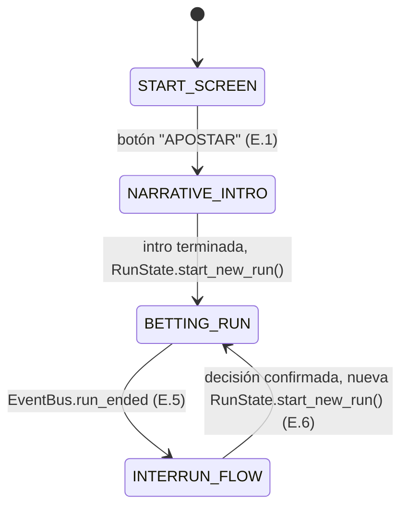
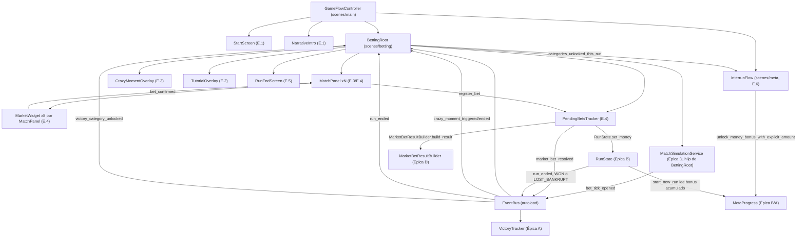
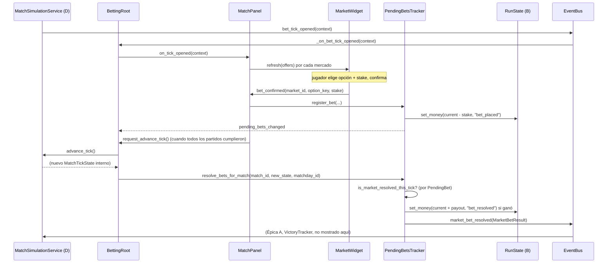

# Épica E — Pantalla de apuestas e interacción de tick (spec técnica, versión MVP)

Cubre historias E.1 a E.6 del backlog. Fuente de diseño: `.ai-studio/memory/game-design.md` → "Primer minuto
y onboarding", "Sistema de tiempo semi-pausado", "Sistema de apuestas" (especialmente "Presentación"),
"Restricciones del domingo" (dentro de "Sistema de apuestas"), "Fase inter-run (lunes-jueves)". Vocabulario:
`.ai-studio/memory/glossary.md`.

Reutiliza en su totalidad `.ai-studio/specs/_arquitectura-base.md` (autoloads `EventBus`, `MetaProgress`,
`NarrativePhase`, `RunState`, `EconomyRules`, recursos `RunResult`, `BettingDay`, `BetTickContext`,
`MarketOffer`, `CrazyBetContext`), `.ai-studio/specs/epic-b-economia-de-run.md` (`StakeResolver`,
`CrazyBetResolver`, señales `crazy_moment_triggered`/`crazy_moment_ended`/`run_ended`), y
`.ai-studio/specs/epic-d-liga-y-partidos.md` (`MatchSimulationService`, `LeagueState`, `MarketDef`,
`MarketCatalog`, `OddsDisclosureResolver`, `TickCommentaryContext`, `MarketBetResultBuilder`, campos
`option_key`/`threshold_display` de `MarketOffer`). **No se rediseña ningún contrato ya fijado en A/B/D.**
Esta spec solo añade lo específico de la UI de apuestas: escenas, nodos, flujo de pantallas, y el punto exacto
donde se invoca `MarketBetResultBuilder` para emitir `EventBus.market_bet_resolved` (responsabilidad delegada
explícitamente a esta épica por D, sección 9 de esa spec).

Ningún fragmento de código aquí es GDScript final: son firmas/contratos para que Programmer implemente sin
ambigüedad.

---

## 0. Resumen de decisiones técnicas clave

1. **Una única escena raíz de run (`res://scenes/betting/betting_root.tscn`) orquesta todo el ciclo
   viernes→domingo**, incluyendo la instancia de `MatchSimulationService` (D, sección 1) como hijo directo,
   tal como esa spec ya anticipa. `BettingRoot` es el nodo que Épica E añade formalmente al lugar que D dejó
   reservado. No es un autoload: se instancia al entrar a una run (`run_started` o al arrancar desde
   continuar campaña) y se libera al cerrar la run (transición a fase inter-run, E.6).
2. **El flujo de pantallas es una máquina de estados simple gestionada por un único nodo controlador
   (`GameFlowController`), no un árbol de escenas anidado con `change_scene_to_file` por cada paso.** Se
   justifica en la sección 1: reutiliza patrón ya visto en el proyecto (autoloads = orquestación mínima +
   estado; nodos de escena = ciclo de vida acotado) y evita recargar/perder estado de `RunState`/`LeagueState`
   entre pantallas que en realidad pertenecen al mismo momento lógico (intro → landing → tick loop → cierre).
3. **El panel de partido (E.3) y la interfaz de mercados (E.4) son el mismo componente reutilizable
   (`MatchPanel`), no dos escenas separadas.** `MatchPanel` se instancia una vez por partido con apuestas
   abiertas ese día (varios en paralelo, según D sección 4.4) y contiene internamente los 6 widgets de mercado
   MVP. Esto responde directamente a la nota de D: "la UI de apuestas es quien agrupa las N señales recibidas
   en el mismo tick global... en su selector de partidos".
4. **Un único componente de mercado genérico (`MarketWidget`) parametrizado por `MarketDef.kind`, no 6
   escenas distintas.** Mismo patrón de "dato gobierna presentación" que `VictoryCategoryDef`/`CategorySlot`
   en Épicas A/C — los 6 mercados MVP comparten la misma estructura de interacción (lista de `option_key` +
   stake), solo cambia cómo se etiquetan las opciones (`"home"/"draw"/"away"` vs `"over"/"under"` vs
   `player_id` para primer goleador).
5. **`PendingBetsTracker` (nodo de escena, no autoload) es el único lugar que sabe "qué apostó el jugador en
   qué tick de qué partido todavía sin resolver".** Ni `MatchSimulationService` (D) ni `RunState` (B) conocen
   este concepto — coherente con la nota explícita de D sección 9 ("D no conoce apuestas del jugador"). Es
   este componente el que invoca `MarketBetResultBuilder.build_result(...)` (D) al resolverse un tick y emite
   `EventBus.market_bet_resolved` (contrato que A ya consume).
6. **El tutorial integrado (E.2) no es una escena/pantalla separada**: es un modo de `MatchPanel` +
   `GameFlowController` que se activa leyendo un flag de `MetaProgress`, superpone anotaciones sobre los
   nodos ya existentes de la UI normal, y bloquea el avance de tick hasta la primera confirmación de apuesta
   — sin introducir un segundo árbol de nodos paralelo.
7. **El Momento Crazy (B.3) se refleja en la UI mediante un componente de presentación desacoplado
   (`CrazyMomentOverlay`) que solo consume `CrazyBetContext`/señales, nunca decide lógica de restricción.**
   `MatchPanel` deshabilita mercados no permitidos consultando `CrazyBetContext.allowed_market_ids` que ya
   llega resuelto por B — no reimplementa `CrazyBetResolver`.
8. **E.6 (fase inter-run mínima) vive en su propia escena raíz separada de `betting_root.tscn`**
   (`res://scenes/meta/interrun_flow.tscn`), reutilizando la convención de carpeta `scenes/meta/` ya prevista
   en la arquitectura base. Es una máquina de estados propia y mucho más simple (2 pantallas secuenciales),
   sin relación de nodos con `BettingRoot` — solo se comunican por señales de `EventBus` y por lectura/escritura
   de autoloads (`RunState`, `MetaProgress`).

---

## 1. `GameFlowController` — orquestador de alto nivel (E.1, E.5, E.6)

### Ubicación y responsabilidad

`res://scenes/main/game_flow_controller.gd`, nodo raíz de `res://scenes/main/main.tscn` — **la única escena
que Godot carga como `run/main_scene` en `project.godot`**. No es autoload: es la raíz de escena de toda la
aplicación, vive siempre, y decide qué sub-escena (`betting_root.tscn`, `interrun_flow.tscn`, pantalla de
inicio) está activa como hija en cada momento. Esto evita que ningún autoload necesite conocer
`get_tree().current_scene` (regla ya fijada en arquitectura base sección 6).

```gdscript
class_name GameFlowController extends Node

enum FlowState { START_SCREEN, NARRATIVE_INTRO, BETTING_RUN, INTERRUN_FLOW }

func _ready() -> void
    # 1. MetaProgress.load_or_create() (si no se hizo ya en un autoload _ready — a confirmar con Programmer
    #    cuál boot-step invoca esto primero; no es responsabilidad de esta spec redefinirlo).
    # 2. LeagueState.load_or_create().
    # 3. Decide FlowState inicial: START_SCREEN si es la primera vez que se abre la app en esta sesión
    #    (siempre, no hay "continuar sin pasar por el menú" — ver E.1).
    # 4. Instancia la sub-escena correspondiente a FlowState como hijo único de un nodo contenedor
    #    (CurrentSceneContainer, Control a pantalla completa).

func _on_start_screen_bet_pressed() -> void        # E.1 — botón "APOSTAR"
func _on_narrative_intro_finished() -> void         # E.1 — tras la intro, arranca la run
func _on_run_ended(result: RunResult) -> void       # conectado a EventBus.run_ended (E.5) -> transiciona a INTERRUN_FLOW
func _on_interrun_flow_finished() -> void            # E.6 -> vuelve a BETTING_RUN (nueva run ya arrancada)
```

Árbol de `res://scenes/main/main.tscn`:

```
Main (Node)                                          [script: game_flow_controller.gd]
└── CurrentSceneContainer (Control, anchor full rect)
    # hijo dinámico único: StartScreen | NarrativeIntro | BettingRoot | InterrunFlow
```

### Diagrama de estados (Mermaid)



### E.1 — `StartScreen` (`res://scenes/main/start_screen.tscn`)

```
StartScreen (Control)                                [script: start_screen.gd]
├── Background (ColorRect/TextureRect)
├── TitleLabel (Label)                                # título del juego
└── BetButton (Button)                                 # texto exacto: "APOSTAR"
```

```gdscript
class_name StartScreen extends Control
signal bet_pressed()   # conectado por GameFlowController
```

### E.1 — `NarrativeIntro` (`res://scenes/main/narrative_intro.tscn`)

Pantalla negra, solo texto, avance manual (click/tap/tecla para continuar cada línea o para saltar todo el
bloque — decisión de UX menor delegada a Programmer, no bloqueante). Texto fuente: el ya escrito literalmente
en `game-design.md` → "Introducción narrativa" (no se re-redacta aquí, es contenido ya cerrado).

```
NarrativeIntro (Control)                             [script: narrative_intro.gd]
├── BlackBackground (ColorRect)
├── IntroText (RichTextLabel)                          # texto ya definido en game-design.md
└── ContinuePrompt (Label)                              # "toca para continuar" / equivalente
```

```gdscript
class_name NarrativeIntro extends Control
signal intro_finished()   # conectado por GameFlowController
```

Contenido de texto vive embebido directamente en el nodo o en un recurso mínimo de solo-lectura
(`res://resources/definitions/narrative/intro_text.tres`, un único `.tres` con un `@export var lines:
Array[String]`) — se prefiere el recurso porque es coherente con el patrón ya usado en A/C/D de mantener
contenido de texto fuera del script (permite a Game Designer ajustar el texto sin tocar `narrative_intro.gd`),
aunque el volumen sea mínimo.

### E.1 — Aterrizaje en la jornada del viernes (contrato con Épica D)

`GameFlowController._on_narrative_intro_finished()` ejecuta, en orden:

1. `RunState.start_new_run()` (Épica B, ya emite `EventBus.run_started`).
2. Instancia `res://scenes/betting/betting_root.tscn` como hija de `CurrentSceneContainer`.
3. `BettingRoot._ready()` (ver sección 2) obtiene `LeagueState.get_current_matchday_fixture()` y llama
   `MatchSimulationService.start_matchday(fixture, BettingDay.Day.FRIDAY)`.

Requisito de "15 minutos antes del kickoff" (criterio de éxito E.1): es un valor de **presentación**, no de
simulación — `MatchSimulationService` (D) no modela un reloj de partido antes del minuto 0. `BettingRoot`
mantiene un campo propio de solo UI:

```gdscript
# BettingRoot (ver sección 2)
var _display_clock_minutes_before_kickoff: int = 15   # decrementado por un temporizador de presentación
                                                        # propio de BettingRoot, no de MatchSimulationService
```

`HourDisplay` (sección 3.2) muestra la cuenta regresiva desde "kickoff - 15min" hasta el kickoff real, momento
en el que `BettingRoot` invoca el primer `MatchSimulationService.advance_tick()` implícito (D ya define que
`start_matchday` deja los partidos en `current_tick_index == 0`, minuto 0 — el primer `bet_tick_opened` de
cada partido llega en cuanto `advance_tick()` se invoca por primera vez). Esta cuenta regresiva de 15 minutos
es puramente visual/atmosférica: no bloquea nada, no requiere apuesta, y termina automáticamente (temporizador
de UI, no tick de juego) para dar paso al primer tick real.

---

## 2. `BettingRoot` — escena raíz de una run (E.3, E.4)

`res://scenes/betting/betting_root.tscn`, script `res://scenes/betting/betting_root.gd`. Instanciada por
`GameFlowController` al iniciar cada run, liberada (`queue_free()`) al cerrar la run (después de mostrar la
pantalla de cierre de E.5, justo antes de pasar a `InterrunFlow`).

### 2.1 Árbol de nodos

```
BettingRoot (Control)                                [script: betting_root.gd]
├── MatchSimulationService (Node)                     [ya definido por Épica D — instanciado aquí como hijo]
├── PendingBetsTracker (Node)                         [script: pending_bets_tracker.gd — ver sección 4]
├── TopBar (Control)                                   [script: top_bar.gd — ver sección 3.1/3.2/3.3]
│   ├── BalanceDisplay (Label)                         # saldo actual, siempre visible
│   ├── HourDisplay (Label)                            # hora actual / cuenta regresiva pre-kickoff
│   └── PendingBetsSummary (Control)                   # resumen compacto de apuestas pendientes, siempre visible
│       └── PendingBetsList (VBoxContainer)            # 1 fila por apuesta pendiente sin resolver
├── MatchSelector (Control)                            [script: match_selector.gd]
│   └── MatchTabButton (Button) xN                     # 1 por partido en curso ese día, N variable
├── MatchPanelContainer (Control)
│   └── MatchPanel (instancia de match_panel.tscn)      # el partido actualmente enfocado — ver sección 3
├── CrazyMomentOverlay (Control)                       [script: crazy_moment_overlay.gd — ver sección 5]
├── TutorialOverlay (Control)                           [script: tutorial_overlay.gd — ver sección 6, oculto salvo E.2]
└── RunEndScreen (Control)                              [script: run_end_screen.gd — ver sección 7, oculto hasta run_ended]
```

### 2.2 Contrato de `betting_root.gd`

```gdscript
class_name BettingRoot extends Control

var _focused_match_id: StringName = &""
var _match_panels: Dictionary   # match_id (StringName) -> MatchPanel instanciado

func _ready() -> void
    # 1. Obtiene LeagueState.get_current_matchday_fixture(), llama
    #    MatchSimulationService.start_matchday(fixture, RunState.current_day).
    # 2. Instancia 1 MatchPanel por MatchFixture del día (todos ocultos salvo el enfocado por defecto).
    # 3. Se suscribe a EventBus.bet_tick_opened, EventBus.crazy_moment_triggered, EventBus.crazy_moment_ended,
    #    EventBus.matchday_finished, EventBus.run_ended.
    # 4. Si MetaProgress indica que es la primera run de la campaña sin tutorial completado (ver E.2),
    #    activa TutorialOverlay.

func _on_bet_tick_opened(context: BetTickContext) -> void
    # Enruta el context al MatchPanel correspondiente a context.available_markets[0].match_id (todas las
    # entradas de un mismo BetTickContext comparten match_id, ver contrato D sección 4.4).
    # Actualiza MatchSelector (aparece/persiste el tab de ese partido si no existía).

func _on_crazy_moment_triggered(crazy_bet: CrazyBetContext) -> void
    # Delega a CrazyMomentOverlay.show_crazy_moment(crazy_bet) y notifica al MatchPanel enfocado (y a los
    # demás activos) para restringir mercados -- ver sección 5.

func _on_crazy_moment_ended() -> void
    # Delega a CrazyMomentOverlay.hide_crazy_moment().

func _on_matchday_finished(matchday_index: int) -> void
    # Fin de la jornada del día actual (viernes o sábado): transición al día siguiente.
    # No implica fin de run (eso es EventBus.run_ended, ver E.5) -- ver sección 7 para el detalle
    # de cuándo BettingRoot decide llamar RunState.end_run() vs. avanzar de día.

func _on_run_ended(result: RunResult) -> void
    # Muestra RunEndScreen (ver sección 7) con el resultado ya recibido.

func request_advance_tick() -> void
    # Único punto de entrada para pedir avanzar de tick. Invocado por MatchPanel cuando el jugador
    # confirmó su apuesta obligatoria del tick vigente para TODOS los partidos con tick abierto ese
    # momento global (ver nota de sincronización en sección 3.4). Llama MatchSimulationService.advance_tick().
```

### 2.3 Transición de día (viernes → sábado → domingo) — contrato explícito

Ni B ni D definen quién decide "pasar de viernes a sábado" (D solo expone `is_matchday_finished()` y emite
`matchday_finished` por jornada de liga, que es un concepto distinto de "día de la run" — una jornada de liga
completa en D corresponde a un único día de apuestas de la run, ver `RunState.current_day` en arquitectura
base). Se fija aquí:

- `BettingRoot` escucha `EventBus.matchday_finished`. Al recibirlo:
  - Si `RunState.current_day == BettingDay.Day.FRIDAY` → incrementa a `SATURDAY`, pide a `LeagueState` la
    fixture de la **misma jornada de liga** para el nuevo día de apuestas (nota: una jornada de liga se juega
    en un único fin de semana repartido en 2-3 días de apuestas según `game-design.md`; el detalle de qué
    partidos concretos corresponden a qué día de la run, dentro de la misma jornada de 10 partidos, es una
    decisión de contenido/diseño de calendario ya resuelta por D — `MatchdayFixture.matches` se reparte entre
    los días de la run por un criterio que D no fija explícitamente; se asume 1/3 de los partidos por día
    aproximadamente, decisión de balance delegada a Programmer, no bloqueante para esta spec) y vuelve a
    llamar `MatchSimulationService.start_matchday(...)` con el subconjunto de partidos de ese día.
  - Si `RunState.current_day == BettingDay.Day.SATURDAY` → incrementa a `SUNDAY`, mismo flujo.
  - Si `RunState.current_day == BettingDay.Day.SUNDAY` → la jornada (y por tanto la run) ha llegado a su
    último tick disponible: `BettingRoot` verifica `RunState.get_money() > 0` y llama
    `RunState.end_run(RunResult.new(Outcome.WON, ...))` (ver E.5, sección 7). No hay un cuarto día.

Esto es responsabilidad de **Épica E**, no de D: D declaró explícitamente que "una jornada de liga no
equivale a un fin de semana real" es una nota de diseño general, pero el reparto operativo de partidos entre
viernes/sábado/domingo de una run concreta no tenía dueño fijado — queda fijado aquí, en `BettingRoot`, para
no tocar `MatchSimulationService` (que solo conoce "un día con N partidos", agnóstico a si ese día es
viernes/sábado/domingo salvo por el parámetro `day` que ya recibe).

### 2.4 Restricciones de domingo (nota, no bloqueante)

`game-design.md` → "Restricciones del domingo": "ciertos mercados desaparecen, los márgenes de casa aumentan,
algunas apuestas tienen stake mínimo obligatorio". El aumento de margen ya está resuelto por D
(`HOUSE_MARGIN_SUNDAY_MULTIPLIER`, spec D sección 5.2) — Épica E no recalcula margen, solo muestra el
`MarketOffer` ya afectado. La desaparición de mercados específicos de domingo (más allá de la restricción de
Momento Crazy) **no tiene tabla de contenido fijada en ninguna spec previa** (D no la define, B tampoco). Se
deja como nota explícita para Coordinator/Game Designer: en el MVP, Épica E simplemente muestra los
`MarketOffer` que `MatchSimulationService`/`OddsDisclosureResolver` decidan ofertar ese día — si D no reduce
la lista, la UI de domingo mostrará los mismos 6 mercados, solo con margen más alto. Ampliar esto a una
reducción real de catálogo por día requeriría una historia/spec adicional en D, no una decisión libre de esta
spec de E.

---

## 3. `MatchPanel` — panel de partido + mercados (E.3, E.4)

`res://scenes/betting/match_panel.tscn`, script `match_panel.gd`. Una instancia por `MatchFixture` del día
actual, todas hijas de `MatchPanelContainer`, con `visible` controlado por `BettingRoot` según
`_focused_match_id` (evita destruir/reinstanciar estado al cambiar de foco — requisito explícito del criterio
de éxito de E.3: "cambiar de foco entre partidos en paralelo sin perder apuestas ya abiertas en otros").

### 3.1 Árbol de nodos

```
MatchPanel (Control)                                 [script: match_panel.gd]
├── ScoreboardPanel (Control)                          [script: scoreboard_panel.gd]
│   ├── HomeTeamLabel (Label)
│   ├── AwayTeamLabel (Label)
│   ├── ScoreLabel (Label)                              # "2 - 1"
│   └── MinuteLabel (Label)                             # "min 60"
├── StatsPanel (Control)                               [script: stats_panel.gd]
│   ├── PossessionBar (ProgressBar / doble barra)
│   ├── ShotsOnTargetLabel (Label)
│   ├── CardsLabel (Label)
│   ├── CornersLabel (Label)                            # estadística únicamente, no mercado (ver D, decisión 6)
│   └── FoulsLabel (Label)
├── CommentaryPanel (Control)                           [script: commentary_panel.gd]
│   └── CommentaryLines (VBoxContainer)                 # 2-3 Label, contenido de CommentaryResolver (D)
├── MarketsContainer (VBoxContainer)
│   ├── MarketWidget_1x2                (instancia de market_widget.tscn)
│   ├── MarketWidget_goals_ou_1_5       (instancia de market_widget.tscn)
│   ├── MarketWidget_goals_ou_2_5       (instancia de market_widget.tscn)
│   ├── MarketWidget_goals_ou_3_5       (instancia de market_widget.tscn)
│   ├── MarketWidget_first_scorer       (instancia de market_widget.tscn)
│   ├── MarketWidget_btts               (instancia de market_widget.tscn)
│   ├── MarketWidget_cards_ou           (instancia de market_widget.tscn)
│   └── MarketWidget_fouls_ou           (instancia de market_widget.tscn)
└── AdvanceTickButton (Button)                          # "Continuar" / "Siguiente" -- ver 3.4
```

Nota: `MarketsContainer` instancia **hasta 8** `MarketWidget` (3 umbrales de goles + 5 mercados restantes,
según catálogo D sección 3), no 6 — el backlog llama "6 mercados MVP" agrupando los 3 umbrales de goles bajo
un único concepto de "goles totales"; a nivel de UI cada umbral (`goals_ou_1_5`/`goals_ou_2_5`/`goals_ou_3_5`)
es una oferta independiente con su propio `MarketOffer`, coherente con cómo D define `MarketCatalog`. No es
una discrepancia: "6 mercados" es un conteo conceptual de diseño (game-design.md los agrupa como "Goles
totales, umbral variable"), la UI simplemente lista las ofertas reales que D emite ese tick. `MarketWidget`
correspondientes a mercados no ofertados en el `BetTickContext` actual (ej. `cards_ou`/`fouls_ou` si D decide
no ofertarlos ese tick) se ocultan (`visible = false`), no se eliminan — mismo patrón de nodo fijo +
visibilidad condicional ya usado en Épica C (`CategorySlot`).

### 3.2 Contrato de `match_panel.gd`

```gdscript
class_name MatchPanel extends Control

var match_id: StringName
var _current_tick_context_by_market: Dictionary   # market_id (StringName) -> MarketOffer (las opciones vigentes agrupadas)
var _has_bet_this_tick: bool = false

func setup(match_id: StringName) -> void

## Llamado por BettingRoot cuando llega un BetTickContext para este match_id.
func on_tick_opened(context: BetTickContext) -> void
    # 1. Agrupa context.available_markets por market_id (varias entradas = varias option_key del mismo mercado).
    # 2. Actualiza ScoreboardPanel/StatsPanel a partir del MatchTickState más reciente (D expone este dato
    #    junto al contexto -- ver nota de acceso a MatchTickState abajo).
    # 3. Actualiza CommentaryPanel con las líneas ya resueltas por CommentaryResolver (D) para este tick.
    # 4. Por cada MarketWidget correspondiente a un market_id presente: refresh(options) y visible = true;
    #    los ausentes: visible = false.
    # 5. Si hay CrazyBetContext activo (BettingRoot ya lo sabe, ver sección 5): aplica restricción de
    #    mercados/stake forzoso a los MarketWidget.
    # 6. _has_bet_this_tick = false; AdvanceTickButton.disabled = true (ver 3.4).

func _on_market_widget_bet_confirmed(market_id: StringName, option_key: StringName, stake: int) -> void
    # Conectado a la señal bet_confirmed de cada MarketWidget hijo.
    # 1. Valida el stake contra el monto obligatorio vigente (ver 3.4/StakeGate).
    # 2. PendingBetsTracker.register_bet(match_id, tick_index, market_id, option_key, stake) (sección 4).
    # 3. _has_bet_this_tick = true; habilita AdvanceTickButton si el gate global de BettingRoot lo permite.

func _on_advance_tick_pressed() -> void
    # Delega a BettingRoot.request_advance_tick() -- MatchPanel no decide si TODOS los partidos ya
    # cumplieron su apuesta obligatoria (ver 3.4), solo informa que ESTE partido ya cumplió la suya.
```

Nota de acceso a `MatchTickState`: `BetTickContext` (arquitectura base 4.2) no incluye el `MatchTickState`
completo (marcador, estadísticas), solo `available_markets`. Épica D expone el estado del partido para
consumo de UI mediante un método adicional ya implícito en su contrato (`MatchSimulationService` mantiene
`active_matches: Dictionary` con `MatchTickState` por partido, sección 4.4 de D). Se fija aquí el método que
D debe exponer públicamente para que E lo consuma (extensión mínima y no conflictiva del contrato de D,
documentada explícitamente porque D no lo declaró como público):

```gdscript
# Añadido al contrato público de MatchSimulationService (D), consumido por MatchPanel:
func get_match_tick_state(match_id: StringName) -> MatchTickState
func get_tick_commentary_context(match_id: StringName) -> TickCommentaryContext
```

Esto no modifica ninguna firma ya existente de D — son dos getters nuevos sobre datos que
`MatchSimulationService` ya mantiene internamente (`active_matches`). Programmer de D (si ya estuviera
implementado) solo necesita añadir estos dos métodos de lectura.

### 3.3 `MarketWidget` (`res://scenes/betting/market_widget.tscn`)

Componente único parametrizado, reutilizado para los 8 `MarketDef.kind` (sección 0, decisión 4).

```
MarketWidget (Control)                                [script: market_widget.gd]
├── MarketTitleLabel (Label)                            # ej. "Resultado final", "Goles +/- 2.5", "Tarjetas +/- 4.5"
├── OptionsContainer (HBoxContainer / GridContainer)
│   └── OptionButton_<option_key> (Button) xN            # N según MarketDef.kind: 3 (1x2), 2 (over/under, btts),
│                                                          # variable (first_scorer, 1 por jugador relevante ofertado)
│       └── OddsRangeLabel (Label, hijo del botón)        # "40%-65%" a partir de displayed_probability_min/max
├── StakeInput (SpinBox / LineEdit numérico)
├── ConfirmBetButton (Button)                             # "Apostar"
└── DisabledOverlay (Control)                              # visible cuando el mercado está restringido (Crazy Moment)
```

```gdscript
class_name MarketWidget extends Control

signal bet_confirmed(market_id: StringName, option_key: StringName, stake: int)

var market_id: StringName
var _offers_by_option: Dictionary   # option_key (StringName) -> MarketOffer

## Puebla el widget con las ofertas vigentes de este mercado para el tick actual.
func refresh(offers: Array[MarketOffer]) -> void
    # Por cada MarketOffer: crea/actualiza un OptionButton con label = option_key (traducido a texto legible,
    # ver nota de mapeo abajo) + OddsRangeLabel = "{min}%-{max}%" redondeado, usando threshold_display cuando
    # corresponda ("Over {threshold_display}" / "Under {threshold_display}").

## Fuerza un stake fijo no editable (Crazy Bet) y limita las opciones seleccionables. Ver sección 5.
func apply_forced_stake(amount: int) -> void
func set_restricted(is_restricted: bool) -> void   # true si este market_id no está en allowed_market_ids

## Fuerza el piso de stake normal (no-Crazy), delegando el valor ya calculado por StakeResolver (B.2).
func set_minimum_stake(amount: int) -> void

func _on_confirm_pressed() -> void
    # valida stake >= mínimo vigente (normal o forzoso), emite bet_confirmed.
```

Nota de mapeo `option_key` → texto legible: es contenido de presentación, no lógica — vive en un diccionario
de traducción simple dentro de `market_widget.gd` o en un recurso `res://resources/definitions/market/
market_option_labels.tres` (`Dictionary[StringName, String]`, ej. `"home" -> "Gana Local"`, `"draw" -> "Empate"`,
`"over" -> "Más de"`, `"under" -> "Menos de"`). Para `first_scorer`, `option_key` es un `player_id`
(`StringName`) y el texto se resuelve consultando `LeagueState.get_team(...)`/plantilla del partido para
obtener `PlayerDef.display_name` — único mercado que requiere una resolución de nombre en vez de traducción
fija, documentado explícitamente porque no encaja en el diccionario estático de los demás mercados.

### 3.4 Flujo de apuesta obligatoria por tick — `StakeGate`

Contrato explícito de "no se puede avanzar sin apostar", combinando B.2 (stake normal/all-in) y B.3 (Crazy
Bet) sin reimplementar ninguna de las dos:

```gdscript
# res://scripts/betting/stake_gate.gd — RefCounted, lógica pura, testeable aislado
class_name StakeGate extends RefCounted

## Determina el monto mínimo exigido para el tick vigente de UN partido concreto.
## No decide restricción de mercado -- eso ya lo resuelve CrazyBetContext.allowed_market_ids directamente.
static func compute_required_amount(current_money: int, active_crazy_bet: CrazyBetContext) -> int:
    if active_crazy_bet != null:
        return active_crazy_bet.forced_stake_amount
    return StakeResolver.compute_required_stake(current_money)   # Épica B, reutilizado sin modificar
```

Regla de sincronización multi-partido (aclarada aquí porque ni B ni D la definen, al ser puramente de UI):
**el Momento Crazy y el stake obligatorio son por jugador/tick global, no por partido individual** — B.3
calcula un único `CrazyBetContext` por tick disparado (arquitectura base 4.3, sin `match_id` en el recurso).
En consecuencia:

- Si el tick vigente **no** es Crazy Moment: cada partido con un tick abierto exige su propio stake mínimo de
  forma independiente (`StakeResolver.compute_required_stake(RunState.get_money())`, recalculado tras cada
  apuesta confirmada porque el dinero disponible baja). El jugador puede apostar el mínimo en cada partido
  en paralelo que tenga tick abierto ese momento.
- Si el tick vigente **es** Crazy Moment: el `CrazyBetContext` activo aplica **una sola vez** al primer
  mercado permitido en el que el jugador apueste ese tick, en cualquiera de los partidos en paralelo con tick
  abierto — no se exige el monto forzoso en cada partido por separado (el diseño original de B.3 asume "la
  siguiente apuesta obligatoria", singular). `BettingRoot` marca el Crazy Bet como resuelto (llama
  internamente a lo que dispara `EventBus.crazy_moment_ended`, evaluado por `RunState`/B.3 al recibir el
  `set_money` correspondiente) en cuanto **cualquier** `MatchPanel` reporta una apuesta confirmada por el
  monto/mercado forzoso vigente. Los demás partidos con tick abierto ese momento vuelven a exigir solo el
  stake mínimo normal para poder avanzar. Se documenta esta regla explícitamente porque B.3 nunca contempló
  multi-partido en paralelo (fuera de su alcance) y D tampoco la resuelve — es una decisión de integración
  que le corresponde fijar a esta spec.

`BettingRoot.request_advance_tick()` solo llama `MatchSimulationService.advance_tick()` cuando **todos** los
`MatchPanel` con tick abierto en el ciclo actual tienen `_has_bet_this_tick == true` (incluida la condición de
Crazy Bet resuelto si aplicaba). Este gate global vive en `BettingRoot`, no en `MatchPanel` (cada panel solo
sabe de sí mismo, coherente con la separación ya declarada en sección 2.2).

---

## 4. `PendingBetsTracker` — apuestas pendientes + emisión de `market_bet_resolved`

`res://scripts/betting/pending_bets_tracker.gd`, nodo hijo de `BettingRoot` (no autoload — vive solo durante
una run, se destruye con `BettingRoot`). Es el componente que finalmente conecta D y A, tal como D sección 9
delega explícitamente a "la UI de apuestas".

### 4.1 `PendingBet` (`res://resources/runtime/pending_bet.gd`) — estado runtime, no persistente

```gdscript
class_name PendingBet extends Resource

@export var match_id: StringName
@export var market_offer: MarketOffer          # la opción concreta apostada (incluye option_key, threshold_display)
@export var stake: int
@export var tick_index_placed: int              # tick en el que se confirmó, para resolverla en el tick siguiente
```

### 4.2 Contrato de `PendingBetsTracker`

```gdscript
class_name PendingBetsTracker extends Node

var _pending: Array[PendingBet] = []

signal pending_bets_changed(pending: Array[PendingBet])   # consumida por TopBar.PendingBetsSummary

## Invocado por MatchPanel al confirmar una apuesta (vía BettingRoot, ver 2.2/3.2).
func register_bet(match_id: StringName, market_offer: MarketOffer, stake: int, tick_index: int) -> void
    # 1. RunState.set_money(RunState.get_money() - stake, "bet_placed")  -- única vía de descuento, regla ya
    #    fijada en arquitectura base.
    # 2. _pending.append(PendingBet nuevo).
    # 3. emit pending_bets_changed(_pending).

## Invocado por BettingRoot tras cada MatchSimulationService.advance_tick() ya resuelto, una vez por partido
## cuyo tick avanzó, ANTES de abrir el siguiente BetTickContext de ese partido.
func resolve_bets_for_match(match_id: StringName, match_state: MatchTickState, matchday_id: StringName) -> void
    # 1. Filtra _pending por match_id y tick_index_placed == tick recién resuelto (el tick anterior al nuevo
    #    current_tick_index de match_state).
    # 2. Por cada PendingBet filtrada:
    #    a. won: bool = se deriva comparando market_offer.option_key contra el resultado real ya contenido
    #       en match_state (ej. "1x2"->"home" es correcto si match_state.home_goals > match_state.away_goals
    #       al final del partido para el mercado 1x2 -- PERO nota: los mercados over/under/1x2 solo tienen
    #       resultado DEFINITIVO al final del partido (minuto 90), no tick a tick. Ver nota de resolución
    #       parcial vs. final más abajo.
    #    b. result: MarketBetResult = MarketBetResultBuilder.build_result(pending.market_offer, won,
    #       match_state, matchday_id, RunState.run_number)   -- función expuesta por Épica D, sección 9.
    #    c. RunState.set_money(RunState.get_money() + payout, "bet_resolved") si won (payout calculado por
    #       cuota derivada del margen de casa ya aplicado -- ver nota de cálculo de payout abajo).
    #    d. EventBus.emit_signal("market_bet_resolved", result)   -- ESTA es la emisión que Épica A consume.
    #    e. _pending.erase(pending); emit pending_bets_changed(_pending).
```

### 4.3 Nota de resolución: tick a tick vs. al final del partido

Los 8 `MarketOffer` (D sección 3) tienen naturaleza de resolución distinta:

- **Resolución solo al final del partido (minuto 90)**: `1x2`, `goals_ou_*`, `btts`, `cards_ou`, `fouls_ou`.
  Una apuesta de estos mercados hecha en el tick 2 no se resuelve en el tick 3 — permanece pendiente hasta
  `MatchTickState.current_tick_index == 5` (minuto 90) de ESE partido.
- **Resolución inmediata al ocurrir el evento**: `first_scorer` — se resuelve en cuanto
  `MatchTickState.goal_scorers` gane su primer elemento (puede ocurrir en cualquier tick), no al final del
  partido; si el partido termina sin goles, todas las apuestas pendientes de `first_scorer` se resuelven como
  perdidas en el tick final.

Esto exige un ajuste explícito al contrato de `resolve_bets_for_match` de 4.2 (no es un simple "resolver el
tick recién cerrado"): `PendingBetsTracker` evalúa en cada tick **todas** las `PendingBet` de ese `match_id`
pendientes (no solo las del tick recién colocado) contra la condición de resolución de su propio `market_id`:

```gdscript
## Reemplaza la lógica simplificada del punto 4.2 (b): por cada PendingBet pendiente de este match_id,
## comprobar si su market_id ya tiene condición de cierre cumplida en el match_state actual.
static func is_market_resolved_this_tick(market_id: StringName, match_state: MatchTickState) -> bool:
    if market_id == &"first_scorer":
        return not match_state.goal_scorers.is_empty() or match_state.current_tick_index == 5
    # el resto de mercados: solo se resuelven al llegar al minuto 90
    return match_state.current_tick_index == 5
```

`resolve_bets_for_match` solo construye/emite `MarketBetResult` para las `PendingBet` donde
`is_market_resolved_this_tick(...) == true` en la llamada de ese tick; el resto sigue en `_pending` y se
re-evalúa en el siguiente tick del mismo partido. Esto es contrato nuevo de Épica E (no estaba en D ni en A) —
se documenta aquí explícitamente porque afecta directamente cuándo se emite `market_bet_resolved`.

### 4.4 Cálculo de payout (nota de contrato, no de balance)

`MarketBetResultBuilder` (D) construye `MarketBetResult` (ganó/perdió + tags), pero **no calcula el dinero a
pagar** — D sección 9 declara ese builder enfocado en el contrato de Épica A, no en economía. El payout
(cuánto dinero recibe el jugador si acierta) es responsabilidad de Épica E, calculado a partir de la cuota
implícita ya afectada por margen de casa:

```gdscript
# res://scripts/betting/payout_calculator.gd — RefCounted, lógica pura
class_name PayoutCalculator extends RefCounted

## Cuota mostrada al jugador en el momento de apostar = 1 / p_shown_center (ver OddsDisclosureResolver, D 5.2).
## Se fija el punto medio del rango mostrado como cuota "congelada" al momento de apostar (no al de resolver),
## coherente con cómo funcionan las casas de apuestas reales: la cuota se fija al confirmar, no al resolver.
static func compute_payout(pending_bet: PendingBet) -> int:
    var shown_center: float = (pending_bet.market_offer.displayed_probability_min + pending_bet.market_offer.displayed_probability_max) / 2.0
    var implied_odds: float = 1.0 / max(shown_center, 0.01)
    return int(ceil(pending_bet.stake * implied_odds))
```

Nota explícita: esta fórmula usa el **rango mostrado** (lo que el jugador vio), no `p_real` (que nunca se
expone, D sección 0 decisión 4) — esto es coherente con el pilar "ilusión de control": el jugador apuesta y
cobra según lo que el sistema le mostró, no según la probabilidad interna real. Es una decisión de balance
razonable pero ajustable por Game Designer sin tocar arquitectura (constante de redondeo, posible margen
adicional en el cálculo de cuota) — se dejó aquí porque ninguna spec previa fijaba quién calcula el payout y
Programmer no puede implementar E.4 sin esta pieza.

---

## 5. Momento Crazy en la UI — `CrazyMomentOverlay`

`res://scenes/betting/crazy_moment_overlay.tscn`, hijo de `BettingRoot`, oculto por defecto.

```
CrazyMomentOverlay (Control, full rect, encima de MatchPanelContainer)
├── AlertTintOverlay (ColorRect)                        # tiñe pantalla de rojo/ámbar, alpha animado
├── CrazySealLabel (Label)                               # "CRAZY" grande, sello
└── ForcedStakeLabel (Label)                              # "70% obligatorio" / equivalente
```

```gdscript
class_name CrazyMomentOverlay extends Control

func show_crazy_moment(crazy_bet: CrazyBetContext) -> void
    # Activa overlay visual, muestra forced_stake_amount/stake_percentage.
    # NO decide mercados -- solo presenta. BettingRoot ya notificó a los MatchPanel activos (ver 2.2).

func hide_crazy_moment() -> void
```

Conexión con `MatchPanel`/`MarketWidget` (B.3 ya expone todo el dato necesario, E solo lo consume):

```gdscript
# BettingRoot._on_crazy_moment_triggered(crazy_bet: CrazyBetContext) -> void
# Por cada MatchPanel activo (todos, no solo el enfocado -- el Crazy Bet aplica al tick global, sección 3.4):
#   por cada MarketWidget hijo:
#     if crazy_bet.allowed_market_ids.has(widget.market_id):
#         widget.apply_forced_stake(crazy_bet.forced_stake_amount)
#         widget.set_restricted(false)
#     else:
#         widget.set_restricted(true)   # deshabilita ConfirmBetButton, muestra DisabledOverlay
```

`MarketWidget.set_restricted(true)` deshabilita `ConfirmBetButton` y muestra `DisabledOverlay` (criterio de
éxito de E.3: "mercados restringidos deshabilitados en pantalla"). Ningún cálculo de qué mercado excluir
ocurre en E — `CrazyBetContext.excluded_market_id`/`allowed_market_ids` ya vienen resueltos por
`CrazyBetResolver` (B.3).

Comentario textual durante Crazy Moment: ya resuelto por `CommentaryResolver` (D sección 7, regla de
prioridad punto 4) — `CommentaryPanel` simplemente muestra las líneas que `TickCommentaryContext.is_crazy_moment
== true` ya produce distintas; E no necesita lógica adicional de comentario.

---

## 6. Tutorial integrado (E.2)

### 6.1 Persistencia del flag

Se añade un campo mínimo al contrato ya existente de `MetaProgress` (extensión aditiva, no rediseño):

```gdscript
# Añadido al contrato de MetaProgress (autoload, arquitectura base 2.2)
func has_completed_first_bet_tutorial() -> bool
func mark_first_bet_tutorial_completed() -> void   # idempotente
```

Se persiste junto al resto de meta-progresión (`user://save_meta.tres`), no requiere archivo nuevo.

### 6.2 `TutorialOverlay` (`res://scenes/betting/tutorial_overlay.tscn`)

Hijo de `BettingRoot`, activo solo si `not MetaProgress.has_completed_first_bet_tutorial()`. No es un modal
bloqueante que tape la UI (criterio de éxito explícito de E.2: "no bloquea la pantalla con un modal
separado... vive integrado en la UI de apuestas normal") — es una capa de anotaciones (tooltips persistentes
apuntando a `MarketWidget`, `StakeInput`, `BalanceDisplay`) superpuesta sobre `BettingRoot` ya visible y
funcional.

```
TutorialOverlay (Control, full rect, mouse_filter = IGNORE salvo en sus propios botones)
├── AnnotationBubble_Probabilities (Control)            # apunta a OddsRangeLabel de un MarketWidget
├── AnnotationBubble_Stake (Control)                     # apunta a StakeInput
├── AnnotationBubble_Balance (Control)                   # apunta a BalanceDisplay
└── SkipHintLabel (Label)                                # opcional: aclara que debe apostar para continuar
```

```gdscript
class_name TutorialOverlay extends Control

func _ready() -> void
    # Se posiciona sobre los nodos reales de BettingRoot/MatchPanel enfocado (referencias inyectadas por
    # BettingRoot al instanciar, no acopladas a un MatchPanel fijo -- si el jugador cambia de foco, las
    # anotaciones se reposicionan sobre el MatchPanel actualmente visible).

func on_first_bet_confirmed() -> void
    # Llamado por BettingRoot cuando PendingBetsTracker.register_bet() se dispara por primera vez en esta
    # run Y MetaProgress.has_completed_first_bet_tutorial() era false al momento de apostar.
    # 1. MetaProgress.mark_first_bet_tutorial_completed().
    # 2. queue_free() de sí mismo (o animación de salida breve).
```

### 6.3 Apuesta inicial ~50$

`game-design.md` fija "cantidad fija pequeña (aproximadamente 50$)" para la primera apuesta del tutorial. No
se introduce una constante nueva: **coincide exactamente con `EconomyRules.MINIMUM_STAKE`** (B.2, ya definida
como 50$) — no hay razón de diseño para un valor distinto del stake mínimo normal, y el propio flujo de tick
obligatorio ya exige como mínimo ese monto en el primer tick de cualquier run (tutorial o no). `TutorialOverlay`
no fuerza un monto distinto: simplemente explica que el mínimo vigente (`StakeGate.compute_required_amount`,
sección 3.4) es la apuesta a realizar. Esto evita crear una constante paralela de "monto de tutorial" que
pudiera desincronizarse de `MINIMUM_STAKE` si Game Designer ajusta el balance más adelante.

### 6.4 Condición de fin del tutorial

`GameFlowController`/`BettingRoot` no bloquean el avance de tick por el tutorial en sí — el bloqueo de "no
avanzar sin apostar" ya existe siempre (`StakeGate`, sección 3.4), tutorial o no. El tutorial solo añade la
capa de anotaciones visibles hasta la primera confirmación; `on_first_bet_confirmed()` se dispara con el
mismo evento (`PendingBetsTracker.register_bet`) que ya haría avanzar el gate normal — no hay una segunda
condición de bloqueo paralela.

---

## 7. Cierre de run (E.5) — `RunEndScreen`

`res://scenes/betting/run_end_screen.tscn`, hijo de `BettingRoot`, oculto hasta `EventBus.run_ended`.

### 7.1 Disparo del cierre — quién llama `RunState.end_run()`

Dos caminos, ambos ya contemplados por el contrato de B (arquitectura base 2.4, epic-b sección B.2):

1. **Derrota por saldo cero** (`Outcome.LOST_BANKRUPT`): ya la dispara `RunState` internamente al recibir
   `bet_tick_opened` con `current_money == 0` (epic-b, diagrama de secuencia B.2) — **Épica E no llama
   `end_run()` en este caso**, solo escucha `EventBus.run_ended` y reacciona. `BettingRoot` no necesita lógica
   propia de detección de bancarrota: es 100% responsabilidad de B, ya implementada según su propia spec.
2. **Victoria de run** (`Outcome.WON`, domingo con dinero > 0): **este caso sí lo dispara Épica E**, porque B
   no tiene forma de saber "es domingo y ya no quedan más ticks" sin conocer el concepto de jornada/día de la
   run (ese conocimiento vive en `BettingRoot`/D, sección 2.3 de esta spec). Contrato:

```gdscript
# BettingRoot, continuación de _on_matchday_finished (sección 2.3)
# cuando RunState.current_day == BettingDay.Day.SUNDAY y matchday_finished ya se recibió para ese día:
if RunState.get_money() > 0:
    var result := RunResult.new()
    result.outcome = RunResult.Outcome.WON
    result.final_money = RunState.get_money()
    result.peak_money = RunState.peak_money_this_run
    result.run_number = RunState.run_number
    RunState.end_run(result)   # RunState.end_run ya emite EventBus.run_ended (arquitectura base 2.4)
```

Nota: si `RunState.get_money() == 0` exactamente al cerrar el domingo (llegó a 0$ en la última apuesta del
domingo sin que hubiera un tick obligatorio *siguiente* donde B.2 lo detectara — caso borde de "se quedó en
0$ en la resolución de la última apuesta del último tick"), `BettingRoot` **no** debe construir un `RunResult`
de victoria: debe evaluar `is_run_dead` con la misma función que B ya expone
(`StakeResolver.is_run_dead(RunState.get_money())`) y construir `Outcome.LOST_BANKRUPT` en su lugar. Esto
evita un hueco donde el criterio "domingo con dinero > 0" (game-design.md) se aplique de forma laxa
(`>= 0` por descuido) contradiciendo la regla ya fijada por B de que 0$ es siempre derrota.

### 7.2 Árbol y contrato de `RunEndScreen`

```
RunEndScreen (Control, full rect, oculto por defecto)                [script: run_end_screen.gd]
├── VictoryContent (Control)                            # visible solo si outcome == WON
│   ├── ResultTitleLabel (Label)                         # "Fin de semana cerrado"
│   ├── FinalMoneyLabel (Label)
│   └── ContinueButton (Button)
└── BankruptcyContent (Control)                          # visible solo si outcome == LOST_BANKRUPT
    ├── ResultTitleLabel (Label)                          # "Ya es lunes" -- texto ya fijado en game-design.md
    └── ContinueButton (Button)
```

```gdscript
class_name RunEndScreen extends Control

signal continue_pressed()   # conectado por BettingRoot -> GameFlowController

func show_result(result: RunResult) -> void
    # Alterna VictoryContent/BankruptcyContent visible según result.outcome, puebla labels.
```

`BettingRoot._on_run_ended(result)` (sección 2.2) llama `RunEndScreen.show_result(result)`. Al pulsar
`ContinueButton`, `BettingRoot` emite hacia `GameFlowController` (vía señal reenviada o llamada directa,
Programmer decide el mecanismo exacto de desacople) que dispara la transición a `InterrunFlow` (E.6, sección
8) y **entonces** `BettingRoot.queue_free()`.

Criterio explícito (nota para Programmer, evita ambigüedad): la pantalla "Ya es lunes" **no** muestra ningún
resumen de categorías desbloqueadas ni eventos de domingo — eso es responsabilidad exclusiva de `InterrunFlow`
(E.6), tal como la propia historia E.5 del backlog aclara ("qué pantalla ve el jugador *después* de esa
entrega es responsabilidad de E.6"). `RunEndScreen` es deliberadamente mínima en ambos casos.

---

## 8. Fase inter-run mínima (E.6) — `InterrunFlow`

`res://scenes/meta/interrun_flow.tscn`, escena raíz independiente (no hija de `BettingRoot`), instanciada por
`GameFlowController` al recibir `_on_run_ended` → tras cerrar `RunEndScreen` (sección 7.2) → transición a
`FlowState.INTERRUN_FLOW`.

### 8.1 Árbol de nodos

```
InterrunFlow (Control)                                [script: interrun_flow.gd]
├── MondaySummaryScreen (Control)                        [script: monday_summary_screen.gd]
│   ├── OutcomeLabel (Label)                              # victoria/derrota de la run recién cerrada
│   ├── FinalMoneyLabel (Label)
│   ├── UnlockedCategoriesList (VBoxContainer)             # 0..N filas, ver 8.2
│   └── ContinueButton (Button)
└── DecisionScreen (Control)                              [script: decision_screen.gd]
    ├── DecisionPromptLabel (RichTextLabel)                 # texto breve, tono directo (game-design.md)
    ├── OptionsContainer (VBoxContainer)
    │   └── DecisionOptionButton (Button) x2-3               # ver 8.3
    └── (sin botón de "saltar" -- decisión no opcional, criterio de éxito E.6)
```

### 8.2 `MondaySummaryScreen` — contrato

```gdscript
class_name MondaySummaryScreen extends Control

signal continue_pressed()

func setup(result: RunResult, unlocked_this_run: Array[StringName]) -> void
    # unlocked_this_run: category_id de VictoryCategoryDef (Épica A) desbloqueadas DURANTE la run recién
    # cerrada -- ver 8.2.1 para cómo se recolecta este array sin acoplar InterrunFlow a VictoryTracker
    # en tiempo real.
```

#### 8.2.1 Cómo se obtiene `unlocked_this_run` — contrato de integración con Épica A (sin reabrir A)

`VictoryTracker` (Épica A) no expone directamente "qué se desbloqueó en la run N" como consulta — solo emite
`victory_category_unlocked(category_id, run_number)` en tiempo real y persiste `VictoryCategoryState` con
`unlocked_at_run_number`. Para no reabrir la spec de Épica A (que no previó este consumo específico),
`BettingRoot` (no `InterrunFlow`, porque la run ya no existe como escena cuando `InterrunFlow` arranca) es
quien recolecta esta lista **durante la run**, escuchando la señal ya existente:

```gdscript
# BettingRoot — nuevo campo y suscripción, sección 2.2 ampliada
var _categories_unlocked_this_run: Array[StringName] = []

func _on_victory_category_unlocked(category_id: StringName, run_number: int) -> void:
    if run_number == RunState.run_number:
        _categories_unlocked_this_run.append(category_id)
```

`GameFlowController` recibe este array como parte de la transición (`BettingRoot` lo expone antes de
`queue_free()`, ej. mediante un parámetro en la señal de cierre ya mencionada en 7.2, o leyéndolo
directamente como propiedad pública antes de liberar el nodo) y se lo pasa a
`MondaySummaryScreen.setup(result, categories_unlocked_this_run)`. Esto evita que `VictoryTracker` necesite
una API nueva de consulta retroactiva — es momento de la única modificación de flujo requerida en E, no en A.

`UnlockedCategoriesList` puebla una fila por `category_id` usando `VictoryCategoryFlavor.display_name` (Épica
C, reutilizado como fuente de nombre legible — evita duplicar una tercera copia de "nombre de categoría";
`MetaProgress.get_victory_category_state(category_id)` da fecha/run para el texto "conseguida esta run").

### 8.3 `DecisionScreen` — decisión conversacional simplificada

```gdscript
class_name DecisionScreen extends Control

signal decision_confirmed(bonus_amount: int)

func setup(options: Array[InterrunDecisionOption]) -> void
```

Recurso de contenido (dato de diseño, editable por Game Designer, mismo patrón que el resto del proyecto):

```gdscript
# res://resources/definitions/interrun/interrun_decision_option.gd
class_name InterrunDecisionOption extends Resource

@export var option_id: StringName
@export var prompt_text: String            # texto de la opción tal como la ve el jugador
@export var flavor_text: String            # línea breve de sabor narrativo (opcional, puede quedar vacía)
@export var money_bonus_amount: int        # monto de dinero extra otorgado, efecto mecánico único en esta versión
```

`res://resources/definitions/interrun/decision_set_mvp.tres` (`InterrunDecisionSet`, contenedor simple con
`Array[InterrunDecisionOption]`, 2-3 entradas) es la única fuente de contenido para esta versión mínima —
igual patrón que `VictoryRequirementSet` (A) para no hardcodear opciones en el script.

```gdscript
class_name InterrunDecisionSet extends Resource
@export var options: Array[InterrunDecisionOption]   # 2-3 elementos, MVP
```

Curva de balance propuesta (delegada explícitamente a Architect por la nota de la historia E.6, análoga a
B.1): 3 opciones con montos escalonados y sin costo/riesgo asociado en esta versión mínima (el documento de
diseño no pide riesgo en esta decisión, solo elegir entre montos):

| `option_id` | `money_bonus_amount` | Nota de tono |
|---|---|---|
| `decision_conservadora` | +30$ | Flavor: elegir la opción "segura" del lunes |
| `decision_intermedia` | +60$ | Flavor: neutra |
| `decision_arriesgada` | +100$ | Flavor: tono ligeramente más absurdo/temerario, coherente con el resto de lore inter-run |

Estos montos son un detalle de balance ajustable por Game Designer sin tocar arquitectura (editando el
`.tres`), igual que la tabla de bonus de B.1.

### 8.4 Conexión con `MetaProgress.unlock_money_bonus()` (B.1, ya definido — no se rediseña)

Contrato explícito pedido por el encargo: la decisión de E.6 **no** inventa un mecanismo paralelo de bonus de
dinero — usa exactamente `MetaProgress.unlock_money_bonus(bonus_id: StringName)` (B.1, arquitectura ya
cerrada). Esto requiere que cada `InterrunDecisionOption` tenga, además del monto, un `bonus_id` para
registrar el desbloqueo de forma idempotente y persistente igual que cualquier otro bonus de meta-progresión:

```gdscript
# Ajuste al recurso de 8.3 -- añadir el campo que faltaba para conectar con B.1:
@export var bonus_id: StringName   # ej. "interrun_decision_conservadora_run_{n}" -- ver nota de unicidad abajo
```

Nota de unicidad de `bonus_id`: `MetaProgress.unlock_money_bonus` es **idempotente por diseño** (B.1: "
desbloquear dos veces no duplica el bonus") — pensado originalmente para bonus fijos de progresión (ej. "acertar
un hito"), no para una decisión que se repite cada run con el mismo `option_id`. Si `decision_conservadora`
usara siempre el mismo `bonus_id` literal, solo la primera vez que el jugador la elija sumaría dinero (las
siguientes veces `unlock_money_bonus` sería un no-op por la regla de idempotencia) — **esto contradice
el criterio de éxito de E.6** ("el monto elegido se suma al dinero inicial de la siguiente run", implica cada
vez, no solo la primera). Resolución: `bonus_id` se genera dinámicamente por run, incorporando
`RunState.run_number` recién cerrado (ej. `"interrun_decision_%s_run_%d" % [option_id, run_number]`), de
forma que cada decisión de cada run es un `bonus_id` distinto y por tanto un desbloqueo nuevo (nunca
duplicado, siempre sumado). Esto es coherente con el propio mecanismo de B.1: el diseño de "lista de bonus_id
desbloqueados, sumados en `get_total_starting_money_bonus()`" ya soporta una lista creciente sin límite —
simplemente esta épica genera IDs con sufijo de run en vez de IDs fijos de catálogo. Se documenta aquí
explícitamente porque es el único punto de fricción real entre el mecanismo ya cerrado de B.1 y el uso nuevo
que le da E.6; **no se modifica la firma de `unlock_money_bonus` ni de `MetaMoneyBonus`**, solo se define
la convención de qué `bonus_id` construye el llamador.

Efecto secundario de esta convención: `MetaMoneyBonus.tres` (B.1) son recursos de catálogo pre-creados en el
editor; los `bonus_id` generados dinámicamente por E.6 **no tienen un `.tres` de definición correspondiente**
(B.1 sección "Recurso `MetaMoneyBonus`" resuelve `amount` leyendo el `.tres` por `bonus_id`). Esto requiere un
ajuste mínimo y aditivo a cómo `MetaProgress.get_total_starting_money_bonus()` resuelve el monto: para
`bonus_id` que no matchean ningún `MetaMoneyBonus.tres` en `resources/definitions/meta_bonus/`, `MetaProgress`
debe consultar una segunda fuente — el propio `InterrunDecisionOption` no puede consultarse en ese momento
(la run que lo originó ya cerró, el recurso de opciones no persiste qué se eligió). **Resolución**: `MetaProgress`
añade un registro paralelo simple de "bonus de monto explícito ya resuelto en el momento del desbloqueo" en
vez de recalcular contra un catálogo `.tres`:

```gdscript
# Ajuste al contrato de MetaProgress (extensión aditiva sobre B.1, sección 2.2 de arquitectura base)
func unlock_money_bonus_with_explicit_amount(bonus_id: StringName, amount: int) -> void
    # Variante de unlock_money_bonus() para bonus generados en runtime (ej. decisiones inter-run) que no
    # tienen un MetaMoneyBonus.tres de catálogo -- guarda el par (bonus_id, amount) directamente en el save,
    # en vez de resolver amount contra un .tres en tiempo de consulta. Igual de idempotente por bonus_id.
    # get_total_starting_money_bonus() suma: (a) bonus de catálogo .tres ya resueltos vía unlock_money_bonus,
    # más (b) todos los pares explícitos registrados vía este método. No se pisan entre sí (namespaces de
    # bonus_id distintos por convención de nombre, sección 8.4).
```

Se marca explícitamente: esto es una **extensión aditiva del contrato de `MetaProgress`** (nuevo método, no
modifica ninguno existente de B.1) — coherente con la instrucción de no rediseñar B, solo extenderla donde
haga falta precisión para que E.6 sea implementable sin ambigüedad.

`DecisionScreen._on_option_selected(option: InterrunDecisionOption)`:

```gdscript
func _on_option_selected(option: InterrunDecisionOption) -> void:
    var bonus_id := StringName("interrun_decision_%s_run_%d" % [option.option_id, RunState.run_number])
    MetaProgress.unlock_money_bonus_with_explicit_amount(bonus_id, option.money_bonus_amount)
    decision_confirmed.emit(option.money_bonus_amount)
```

### 8.5 Cierre de `InterrunFlow` → arranque de la siguiente run

```gdscript
# interrun_flow.gd
func _on_decision_confirmed(bonus_amount: int) -> void:
    # El bonus ya fue persistido por DecisionScreen (8.4) antes de emitir esta señal.
    # RunState.start_new_run() (B.1) ya suma MetaProgress.get_total_starting_money_bonus() automáticamente,
    # que ahora incluye el bonus recién registrado -- InterrunFlow NO sobreescribe ni duplica esa suma,
    # solo dispara la transición.
    interrun_finished.emit()   # consumida por GameFlowController._on_interrun_flow_finished()
```

`GameFlowController._on_interrun_flow_finished()` ejecuta el mismo flujo que el paso 1-2 de la sección "E.1 —
Aterrizaje en la jornada del viernes" (arranca `RunState.start_new_run()`, instancia `betting_root.tscn`),
saltándose `StartScreen`/`NarrativeIntro` (esos solo ocurren una vez, al primer arranque de la aplicación) —
`FlowState` pasa directamente de `INTERRUN_FLOW` a `BETTING_RUN`.

---

## 9. Diagrama de dependencias completo (Mermaid)





---

## 10. Resumen de archivos a crear (para Programmer)

```
res://scenes/main/main.tscn
res://scenes/main/game_flow_controller.gd
res://scenes/main/start_screen.tscn
res://scenes/main/start_screen.gd
res://scenes/main/narrative_intro.tscn
res://scenes/main/narrative_intro.gd

res://resources/definitions/narrative/intro_text.tres

res://scenes/betting/betting_root.tscn
res://scenes/betting/betting_root.gd
res://scenes/betting/match_panel.tscn
res://scenes/betting/match_panel.gd
res://scenes/betting/scoreboard_panel.gd
res://scenes/betting/stats_panel.gd
res://scenes/betting/commentary_panel.gd
res://scenes/betting/market_widget.tscn
res://scenes/betting/market_widget.gd
res://scenes/betting/top_bar.gd
res://scenes/betting/match_selector.gd
res://scenes/betting/crazy_moment_overlay.tscn
res://scenes/betting/crazy_moment_overlay.gd
res://scenes/betting/tutorial_overlay.tscn
res://scenes/betting/tutorial_overlay.gd
res://scenes/betting/run_end_screen.tscn
res://scenes/betting/run_end_screen.gd

res://scripts/betting/pending_bets_tracker.gd
res://scripts/betting/stake_gate.gd
res://scripts/betting/payout_calculator.gd

res://resources/runtime/pending_bet.gd

res://resources/definitions/market/market_option_labels.tres

res://scenes/meta/interrun_flow.tscn
res://scenes/meta/interrun_flow.gd
res://scenes/meta/monday_summary_screen.gd
res://scenes/meta/decision_screen.gd

res://resources/definitions/interrun/interrun_decision_option.gd
res://resources/definitions/interrun/interrun_decision_set.gd
res://resources/definitions/interrun/decision_set_mvp.tres
```

Modificaciones (extensiones aditivas, no rediseño) sobre contratos ya cerrados:

```
res://autoloads/meta_progress.gd
    + has_completed_first_bet_tutorial() -> bool
    + mark_first_bet_tutorial_completed() -> void
    + unlock_money_bonus_with_explicit_amount(bonus_id: StringName, amount: int) -> void

res://scenes/betting/match_simulation_service.gd   (Épica D)
    + get_match_tick_state(match_id: StringName) -> MatchTickState
    + get_tick_commentary_context(match_id: StringName) -> TickCommentaryContext
```

Actualización de `project.godot`:

```
run/main_scene = "res://scenes/main/main.tscn"
```

(No se añade ningún autoload nuevo en esta épica — `GameFlowController`, `BettingRoot`, `InterrunFlow` y
todos sus hijos son nodos de escena, coherente con la decisión ya tomada por D para `MatchSimulationService`.)

---

## 11. Dependencias y fuera de alcance

- **Depende de** (ya definido, no se toca): `EventBus` (`bet_tick_opened`, `crazy_moment_triggered/ended`,
  `run_ended`, `market_bet_resolved`, `victory_category_unlocked`), `RunState` (`start_new_run`, `set_money`,
  `get_money`, `end_run`, `current_day`, `run_number`, `peak_money_this_run`), `MetaProgress`
  (`get_total_starting_money_bonus`, `unlock_money_bonus`, extendida en esta spec), `EconomyRules`
  (`MINIMUM_STAKE`), `StakeResolver`/`CrazyBetResolver` (B.2/B.3, reutilizados sin modificar vía `StakeGate`),
  `MatchSimulationService`/`LeagueState`/`MarketDef`/`OddsDisclosureResolver`/`CommentaryResolver`/
  `MarketBetResultBuilder` (Épica D), `VictoryCategoryFlavor` (Épica C, reutilizado para nombres legibles en
  el resumen de lunes).
- **Extiende de forma aditiva** (sin romper contrato): `MetaProgress` (3 métodos nuevos, sección 6.1/8.4),
  `MatchSimulationService` (2 getters nuevos, sección 3.2).
- **Consumido por**: ningún sistema posterior en el roadmap actual — Épica E es la capa de UI final del loop
  de run. La fase inter-run completa (post-MVP, ver `roadmap.md`) reemplazará `InterrunFlow` por un flujo más
  rico, pero esta spec deja explícito (sección 8, nota final de la historia E.6 en el backlog) que ampliar de
  1 a 3 decisiones/día no debe requerir rehacer `MondaySummaryScreen` ni el contrato de
  `unlock_money_bonus_with_explicit_amount`.
- **Fuera de alcance de este documento** (confirmado explícitamente):
  - Draft de amuletos, tienda inter-run, investigación inter-run (post-MVP, `game-design.md` → "Sistema de
    amuletos" y "Fase inter-run" completas — no entran en el MVP de E.6).
  - Contenido narrativo real (textos de `InterrunDecisionOption.flavor_text`, redacción fina del resumen de
    lunes) — responsabilidad de Game Designer/narrativa, los `.tres` pueden llevar texto placeholder sin
    bloquear a Programmer, mismo patrón ya usado en C.
  - Reducción real de catálogo de mercados en domingo más allá del margen de casa ya resuelto por D (sección
    2.4 de esta spec, nota no bloqueante) — requiere spec adicional en D si se decide implementar.
  - Guardado/carga de una run a mitad de jornada (ya marcado fuera de alcance por D, sección 11 de esa spec;
    Épica E tampoco lo resuelve — `BettingRoot` asume sesión continua de principio a fin de una run).
  - Prototipo de la pregunta de diseño abierta en `game-design.md` ("Riesgo de diversión — ritmo del
    viernes"): esta spec implementa la entrada de 15 minutos antes del kickoff tal como está especificada hoy;
    si el prototipo mencionado cambia el enfoque (partidos en directo en vez de ticks), requeriría revisar
    esta spec, no es una interpretación libre de Architect ahora.
```

