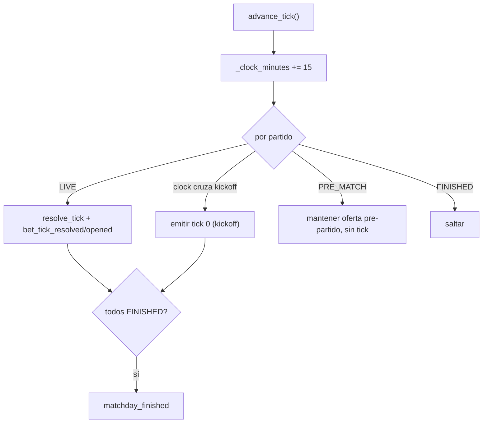

# Historia D.6 — Calendario de jornada con horarios escalonados — spec técnica

Fuente: `.ai-studio/memory/backlog.md` → D.6. Diseño: `game-design.md` → "Calendario de jornada — horarios
escalonados". Reutiliza `.ai-studio/specs/epic-d-liga-y-partidos.md` (§4.4 `MatchSimulationService`, §2.3
fixtures) y `epic-e` §2 (`BettingRoot`). No contiene GDScript final.

> **Bloqueo de documentación (del backlog):** `game-design.md` todavía dice *"Como máximo 2 partidos
> solapados"* y deja abierta la Pregunta #3. El Director confirmó **sin techo fijo** y jornadas especiales
> concentradas. Game Designer debe actualizar esas frases antes de tomar el documento como definitivo. Esta
> spec ya asume la versión confirmada.

---

## 1. Estado actual (punto de partida)

Hoy **no hay horarios**: `BettingRoot._split_matches_for_day` reparte los ~10 partidos de la jornada en
tercios (viernes/sábado/domingo) y `MatchSimulationService.open_initial_tick()` abre el tick 0 de **todos**
los partidos del día a la vez; `advance_tick()` los avanza en **lockstep**. La cuenta regresiva de "15 min
antes" (`BettingRoot._start_landing_countdown`) es puramente cosmética. D.6 introduce un reloj de jornada que
gobierna qué partidos han arrancado.

## 2. Modelo (decisiones clave)

### 2.1 Reloj de jornada y unidad de tiempo
Se introduce un **reloj de jornada** en `MatchSimulationService` medido en minutos, que avanza
`LeagueRules.MATCH_MINUTES_PER_TICK` (=15) por cada `advance_tick()`. Las horas de kickoff se modelan como
**offsets en minutos, múltiplos de 15** (misma unidad que el tick), de modo que el reloj y los ticks de cada
partido comparten rejilla: un partido con offset 30 empieza a generar ticks en el 3.º `advance_tick` del día.
La "hora" bonita de UI ("sábado 18:30") es un formateo del reloj sobre una hora base de día (ver §5), no un
dato de motor.

### 2.2 Estados de partido por reloj
Cada partido, en cada momento del reloj, está en uno de tres estados (derivados, no almacenados):
- **PRE_MATCH**: `clock < kickoff_offset`. Acepta apuestas pre-partido (se le ofertan mercados), **no** genera
  ticks ni comentarios, **no** cuenta para el tick obligatorio.
- **LIVE**: `kickoff_offset <= clock` y `current_tick_index < TICKS_PER_MATCH`. Genera ticks y cuenta para el
  obligatorio.
- **FINISHED**: `current_tick_index == TICKS_PER_MATCH`.

### 2.3 Sin techo de solapamiento
El scheduler **no impone ningún límite de partidos LIVE simultáneos**. El escalonado emerge de la
distribución de offsets; la concentración (Super Sunday) emerge de igualar offsets. Ninguna constante fija un
máximo (se elimina explícitamente cualquier tentación de "max 2").

## 3. Datos nuevos

### 3.1 `MatchFixture` (extensión aditiva)
```gdscript
@export var kickoff_offset_minutes: int = 0   # NUEVO — offset (múltiplo de 15) dentro de la ventana del día
```

### 3.2 `MatchdayFixture` (extensión aditiva)
```gdscript
enum ScheduleKind { STAGGERED, CONCENTRATED }   # NUEVO
@export var schedule_kind: ScheduleKind = ScheduleKind.STAGGERED   # NUEVO
```
`CONCENTRATED` = jornada especial (última jornada, "Super Sunday"): todos/casi todos los partidos comparten
offset y se concentran (opcionalmente todos en el mismo día — ver §4.2).

### 3.3 `LeagueRules` (constantes nuevas, ajustables por Game Designer)
```gdscript
const KICKOFF_OFFSETS_STAGGERED: Array[int] = [0, 15, 15, 30, 45, 60, 75, 90, 90, 105]  # ejemplo/base por índice de partido
const SPECIAL_MATCHDAY_EVERY_N: int = 0        # 0 = solo la última jornada es especial; >0 = además cada N jornadas
const DAY_BASE_HOUR: Dictionary = { /* FRIDAY: "20:00", SATURDAY: "16:15", SUNDAY: "14:00" */ }  # solo display
```
Valores de contenido; la forma (escalonado con ventanas de 1-2 LIVE) es lo que se fija, no los números.

## 4. Generación — `MatchdayScheduler` (RefCounted puro nuevo)

`res://scripts/league/matchday_scheduler.gd`. Asigna `kickoff_offset_minutes` a los partidos de un día y
decide `schedule_kind`. Sustituye la lógica ad-hoc de reparto por una consciente del horario.

```gdscript
class_name MatchdayScheduler extends RefCounted

## Decide si la jornada es especial (CONCENTRATED) según su índice y config, y asigna offsets a sus partidos.
static func build_schedule(matchday: MatchdayFixture, rng: RandomNumberGenerator) -> void   # muta kickoff_offset_minutes + schedule_kind

## Reparte los partidos de un día en offsets escalonados (STAGGERED) — busca ventanas con 1-2 LIVE, sin techo.
static func assign_staggered_offsets(matches: Array[MatchFixture], rng: RandomNumberGenerator) -> void

## Todos/casi todos los partidos comparten offset (CONCENTRATED / Super Sunday).
static func assign_concentrated_offsets(matches: Array[MatchFixture]) -> void
```

Invocación: en `LeagueGenerator.generate_calendar` (offsets estables por temporada) **o** al entrar a la
jornada de la run. Recomendado: al generar el calendario, para que el horario sea consistente entre
consultas; la última jornada (índice `TOTAL_MATCHDAYS-1`) se marca `CONCENTRATED`.

### 4.1 Garantía de arranque (relación con Bug 1 / nota de balance)
`assign_staggered_offsets` **debe garantizar que al menos un partido tenga offset 0** (hay siempre ≥1 partido
LIVE al inicio de la ventana del día), para que el primer tick obligatorio tenga siempre un mercado legal
donde apostar. Sin esto, el escalonado podría crear un estado sin salida (el tipo de bloqueo que motivó el
Bug 1). Test obligatorio de esta invariante.

### 4.2 Reparto por día vs. concentración especial
`BettingRoot._split_matches_for_day` (reparto en tercios) se mantiene para jornadas STAGGERED. Para una
jornada CONCENTRATED, el scheduler puede indicar que todos los partidos caen en un único día (p. ej. domingo)
— `BettingRoot` debe consultar `schedule_kind` en vez de repartir siempre en tercios. Contrato: el reparto por
día pasa a ser responsabilidad de un método consciente del `schedule_kind`, no del `_split` fijo actual.

## 5. Motor — cambios en `MatchSimulationService`

- Nuevo estado `_clock_minutes: int` (0 al iniciar el día).
- `start_matchday(matchday, day)`: crea `MatchTickState` de todos los partidos del día (como hoy), pero
  **no** abre ticks de los que aún no arrancan.
- Sustituir `open_initial_tick()` por un arranque consciente del reloj: emite `bet_tick_opened` (tick 0,
  pre-partido) para los partidos con offset 0, y ofertas pre-partido para el resto (ver §6).
- `advance_tick()`: `_clock_minutes += MATCH_MINUTES_PER_TICK`; para cada partido:
  - si pasa de PRE_MATCH a LIVE este avance → emite su tick 0 (kickoff);
  - si LIVE → `resolve_tick` + `bet_tick_resolved`/`bet_tick_opened` (como hoy);
  - si PRE_MATCH aún → no avanza (mantiene su oferta pre-partido);
  - si FINISHED → se salta.
  `is_matchday_finished()` = todos FINISHED (no "todos en tick 5", ya que arrancan en distintos momentos).
- Nuevo getter para UI: `get_match_status(match_id) -> {PRE_MATCH|LIVE|FINISHED}` y
  `get_clock_minutes() -> int`.

## 6. Apuestas pre-partido (contrato)

Un partido PRE_MATCH se oferta con un `BetTickContext` de estado inicial (marcador 0-0, min 0) para permitir
apostar antes del kickoff, pero **no cuenta para el tick obligatorio** ni recibe comentarios de partido.
Distinción clave para el gate de avance (evita el bloqueo del Bug 1):
- `BettingRoot._matches_with_tick_open_this_cycle` (requisito de apuesta obligatoria) solo debe incluir
  partidos **LIVE** este ciclo. Las apuestas pre-partido son opcionales.
- `BettingRoot._all_matches_satisfied_this_cycle` sigue exigiendo ≥1 apuesta en algún partido LIVE.

## 7. UI (mínima en esta historia; E consume)

- `TopBar.set_hour_text`: mostrar la hora de jornada formateada desde `_clock_minutes + DAY_BASE_HOUR[day]`.
- `MatchSelector`: cada tab muestra el estado del partido (hora de kickoff si PRE_MATCH, "en juego min X" si
  LIVE, "final" si FINISHED). Contrato de datos vía `get_match_status`/`get_clock_minutes`. El layout es
  trabajo de E (esta historia fija el dato, no el pixel).

## 8. Diagrama



## 9. Dependencias y orden

- Depende de D.1 (calendario) y D.3 (motor de tick). Interactúa con `BettingRoot` (Épica E) en el gate y el
  reparto por día.
- **Riesgo técnico (importante):** cambia el modelo lockstep → por-partido-con-reloj. Afecta a
  `MatchSimulationService`, `BettingRoot._split_matches_for_day`, el gate de tick obligatorio y el
  landing countdown. Requiere regresión de E.3 (multi-partido) y de la interacción con Momento Crazy (B.3):
  el Crazy sigue siendo por **tick global**, pero con partidos en distinto tick propio, "el tick" pasa a ser
  el ciclo de `advance_tick` (reloj), no el `tick_index` de un partido. Coordinar con el fix del Bug 1: la
  deduplicación del disparo Crazy debe basarse en el **ciclo de reloj**, no en `tick_index_in_day` de un
  partido (que ya no será común a todos). **Recomendación: implementar el fix del Bug 1 antes de D.6**, o
  diseñar el dedupe del Crazy ya en clave de reloj para no rehacerlo.

## 10. Criterio de éxito

Jornada normal (STAGGERED): kickoffs escalonados con ventanas de predominio 1-2 LIVE, siempre ≥1 partido a
las 0 min. Al menos un tipo de jornada especial (CONCENTRATED) con varios/todos los partidos compartiendo
kickoff. Ningún límite fijo/hardcodeado de solapamiento. El reloj gobierna arranque/fin de partidos.

## 11. Decisiones post-implementación (Architect, tras commit `89671cb`)

Programmer implementó la spec y levantó 2 puntos para decidir. Revisado el código real
(`match_simulation_service.gd`, `matchday_scheduler.gd`, `betting_root.gd`, `run_state.gd`,
`crazy_moment_scheduler.gd`, `league_rules.gd`). Confirmado además que el dedupe del Momento Crazy quedó
reclavado a `(day, clock_cycle)` en `RunState._crazy_moment_triggered_day/_clock_cycle`, poblado desde
`BetTickContext.clock_cycle` (= `_clock_minutes / MATCH_MINUTES_PER_TICK`, ciclo de reloj GLOBAL), NO desde
`tick_index_in_day` — exactamente el contrato de §9. Correcto.

### 11.1 Punto 1 — rango de ticks del sorteo del Momento Crazy con relojes escalonados — DECIDIDO: NO recalibrar

**Decisión: `EconomyRules.TICKS_PER_DAY` (=6) y `CRAZY_MOMENT_MIN_TICK_INDEX` (=1) se mantienen intactas. No
hace falta cambio de código.** El sorteo ya funciona correctamente porque opera sobre `clock_cycle` de forma
independiente del contenido de esas constantes, y el rango sorteado `[1, 5]` está **garantizado cubierto**:

- El sorteo elige un `clock_cycle` en `[CRAZY_MOMENT_MIN_TICK_INDEX .. TICKS_PER_DAY-1]` = `[1, 5]`.
- La invariante de arranque (§4.1, implementada y con test en `assign_staggered_offsets`) garantiza siempre
  ≥1 partido con offset 0. Ese partido está LIVE en los ciclos de reloj 0..5 (tick 0 en ciclo 0, ..., tick 5
  en ciclo 5, FINISHED en ciclo 6). Por tanto, en cualquier ciclo sorteado de `[1, 5]` hay siempre ≥1 partido
  LIVE que emite `bet_tick_opened` con ese `clock_cycle` → el Momento Crazy **siempre dispara**. No hay
  bloqueo ni disparo silencioso. Esto vale igual para CONCENTRATED (todos offset 0, LIVE en ciclos 0..5).

**Coste conocido y aceptado:** con kickoffs muy escalonados, un día puede extenderse hasta el ciclo ~13
(offset 105 → LIVE ciclos 7..12). Como el sorteo tope es 5, el Momento Crazy **nunca cae en la cola tardía**
de la jornada. Eso es una elección de balance/cobertura, no un bug: es seguro y determinista. Se acepta para
D.6.

**Restricción para cualquier futura ampliación (nota para Game Designer):** si en el futuro se quisiera que el
Crazy pueda caer también en la cola escalonada, NO basta con subir `TICKS_PER_DAY`. Subir el tope numérico a
ciegas reintroduce un riesgo tipo Bug 1: un ciclo alto sorteado (p. ej. 10) puede no tener ningún partido LIVE
para ciertas distribuciones de offsets → `bet_tick_opened` nunca se emite en ese ciclo → el Crazy se pierde en
silencio. Cualquier ampliación debe sortear **entre los ciclos realmente ocupados** (los que tienen ≥1 partido
LIVE), no sobre un rango numérico crudo. Eso es una historia de balance separada (Game Designer + Architect),
fuera del scope de D.6. El comentario que Programmer dejó en `crazy_moment_scheduler.gd` queda vigente como
puntero a esta decisión. **No reabrir Programmer.**

### 11.2 Punto 2 — día vacío en jornada CONCENTRATED — RECOMENDACIÓN: consultar al Director (decisión de producto)

Programmer implementó que `BettingRoot._start_day_and_countdown` salte automáticamente y **de forma instantánea**
un día sin partidos (`_on_matchday_finished(-1)` en cascada: viernes vacío → sábado vacío → domingo con todos
los partidos), sin countdown ni gate.

**Valoración técnica (Architect): el comportamiento implementado es correcto y es el default seguro.** Respeta
la invariante anti-bloqueo que motivó el Bug 1 (nunca dejar al jugador esperando una apuesta obligatoria que no
puede llegar). No hay ambigüedad técnica que resolver aquí: cualquier alternativa (pantalla de descanso) se
apoyaría igualmente sobre este mismo salto, solo añadiendo una pausa cosmética antes.

**Esto es genuinamente una decisión de sensación/ritmo (producto), no técnica.** Si el "Super Sunday" debe
sentirse como un evento —con una pantalla explícita tipo *"No hay partidos hoy. El fin de semana se juega
entero el domingo."* que construya anticipación— o si el salto instantáneo y silencioso es lo deseado, es una
llamada del Director / Game Designer, no del Architect. **Recomiendo trasladar la pregunta al Director.**

Recomendación por defecto mientras tanto: **mantener el salto instantáneo tal cual está** (shipped, correcto,
no bloquea). Si el Director quiere la pantalla de descanso, es un pulido de UX que encaja en Épica E (misma
capa que el estado por partido del `MatchSelector`, §7 / punto 3), no una reapertura de D.6. **No reabrir
Programmer por esto salvo que el Director lo pida.**
