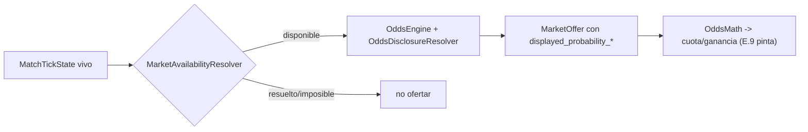

# Historia D.7 — Recalculo de mercados y cuotas por minuto de partido — spec técnica

Fuente: `.ai-studio/memory/backlog.md` → D.7. Diseño: `game-design.md` → "Mercados que varían con el minuto
del partido". Reutiliza `.ai-studio/specs/epic-d-liga-y-partidos.md` (§5 `OddsEngine`/`OddsDisclosureResolver`,
§4.4 `MatchSimulationService._build_market_offers`) y `OddsMath` de E.7. No contiene GDScript final.

---

## 1. Estado actual (punto de partida)

`MatchSimulationService._build_market_offers()` ya **recalcula todas las ofertas en cada tick** a partir del
`MatchTickState` vivo (`OddsEngine.compute_market_probabilities` + `OddsDisclosureResolver.build_market_offer`).
Es decir, la parte de "las probabilidades varían con el minuto" **ya existe**. Lo que **falta** (alcance de
D.7):
1. Que la variación cubra explícitamente **cuota y ganancia potencial**, no solo la probabilidad.
2. **Retirar de la oferta** los mercados ya resueltos o matemáticamente imposibles (hoy los 8 mercados se
   ofertan siempre; p. ej. `first_scorer` se sigue ofertando tras el primer gol).

Esto es la **capa base**, independiente de las restricciones de Momento Crazy (B.3) y de domingo, que se
apilan encima.

## 2. Cuota y ganancia potencial como parte de la variación (coordinación con E.7)

**No** se crean campos redundantes de cuota en `MarketOffer` con su propia aritmética (evita dos fuentes de
verdad — nota explícita del backlog). Decisión:
- La cuota se deriva **siempre** de `displayed_probability_min/max` vía `OddsMath` (E.7). Como esas
  probabilidades ya se recalculan por tick, la cuota y la ganancia potencial **ya varían por minuto** sin
  campo extra: es una consecuencia de que E.9 las pinte desde `OddsMath` en cada refresh de tick.
- Único caso que puede requerir un campo nuevo: **cuota residual** de un mercado casi-decidido que se decide
  mantener en oferta en vez de retirarlo (ver §3). Para ese caso, si Programmer opta por residual en lugar de
  retirada, se añade de forma aditiva a `MarketOffer`:
  ```gdscript
  @export var is_residual: bool = false   # NUEVO opcional — mercado casi-decidido ofertado con cuota mínima
  ```
  Recomendación: en el MVP, **retirar** (no ofertar) los decididos/imposibles es más simple y suficiente para
  el criterio de éxito; `is_residual` queda como opción de balance, no obligatoria.

## 3. Retirada de mercados — `MarketAvailabilityResolver` (RefCounted puro nuevo)

`res://scripts/league/market_availability_resolver.gd`. Decide, por mercado y estado vivo, si sigue
ofertándose. Se invoca desde `_build_market_offers` (filtra antes de construir las ofertas de ese mercado).

```gdscript
class_name MarketAvailabilityResolver extends RefCounted

## true si el mercado sigue teniendo sentido ofertar dado el estado vivo del partido.
## Comportamiento base, independiente de Crazy/domingo (que se apilan aparte).
static func is_market_available(market: MarketDef, state: MatchTickState) -> bool
```

Reglas MVP (por `market_id`/`kind`), coherentes con `game-design.md`:
- `first_scorer`: **retirar** una vez `not state.goal_scorers.is_empty()` (ya resuelto).
- `goals_ou_X` / over-under de goles: retirar si el umbral ya es **inalcanzable o ya decidido sin vuelta
  atrás** dado los ticks restantes. Criterio: "under X.5" imposible si `total_goals > X.5` (ya cae "over");
  "over X.5" ya no puede fallar si `total_goals > X.5` (ya cae "over") → mercado decidido, retirar. Con ticks
  restantes suficientes para alcanzar el umbral, se mantiene.
- `cards_ou` / `fouls_ou`: mismo criterio de "decidido/imposible" sobre su total y umbral elegido del partido.
- `1x2`, `btts`: se mantienen hasta el final (siempre pueden cambiar hasta el min 90). No se retiran por
  minuto (solo por Crazy/domingo, fuera de esta capa).

Nota: la retirada por minuto es **la capa base**. `CrazyBetResolver.select_restricted_markets` (B.3) y las
restricciones de domingo (`OddsDisclosureResolver` ya aplica el multiplicador de margen de domingo) operan
**sobre el conjunto ya filtrado** por D.7. Esto encadena con el fix del Bug 1 (§7.2 del bug): la selección de
Crazy debe partir de las ofertas realmente disponibles ese tick.

## 4. Integración en `MatchSimulationService._build_market_offers`

Contrato (sin código): antes de generar las ofertas de un `MarketDef`, consultar
`MarketAvailabilityResolver.is_market_available(effective_market, state)`; si `false`, no generar sus
`MarketOffer`. El resto del flujo (probabilidades → `OddsDisclosureResolver` → `MarketOffer`) no cambia.

Consecuencia en el contrato `BetTickContext.available_markets`: pasa a contener solo mercados vigentes ese
tick. Todos los consumidores (E.9, B.3) ya iteran esa lista, así que la retirada se propaga sin cambios de
firma. **Garantía de no-bloqueo (relación Bug 1):** `is_market_available` debe garantizar que un partido LIVE
nunca se quede con **cero** mercados ofertables (siempre quedan `1x2`/`btts`). Test obligatorio.

## 5. Interfaces tocadas (resumen)

| Elemento | Tipo | Cambio |
|---|---|---|
| `MarketAvailabilityResolver` | `RefCounted` nuevo | predicado de disponibilidad por mercado/estado |
| `MatchSimulationService._build_market_offers` | existente | filtrar mercados no disponibles |
| `MarketOffer` | Resource | (opcional) `is_residual` si se elige residual en vez de retirada |
| `OddsMath` (E.7) | `RefCounted` | reutilizado para cuota/ganancia variables (sin campo redundante) |

No se toca: firma de `bet_tick_opened`/`BetTickContext`, `OddsEngine`, `OddsDisclosureResolver` (la variación
de prob por minuto ya existe).

## 6. Diagrama



## 7. Dependencias y orden

- Depende de D.3 y D.5 (ya implementados). Comparte `OddsMath` con E.7.
- Es la fuente de datos de E.9. **Recomendación: D.7 y E.9 se diseñan/implementan juntas** (D.7 produce, E.9
  consume; no aportan valor por separado).
- La variación de cuota/ganancia (parte 1 del objetivo) **ya está** cubierta por el recálculo existente + E.7;
  el trabajo real y nuevo de D.7 es la **retirada** (parte 2). Esto reduce el riesgo de D.7 a un resolver
  puro bien acotado.

## 8. Criterio de éxito

En cada tick, prob/cuota/ganancia de los mercados ofertados varían coherentemente con lo ocurrido; un mercado
decidido/imposible desaparece de la oferta sin intervención manual; el efecto es visible como capa base sin
Momento Crazy ni restricciones de domingo; un partido LIVE nunca queda sin mercados ofertables.
