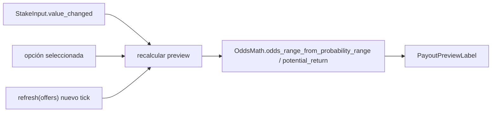

# Historia E.7 — Cuota comercial y ganancia potencial visible (payout) — spec técnica

Fuente: `.ai-studio/memory/backlog.md` → E.7. Diseño: `game-design.md` → "Ganancia potencial visible" y
"Principios de usabilidad de la interfaz". Reutiliza `.ai-studio/specs/epic-e-pantalla-de-apuestas.md`
(secciones 3.3 `MarketWidget`, 4.4 `PayoutCalculator`) y `epic-d` §5 (`OddsDisclosureResolver`,
`displayed_probability_min/max`). No contiene GDScript final.

---

## 1. Objetivo

Que en cada mercado apostable el jugador vea **siempre, antes de confirmar**: (a) la **cuota comercial**
(multiplicador) junto al %/rango de probabilidad, y (b) la **ganancia potencial** del importe introducido, en
tiempo real, formato boleto. Con probabilidad en rango, cuota y ganancia también se muestran como rango.

## 2. Fuente única de verdad de la cuota (decisión clave)

Ya existe `PayoutCalculator.compute_payout(pending_bet)` que congela la cuota como
`1 / p_shown_center` usando el punto medio de `displayed_probability_min/max`. Para **no crear una segunda
fuente de verdad** (nota de coordinación con D.7 en el backlog), se centraliza toda la aritmética de cuota en
un único helper puro y se hace que tanto la UI (E.7), el pago real (`PayoutCalculator`) y D.7 lo consuman.

Nuevo `RefCounted` puro (o extensión de `PayoutCalculator`) — **firmas, no implementación**:

```gdscript
class_name OddsMath extends RefCounted   # res://scripts/betting/odds_math.gd

## Cuota comercial a partir de una probabilidad mostrada (ya incluye margen de casa, ver epic-d §5.2).
static func odds_from_probability(shown_probability: float) -> float        # = 1.0 / max(p, MIN_P)

## Cuota como rango (a partir del rango mostrado). Nota: menor probabilidad => mayor cuota, por eso el
## MIN de cuota se deriva del MAX de probabilidad y viceversa.
static func odds_range_from_probability_range(p_min: float, p_max: float) -> Vector2   # (odds_min, odds_max)

## Ganancia potencial (devolución total y neta) de un stake a una cuota dada.
static func potential_return(stake: int, odds: float) -> int                 # ceil(stake * odds)
static func potential_net(stake: int, odds: float) -> int                    # potential_return - stake
```

`PayoutCalculator.compute_payout` debe reexpresarse en términos de `OddsMath` (misma fórmula que hoy:
`ceil(stake * (1/shown_center))`) para que la cuota mostrada al apostar y la usada al pagar sean
**idénticas por construcción** (la cuota se congela en el `MarketOffer` guardado en `PendingBet`, ya cubierto
por E.4). `MIN_P` = mismo sentinel que hoy (`0.01`).

Esto permite que E.7 se implemente **sin depender de D.7**: la cuota se deriva de `displayed_probability_*`
que ya existen en cada `MarketOffer`. Ver nota de orden en §7.

## 3. Cambios en la UI — `MarketWidget` (`scenes/betting/market_widget.gd` + `.tscn`)

Hoy cada botón de opción muestra solo `"<label>\n%d%%-%d%%"`. Se amplía a mostrar cuota, y se añade una
línea de "ganancia potencial" viva ligada al `StakeInput`.

Nodos nuevos en `market_widget.tscn` (dentro de `BetRow` o una fila hermana `PayoutRow`):
- `PayoutPreviewLabel: Label` — texto boleto vivo: `"Apuestas $X → devuelve $Y (neto +$Z)"`; en rango:
  `"Apuestas $X → devuelve $Y1–$Y2"`.

Cambios de comportamiento (contratos, sin código):
- Al construir cada botón de opción (`_rebuild_option_buttons`), añadir la cuota derivada por opción:
  texto tipo `"<label>\n<pct_min>%–<pct_max>%\n<cuota_min>–<cuota_max>"` (una sola cuota si el rango colapsa).
  Jerarquía de lectura (game-design "Jerarquía de lectura"): cuota como dato principal, probabilidad como
  apoyo — el layout debe dar más peso visual a la cuota.
- `PayoutPreviewLabel` se recalcula ante:
  - `StakeInput.value_changed` (nuevo `connect`),
  - selección de opción (`_on_option_button_pressed`),
  - `refresh(offers)` (nuevo tick, cuota puede haber cambiado — E.9),
  - `apply_forced_stake` / `set_minimum_stake` (el importe cambió por regla de stake).
- El cálculo usa `OddsMath` sobre el `MarketOffer` de la opción seleccionada
  (`_offers_by_option[_selected_option_key]`). Si no hay opción seleccionada, muestra el rango de la opción
  de mayor probabilidad como estimación, o queda en blanco (decisión de UX menor, delegada a implementación).

## 4. Tono / usabilidad (reglas duras de game-design)

- Presentación fría/funcional, sin celebración ni decoración (la celebración es de E.8, en la resolución).
- Sin solapamientos: `PayoutPreviewLabel` en su propia fila, nunca encima de opciones/estadísticas
  ("Principios de usabilidad de la interfaz").
- La cuota es dato ancla siempre visible por opción; la ganancia potencial siempre visible antes de confirmar.

## 5. Interfaces tocadas (resumen)

| Elemento | Tipo | Cambio |
|---|---|---|
| `OddsMath` | `RefCounted` nuevo (`scripts/betting/odds_math.gd`) | fuente única de cuota/payout |
| `PayoutCalculator` | `RefCounted` existente | reexpresar sobre `OddsMath` (sin cambiar resultado) |
| `MarketWidget` | escena+script existente | mostrar cuota por opción + `PayoutPreviewLabel` vivo |
| `market_widget.tscn` | escena | nodo `PayoutPreviewLabel` |

No se toca: `MarketOffer` (usa `displayed_probability_*` ya existentes), `EventBus`, autoloads, contrato de
`bet_confirmed`.

## 6. Diagrama (flujo de recálculo vivo)



## 7. Dependencias y orden de implementación

- **Puede implementarse antes que D.7** derivando la cuota de `displayed_probability_*` (ya existentes). Esto
  respeta el orden de producto (E.7 antes que D.7).
- Cuando D.7 añada retirada de mercados / cuota residual, **no** debe duplicar la aritmética: seguirá usando
  `OddsMath`. Si D.7 decide materializar `commercial_odds`/`potential_*` en `MarketOffer`, esos campos deben
  derivarse de `OddsMath` sobre `displayed_probability_*`, manteniendo la fuente única.
- Depende de E.3/E.4 (ya implementadas: `MarketWidget`, `StakeInput`, `PendingBet` congela `MarketOffer`).

## 8. Criterio de éxito

Cuota + ganancia potencial visibles antes de confirmar, en cualquier mercado ofertado; la ganancia se
actualiza en tiempo real al cambiar el importe; con probabilidad en rango, cuota y ganancia se muestran como
rango; la cuota mostrada al apostar coincide exactamente con la usada al pagar (misma `OddsMath`).
