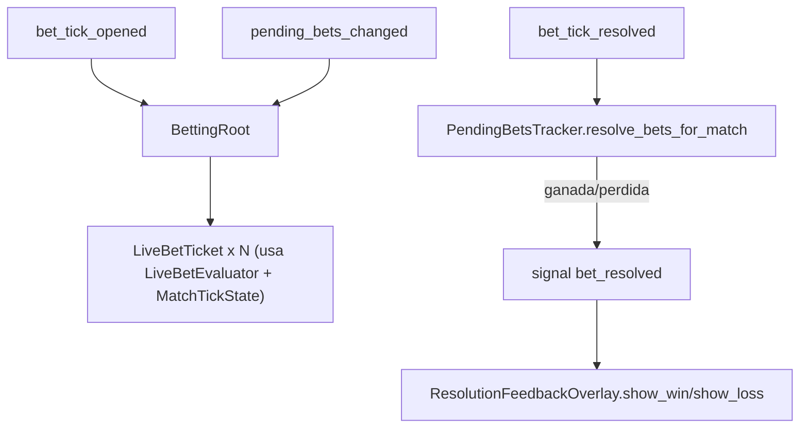

# Historia E.8 — Boleto vivo: estado en tiempo real + feedback de resolución — spec técnica

Fuente: `.ai-studio/memory/backlog.md` → E.8 (+ nota importante: el Director confirmó **dopamina alta y
consistente en cualquier fase**, contradiciendo el "confirmación seca" que aún describe `game-design.md` —
pendiente que Game Designer actualice esas frases; esta spec ya asume la versión confirmada). Diseño:
`game-design.md` → "Boleto vivo y feedback de resolución". Reutiliza
`.ai-studio/specs/epic-e-pantalla-de-apuestas.md` §4 (`PendingBetsTracker`, `PendingBet`) y `epic-d` §4.1
(`MatchTickState`). No contiene GDScript final.

---

## 1. Objetivo

Dos entregables sobre el panel de apuestas pendientes:
1. **Estado vivo** por apuesta abierta: mercado, importe, cuota fijada, ganancia potencial, un indicador
   `vas ganando / vas perdiendo / indeciso` respecto al partido en curso, y cuánto falta para su resolución
   (minuto/tick de cierre). Siempre visible, sin condicionar a investigación.
2. **Feedback de resolución** enérgico e inmediato al ganarse/perderse una apuesta (importe concreto,
   atribuible a esa apuesta), con intensidad **alta y consistente en cualquier fase narrativa**.

## 2. Estado vivo — lógica pura reutilizable

La evaluación "¿esta apuesta va ganando ahora mismo?" es exactamente `PendingBetsTracker._is_bet_won(offer,
match_state)` aplicada al `MatchTickState` **actual** (no final). Se promueve esa lógica a un helper puro y
tri-estado para poder distinguir "indeciso" (mercados aún no decidibles):

```gdscript
class_name LiveBetEvaluator extends RefCounted   # res://scripts/betting/live_bet_evaluator.gd

enum LiveStatus { WINNING, LOSING, UNDECIDED }

## Estado vivo de una apuesta contra el estado actual (parcial) del partido.
static func evaluate(market_offer: MarketOffer, match_state: MatchTickState) -> LiveStatus

## Ticks restantes hasta la resolución de este mercado (0 = se resuelve este tick).
## first_scorer se cierra al primer gol; el resto al minuto 90 (coherente con
## PendingBetsTracker.is_market_resolved_this_tick).
static func ticks_until_resolution(market_offer: MarketOffer, match_state: MatchTickState) -> int
```

Regla de `UNDECIDED` (**solo mercados monótonos**): aplica exclusivamente a mercados cuya condición solo
puede viajar en un sentido dentro del partido y cuyo lado "aún no cumplido" es el estado por defecto del
saque inicial (`btts`, over/under de goles/tarjetas/faltas, `first_scorer` antes del primer gol). Mientras la
condición monótona siga sin cumplirse y el partido no haya terminado → `UNDECIDED` (el resultado aún puede
caer a ambos lados y el lado "under/no" en curso es vacuo, no informa). `WINNING`/`LOSING` = el resultado
actual ya cae irreversiblemente de ese lado (over ya superado = WINNING para "over"; imposible ya = LOSING).

**Mercado `1x2` — decisión explícita (no UNDECIDED nunca):** `1x2` es **no monótono** (el líder puede
cambiar de bando entre ticks), pero tiene un resultado en curso **bien definido en cada tick** (siempre hay
un líder actual, o empate). Refleja **siempre el marcador actual**: `WINNING` si tu selección
(`home`/`draw`/`away`) coincide con el resultado en curso, `LOSING` en caso contrario. **Nunca `UNDECIDED`.**
Razón: `UNDECIDED` está reservado a mercados monótonos con lado por defecto vacuo; aplicar la lectura
"rigurosa" de dejar `1x2` indeciso hasta el minuto 90 dejaría al mercado **más apostado** permanentemente
neutro durante casi todo el partido, anulando la tensión viva ("vas ganando esta") que es el objetivo de la
historia. La lectura por marcador en curso es además la que usan las casas de apuestas en vivo y la que
espera el modelo mental del jugador. (Confirmado por Architect tras implementación: el código de
`_evaluate_1x2` ya es correcto, no requiere cambios.)

La refactorización debe dejar `PendingBetsTracker._is_bet_won` (resolución final) y
`LiveBetEvaluator.evaluate` (estado vivo) apoyándose en la **misma** tabla de reglas por `market_id` para no
duplicar criterios.

## 3. Panel de boleto vivo — UI

Hoy `BettingRoot._refresh_pending_bets_panel()` pinta un resumen plano (contador + últimas 4 líneas
`$stake · mercado`) en `RightPanel/PendingBetsPanel`. Se sustituye por un componente por apuesta.

Nuevo componente reutilizable (patrón `MarketWidget`): `LiveBetTicket` (escena+script en
`scenes/betting/live_bet_ticket.tscn`), un ticket por `PendingBet`:
- Labels: partido (abreviado, sin recortar — reglas de usabilidad), mercado+opción, importe, cuota fijada
  (`OddsMath` de E.7 sobre `market_offer` congelado), ganancia potencial.
- `StatusBadge`: color/texto según `LiveBetEvaluator.LiveStatus` (verde/rojo/neutro).
- `ResolutionLabel`: "cierra en min X" / "cierra este tick" según `ticks_until_resolution`.

`BettingRoot` instancia/actualiza los tickets:
- Se refresca en cada `pending_bets_changed` (alta/baja de apuestas) **y** en cada `bet_tick_opened`
  (avanza el partido → cambia el estado vivo). Para el estado vivo, cada ticket consulta el
  `MatchTickState` de su `match_id` vía `MatchSimulationService.get_match_tick_state(match_id)` (ya expuesto).

## 4. Feedback de resolución (dopamina alta y consistente)

`PendingBetsTracker._resolve_single_bet()` ya calcula el `payout` y ajusta `RunState.set_money`, pero solo
emite `EventBus.market_bet_resolved(result)` (contrato de Épica A, `MarketBetResult` no lleva importe). Para
el feedback E.8 se añade una señal **propia de la UI de apuestas**, sin tocar el contrato cross-épica:

```gdscript
# PendingBetsTracker (señal nueva, local a la escena de apuestas)
signal bet_resolved(pending_bet: PendingBet, won: bool, payout: int)
    # payout = dinero acreditado (0 si perdida). stake vive en pending_bet.stake.
```

Emitida en `_resolve_single_bet` junto a `market_bet_resolved`. `BettingRoot` la consume y dispara un overlay
de feedback:

Nuevo overlay: `ResolutionFeedbackOverlay` (escena+script en
`scenes/betting/resolution_feedback_overlay.tscn`, hijo de `BettingRoot`, `mouse_filter = IGNORE` en todos
los nodos — igual que `CrazyMomentOverlay`, para no reintroducir el patrón de bloqueo del Bug 1):
```gdscript
class_name ResolutionFeedbackOverlay extends Control
func show_win(amount_returned: int, net: int) -> void   # amount_returned = total acreditado; net = amount_returned - stake
func show_loss(amount_lost: int) -> void
```
- **Jerarquía visual de la victoria (decisión explícita):** el número **grande/principal** es
  `amount_returned` (el **total acreditado**, p. ej. `"+$1500"`); el detalle **secundario** es la ganancia
  neta (p. ej. `"neto +$500"`). Razón: `amount_returned` es exactamente el número que el jugador ha estado
  viendo como ancla en el boleto — E.7 lo titula `"Apuestas $X → devuelve $Y (neto +$Z)"` y `LiveBetTicket`
  lo titula `"$stake @ cuota → $potential_return"` (Y = total, sin mostrar el neto). Así el jugador compara
  el mismo número ancla antes ("devuelve $Y") y después ("cobras $Y"), y el desglose `(neto +$Z)` del overlay
  replica el del preview de E.7. **Corrección respecto a la primera implementación**, que invirtió la
  jerarquía (`+$net` como principal, `cobras $amount_returned` como detalle): el número principal debe ser
  `amount_returned`, no `net`. (La derrota muestra `"−$X"` = stake perdido; su asimetría con la victoria es
  intencional: en la derrota no hay "devolución" que comparar contra el boleto, solo el stake hundido.)
- **Enérgico**: animación breve + número grande claro, atribuible a la apuesta. Sin condicionar la intensidad
  a `NarrativePhase` (dopamina alta siempre; ver nota del backlog).
- En fases avanzadas (3-4) el mensaje puede "hablarle" al jugador (canal de deterioro) — es contenido
  narrativo, coordinar con Game Designer; la lógica de selección puede reutilizar `NarrativePhase` igual que
  `CommentaryResolver`, pero **la intensidad visual no baja**.
- Resoluciones múltiples en un mismo tick (varias apuestas cierran a la vez): encolar o agregar en un único
  overlay ("+$total") para no solapar animaciones (decisión de UX menor, delegada a implementación; el
  contrato es que cada resolución sea legible y atribuible).

## 5. Interfaces tocadas (resumen)

| Elemento | Tipo | Cambio |
|---|---|---|
| `LiveBetEvaluator` | `RefCounted` nuevo | estado vivo tri-estado + ticks restantes |
| `PendingBetsTracker` | `Node` existente | nueva señal `bet_resolved`; reusar tabla de reglas con `LiveBetEvaluator` |
| `LiveBetTicket` | escena+script nuevos | ticket por apuesta con estado vivo |
| `ResolutionFeedbackOverlay` | escena+script nuevos | feedback enérgico (mouse IGNORE) |
| `BettingRoot` | existente | instanciar tickets, refrescar en tick, consumir `bet_resolved` |

No se toca: `MarketBetResult`/`EventBus.market_bet_resolved` (contrato de Épica A), `RunState`.

## 6. Diagrama



## 7. Dependencias y orden

- Depende de E.3/E.4 (pending bets, `MatchSimulationService.get_match_tick_state`) y D.3 (estado vivo).
- Comparte `OddsMath` con E.7 para la cuota/ganancia del ticket (implementar E.7 primero o en paralelo).
- Independiente de D.6/D.7. Puede ir justo después de E.7 (orden de producto).

## 8. Criterio de éxito

Cada apuesta abierta muestra su estado vivo actualizado en cada tick, siempre visible; al resolverse, el
cambio de saldo es legible y atribuible a esa apuesta con feedback enérgico, consistente en cualquier fase
narrativa. El overlay de feedback nunca bloquea input (mouse IGNORE, lección del Bug 1).
