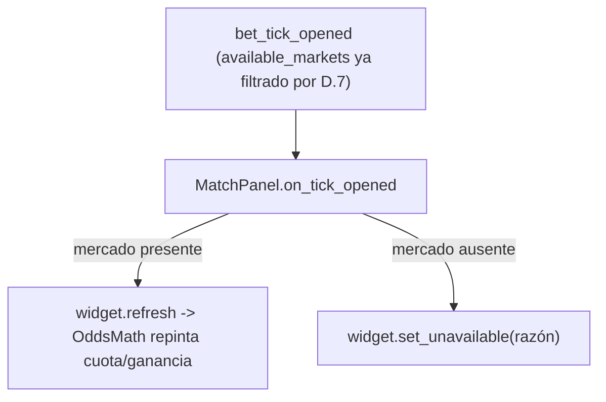

# Historia E.9 — UI de mercados dinámicos por minuto — spec técnica

Fuente: `.ai-studio/memory/backlog.md` → E.9. Diseño: `game-design.md` → "Mercados que varían con el minuto".
Reutiliza `.ai-studio/specs/epic-e-pantalla-de-apuestas.md` (§3.3 `MarketWidget`, §3.2 `MatchPanel`), D.7
(`MarketAvailabilityResolver`, filtrado en `BetTickContext.available_markets`) y `OddsMath` (E.7). No contiene
GDScript final.

---

## 1. Objetivo

Reflejar en pantalla, tick a tick, lo que D.7 calcula: (a) los mercados que dejan de ofertarse desaparecen o
se marcan no disponibles con una razón breve; (b) las cuotas/ganancias potenciales visibles se actualizan en
cada tick sin refresco manual.

## 2. Estado actual (punto de partida)

`MatchPanel.on_tick_opened()` ya recibe el `BetTickContext` y, por cada widget, si el mercado está en las
ofertas del tick hace `widget.refresh(offers); widget.visible = true`, y si no `widget.visible = false`.
Es decir, **la desaparición ya funcionaría** en cuanto D.7 deje de incluir el mercado en
`available_markets` — E.9 solo debe pulir la presentación (mostrar razón en vez de ocultar en seco) y
asegurar que la parte de cuotas/ganancias (E.7) se repinta en cada tick.

## 3. Cambios de UI

### 3.1 Mercado retirado: "no disponible con razón" en vez de ocultar en seco
En vez de `widget.visible = false` cuando un mercado desaparece de la oferta, mostrar el widget en estado
"retirado" con una razón breve (coherente con "estilo bwin", denso y legible):
- Nuevo estado en `MarketWidget`: `set_unavailable(reason: String)` (distinto de `set_restricted`, que es la
  restricción narrativa del Momento Crazy — no reutilizar el mismo overlay para no confundir las dos causas).
  - Muestra el título del mercado atenuado + etiqueta de razón (p. ej. "resuelto: ya hubo gol",
    "imposible con el marcador actual"). Deshabilita opciones y confirm.
- Decisión de UX (delegada a implementación): retirar del todo tras N ticks retirado, o mantener atenuado
  hasta fin de partido. El contrato es: nunca ofertable, razón visible.

La razón puede derivarse en E de forma simple (por qué D.7 lo quitó: `first_scorer`→gol, over/under→umbral
decidido), o D.7 puede exponer un motivo. Recomendación mínima: E deriva la razón por `market_id` +
`MatchTickState` con un helper de texto, sin ampliar el contrato de `BetTickContext`.

### 3.2 Cuotas/ganancias se repintan cada tick
`MarketWidget.refresh(offers)` (ya llamado en cada `on_tick_opened`) debe recalcular cuota por opción y la
`PayoutPreviewLabel` (E.7) con las nuevas `displayed_probability_*` del tick, vía `OddsMath`. Como E.7 ya liga
el repintado a `refresh`, E.9 solo verifica que ocurre sin desfase y que la ganancia potencial del importe ya
introducido se reevalúa (la opción seleccionada puede haber cambiado de cuota).

### 3.3 Consistencia con el conjunto calculado por D.7
`MatchPanel` debe reflejar **exactamente** el conjunto de `available_markets` del `BetTickContext` de ese
tick: ningún widget de un mercado ausente queda apostable. La lógica de `on_tick_opened` (mostrar solo los
presentes) ya lo garantiza; E.9 añade el tratamiento "retirado con razón" para los que estaban y dejaron de
estar.

## 4. Interfaces tocadas (resumen)

| Elemento | Tipo | Cambio |
|---|---|---|
| `MarketWidget` | escena+script existente | `set_unavailable(reason)` + repintado de cuota/ganancia por tick |
| `MatchPanel.on_tick_opened` | existente | usar `set_unavailable` para mercados que desaparecen (vs. ocultar) |
| helper de razón de retirada | (opcional) `RefCounted`/función | derivar texto por `market_id`+estado |

No se toca: `BetTickContext`/`bet_tick_opened` (E.9 solo consume la lista ya filtrada por D.7), autoloads,
`OddsMath`.

## 5. Diagrama

## 6. Dependencias y orden

- Depende de **D.7** (produce la retirada y la variación) y de **E.7** (cuota/ganancia visibles).
- **Recomendación: implementar D.7 + E.9 juntas** (misma feature vista desde motor y UI).
- Independiente de D.6 salvo que ambas tocan `MatchPanel`/`MatchSelector`; coordinar el orden de merge.

## 7. Criterio de éxito

Al pasar de un tick a otro, la lista de mercados del partido enfocado coincide con el conjunto de D.7 (ningún
resuelto/imposible queda apostable); las cuotas y ganancias mostradas coinciden con el recálculo del tick sin
desfase perceptible; un mercado retirado muestra una razón breve, distinguible de la restricción de Momento
Crazy.
